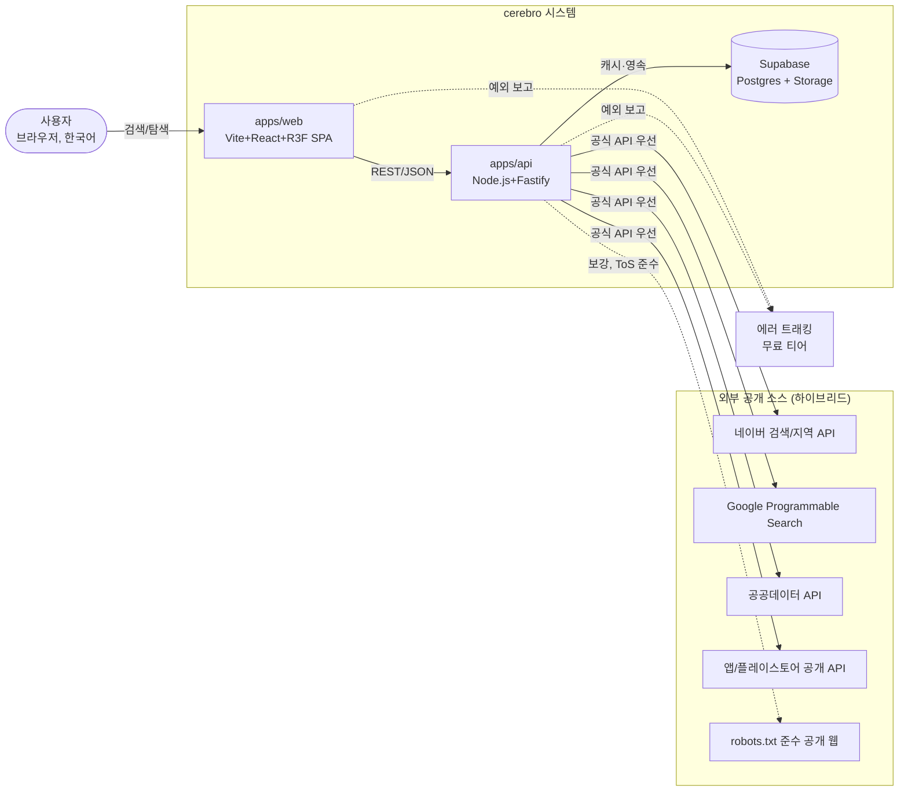
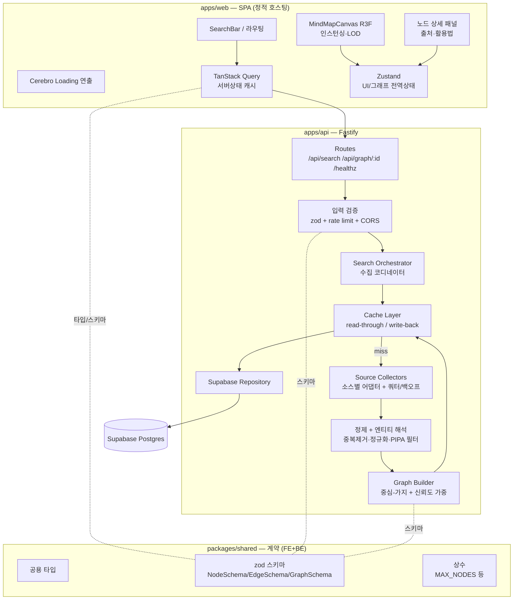
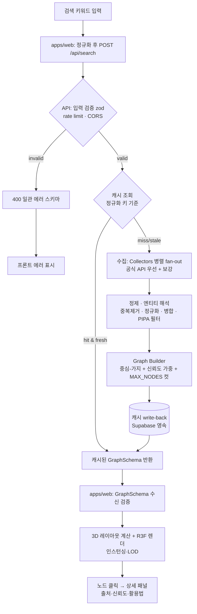
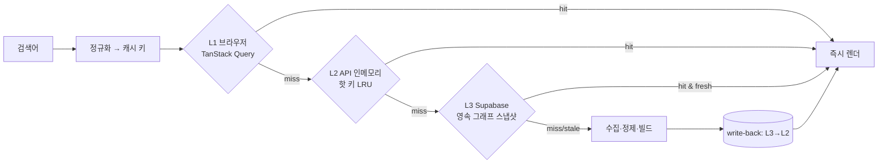
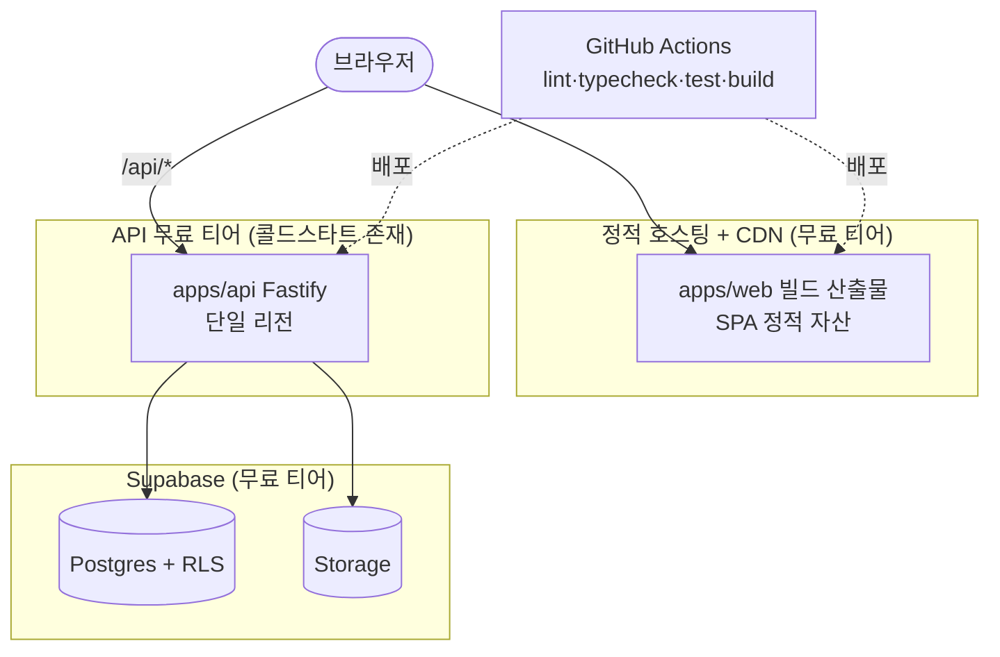
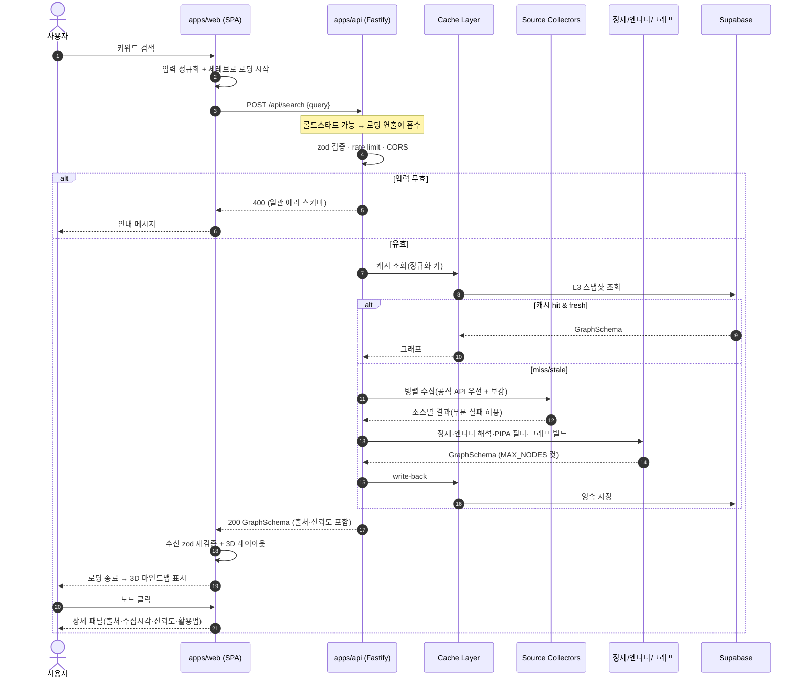

# cerebro — 시스템 아키텍처 (ARCHITECTURE)

> **목적**: cerebro의 시스템 구조·데이터 흐름·배포 토폴로지를 정의해, 모든 에이전트가 동일한 그림 위에서 구현하도록 한다.
> **담당 역할**: Orchestrator / Software Architect

**관련 문서**
- [Foundation Spec (SSOT)](./foundation/FOUNDATION-SPEC.md)
- [데이터 모델](./DATA-MODEL.md)
- [데이터 수집 전략](./DATA-SOURCING.md)
- [보안](./SECURITY.md)
- [UX 스펙](./UX-SPEC.md)
- [PRD](./PRD.md)

> 본 문서는 SSOT(FOUNDATION-SPEC.md)에 종속된다. 충돌 시 SSOT가 우선한다.

---

## 1. 시스템 컨텍스트 (C4 Level 1)

cerebro는 사용자의 검색 1건을 받아, 여러 **외부 공개 소스**에서 수집·정제한 정보를 중심-가지 그래프로 만들어 **3D 마인드맵**으로 응답하는 웹 서비스다. 비용은 MVP 무료 티어 내로 묶고, 캐시로 외부 쿼터와 콜드스타트를 흡수한다.

| 액터/시스템 | 역할 | 경계 책임 |
|---|---|---|
| 사용자 | 키워드 검색, 3D 그래프 탐색, 노드 클릭 | 입력 제공만. 인증은 MVP에서 익명(읽기 중심) |
| apps/web | 검색 UI, 세레브로 로딩 연출, 3D 렌더, 상세 패널 | 표현·인터랙션. 신뢰 경계 밖(검증 불가) |
| apps/api | 수집·정제·엔티티 해석·그래프 빌드·캐시 게이트키퍼 | **모든 외부 입력 검증(zod), 시크릿 보유, PIPA 가드레일** |
| Supabase | 영속 캐시·엔티티·그래프 저장, (추후) Auth | 데이터 영속성. RLS로 최소 권한 |
| 외부 소스 | 원천 데이터 | 쿼터·ToS·robots.txt 제약. 신뢰 경계 밖 |

> **신뢰 경계**: 브라우저↔API 사이가 핵심 경계다. 시크릿(외부 API 키)은 **API에만** 존재하고, 외부 소스 호출은 전부 서버에서 프록시한다. 브라우저는 외부 소스를 직접 호출하지 않는다(키 노출·CORS·SSRF 통제).

---

## 2. 컴포넌트 분해 (C4 Level 2)

### 2.1 apps/web (Frontend Engineer + UI/UX Designer)
| 모듈 | 책임 | 비고 |
|---|---|---|
| SearchBar/라우팅 | 키워드 입력 → `/api/search` 호출 트리거 | 입력 1차 정규화(트림) |
| Cerebro Loading | 회색 인간 형상 스쳐가는 X맨식 연출 | 수집 지연·콜드스타트를 UX로 흡수 |
| MindMapCanvas | 구체 노드/가지 3D 렌더 | three/R3F. 인스턴싱·LOD로 60fps 지향 |
| 노드 상세 패널 | 출처·수집시각·신뢰도·활용법 표시 | 모든 노드에 출처 필수(SSOT §8) |
| TanStack Query | 서버 상태 캐시·중복요청 제거·재시도 | 브라우저측 1차 캐시 |
| Zustand | 선택 노드·카메라·UI 모드 등 전역상태 | 가벼운 전역상태(오버엔지니어링 회피) |

### 2.2 apps/api (Backend Engineer)
| 모듈 | 책임 |
|---|---|
| Routes | `POST /api/search`, `GET /api/graph/:id`, `GET /healthz` |
| 입력 검증 게이트 | zod 검증 + rate limit + CORS 화이트리스트 + 길이/문자 제한 |
| Search Orchestrator | 캐시 조회 → miss 시 수집 코디네이트(병렬 fan-out, 부분 실패 허용) |
| Source Collectors | 소스별 어댑터(공식 API 우선). 쿼터 카운팅·지수 백오프·타임아웃·SSRF 가드 |
| 정제 + 엔티티 해석 | 중복 제거, 정규화, 동일 엔티티 병합, **PIPA 민감정보 필터** |
| Graph Builder | 중심 1 + 가지 N. 신뢰도/관련도로 노드 가중·정렬, `MAX_NODES` 컷 |
| Cache Layer | read-through 조회 / write-back 저장. TTL·신뢰도 기반 |
| Repository | Supabase 접근 단일 창구(쿼리 격리) |

### 2.3 packages/shared (계약: Backend + Frontend 공동)
- `NodeSchema`/`EdgeSchema`/`GraphSchema`(zod) — API 응답이자 렌더 입력. **계약을 shared에 선반영 후 양측 구현**(SSOT §7.1).
- 공용 타입·상수(`MAX_NODES`, 신뢰도 enum 등). 프론트·백 단일 진실원으로 드리프트 차단.

### 2.4 Supabase
- Postgres: 엔티티·그래프 스냅샷·수집 원자료(raw)·캐시 메타. 상세 스키마는 [DATA-MODEL.md](./DATA-MODEL.md).
- RLS로 최소 권한. MVP는 읽기 중심(익명), 쓰기는 service-role 키를 가진 API만.

---

## 3. 데이터 흐름 (검색 요청 → 3D 렌더)

**단계별 책임 요약**

| 단계 | 위치 | 핵심 |
|---|---|---|
| 정규화 | web→api | 검색어 트림/소문자/유사어 정규화 → **캐시 키 결정** |
| 검증 | api | 모든 외부 입력 zod. 실패는 일관 에러 스키마 |
| 수집 | api Collectors | 병렬 fan-out, 소스별 타임아웃, **부분 실패 허용**(가능한 만큼 그래프 구성) |
| 정제/엔티티 | api Refine | 중복·노이즈 제거, 동일 엔티티 병합, 민감정보 제거, 출처·신뢰도 보존 |
| 그래프 빌드 | api Builder | 중심 강조, 가지 가중, `MAX_NODES`로 폭주 차단 |
| 응답 | api | `GraphSchema` JSON. 캐시에도 write-back |
| 렌더 | web | 수신 zod 재검증 후 3D 레이아웃·렌더, 클릭 시 상세 |

> 출처 원칙: 모든 노드는 `source + 수집시각 + 신뢰도`를 보존하고 사용자에게 노출한다(SSOT §8).

---

## 4. 캐싱 전략 (무료 운영의 핵심)

외부 API 쿼터와 콜드스타트가 무료 운영의 가장 큰 제약이다. 캐시는 비용 절감 장치가 아니라 **아키텍처의 1급 구성요소**다.

| 계층 | 저장소 | TTL/정책 | 효과 |
|---|---|---|---|
| L1 | 브라우저(TanStack Query) | 세션/짧은 staleTime | 재검색·뒤로가기 무비용 |
| L2 | API 프로세스 인메모리(LRU) | 분 단위, 인기 키 한정 | 콜드 인스턴스 내 반복 요청 흡수 |
| L3 | Supabase Postgres | 엔티티 변동성 기반(인물/기업 보통 일 단위) | **외부 쿼터 절약의 핵심**. 콜드스타트와 무관하게 영속 |

**설계 결정**
- **정규화 캐시 키**: 검색어를 정규화해 키로 사용 → 표기 흔들림에도 캐시 적중률↑.
- **소스 단위 + 그래프 단위 이중 캐시**: 원천(raw)도 캐시해, 한 소스만 쿼터 초과여도 나머지로 부분 재빌드 가능.
- **stale-while-revalidate**: stale이면 즉시 stale 응답 + 백그라운드 갱신 → 사용자 체감 지연 최소화.
- **write-back**: L3는 영속이라 인스턴스가 죽어도 유지되어 콜드스타트 후 첫 요청도 캐시 히트 가능.
- **트레이드오프**: 신선도↓ vs 비용·속도↑. 변동 적은 공개 엔티티 특성상 신선도 손실을 수용한다. 강제 갱신(`refresh=true`)은 rate limit으로 제한.

---

## 5. 배포 토폴로지

| 구성요소 | 호스팅(MVP) | 특성/트레이드오프 |
|---|---|---|
| apps/web | 정적 호스팅 + CDN(무료) | 콜드스타트 없음·전세계 캐시. SPA는 SEO 약점 → 추후 OG/메타 프리렌더 검토 |
| apps/api | 무료 티어 컨테이너/서버리스 | **콜드스타트(첫 요청 수초 지연)**. → 세레브로 로딩 연출로 UX 흡수 + L3 캐시로 외부 호출 회피. 단일 리전 수용 |
| Supabase | 무료 티어 Postgres+Storage | 영속·RLS. 무료 한도(용량/커넥션) → 커넥션 풀·라이트 페이로드로 관리 |
| CI/CD | GitHub Actions | PR에서 lint·typecheck·test·build 게이트(SSOT §6.3) 통과 후 배포 |

**콜드스타트 대응 (3중)**
1. UX 흡수: 세레브로 로딩 연출이 첫 응답까지의 체감을 덮는다.
2. 캐시 우선: L3 영속 캐시 히트 시 외부 수집을 건너뛰어 응답 단축.
3. (옵션) 가벼운 헬스 핑: `/healthz` 주기 핑으로 인스턴스 웜 유지(무료 한도 내에서만, 과사용 금지).

> **시크릿**: 모든 외부 API 키/Supabase service-role 키는 호스팅 시크릿 매니저로만 주입한다(코드/문서/커밋 금지, SSOT §5). 본 문서의 모든 키 표기는 플레이스홀더다.

---

## 6. 기술 선택 근거 · 트레이드오프

| 결정 | 채택 | 근거 | 트레이드오프 / 대안 |
|---|---|---|---|
| Vite SPA (Next.js 미사용) | Vite+React | R3F 3D가 주력이라 SSR 이점 작음. 정적 호스팅=콜드스타트 0·무료. 빌드 단순 | SEO/초기 메타 약함 → 프리렌더로 보완. 대안 Next.js는 무료 SSR 운영비·복잡도↑ |
| React Three Fiber | R3F + drei | three 명령형을 선언형 React로. 인스턴싱/LOD로 대형 그래프 성능 확보 | three 직접 대비 추상화 비용. 저사양은 품질 자동 저하 폴백 |
| Fastify (Express 아님) | Fastify ^5 | 빠르고 가벼움, 스키마(zod) 친화, 콜드스타트 부담↓ | 생태계는 Express보다 작음. 핵심 기능엔 충분 |
| Zustand + TanStack Query | 둘 다 | 전역 UI는 Zustand(가벼움), 서버상태/캐시는 Query로 분리 | Redux 대비 규약 적음 → 컨벤션으로 보완 |
| zod 공용 스키마(shared) | 채택 | 프론트·백 단일 계약, 경계 런타임 검증, 드리프트 차단 | 스키마 변경 시 양측 동기 비용 → shared 선반영 규칙으로 관리 |
| Supabase | 채택 | Postgres+Auth+Storage 무료 통합, RLS 보안, 빠른 부트스트랩 | 벤더 종속 → Repository 패턴으로 격리, 표준 SQL 우선 |
| 다층 캐시 | 채택 | 무료 운영·쿼터 절약의 핵심 | 신선도 vs 비용 → 변동 적은 공개 엔티티라 수용 |
| 서버 전용 외부 호출 | 채택 | 키 비노출·SSRF/CORS 통제 | API 부하 집중 → 캐시·rate limit으로 완화 |

---

## 7. "검색 1건" 시퀀스

캐시 미스(최악 경로) 기준 단일 검색의 전체 시퀀스다. 콜드스타트·부분 실패·PIPA 필터를 모두 포함한다.

**경로별 지연 특성**
| 경로 | 외부 호출 | 체감 지연 | 빈도(예상) |
|---|---|---|---|
| L1/L2 히트 | 없음 | 즉시 | 높음(반복 검색) |
| L3 히트 | 없음 | 짧음(DB 1회) | 중간 |
| 미스(콜드) | 다중 병렬 | 큼 → 로딩 연출로 흡수 | 낮음(첫 검색) |
