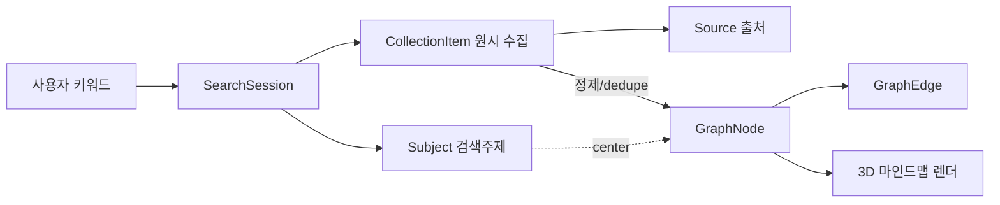
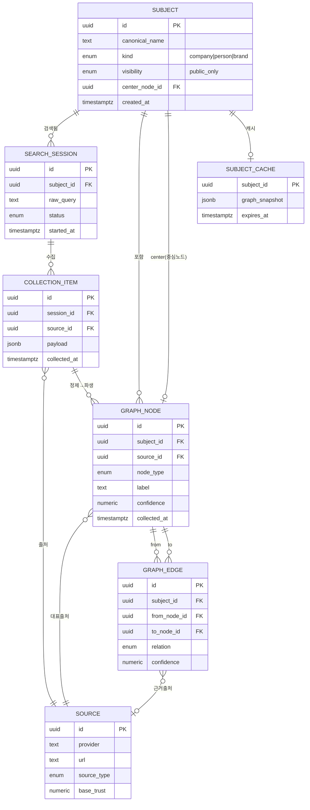
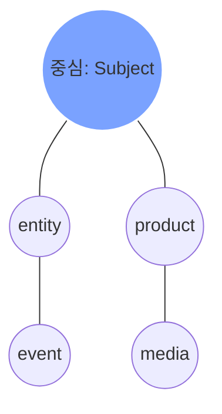

# cerebro — 데이터 모델 (DATA-MODEL)

> **목적**: cerebro의 핵심 엔티티·그래프 표현·출처/신뢰도 보존·`packages/shared` zod 스키마·Supabase Postgres 테이블을 정의하는 데이터 계약(Single Source of Data Contract)이다.
>
> **담당 역할**: Software Architect (Orchestrator/Architect 소유 — `docs/DATA-MODEL.md`)

**관련 문서**
- [Foundation Spec (SSOT)](./foundation/FOUNDATION-SPEC.md)
- [Architecture](./ARCHITECTURE.md)
- [Data Sourcing 전략](./DATA-SOURCING.md)
- [Security / PIPA 가드레일](./SECURITY.md)

- 문서 버전: `0.1.0` · 최종 갱신: 2026-06-25 · 상태: Living Document

---

## 1. 개요 & 설계 원칙

cerebro의 데이터는 **"검색 1회 = 1개의 SearchSession"** 을 중심으로 흐른다. 사용자가 키워드를 입력하면 하나의 `Subject`(검색 주제)가 만들어지고, 하이브리드 수집기가 여러 `Source`에서 `CollectionItem`(원시 수집 항목)을 모은 뒤, 정제 단계에서 이를 `GraphNode`/`GraphEdge`로 변환한다. 화면은 이 그래프를 3D 마인드맵으로 렌더링한다.



### 설계 원칙

| 원칙 | 내용 | 근거 / 트레이드오프 |
|---|---|---|
| 출처 불변 보존 | 모든 노드/엣지는 `source + collectedAt + confidence`를 항상 보유 | 신뢰성·법적 근거 표시 필수(SSOT §8). 약간의 저장 중복 감수 |
| 원시/정제 분리 | `CollectionItem`(원시) → `GraphNode`(정제)로 단계 분리 | 재정제·디버깅 가능. 단일 테이블 대비 조인 비용은 캐시로 상쇄 |
| 그래프는 인접 리스트 | 노드/엣지를 별도 테이블로(그래프 DB 미사용) | MVP 규모(노드 수백~수천)에 Postgres로 충분. YAGNI |
| 개인정보 최소수집 | 공개정보·공인 한정, 민감정보 스키마 자체에 부재 | PIPA(SSOT §5.3). "필드가 없으면 저장 불가" 강제 |
| 캐시 우선 | `Subject` 단위 결과 캐시 + 외부 API 응답 캐시 | 무료 티어 쿼터·속도(SSOT §8). 신선도는 TTL로 관리 |
| zod = 런타임 계약 | `packages/shared`의 zod 스키마가 FE/BE/DB 경계의 진실 | 타입+런타임 동시 보장. DB 컬럼은 스키마에서 파생 |

---

## 2. 핵심 엔티티 관계 (ER 다이어그램)



---

## 3. 엔티티 정의 (필드·타입·관계)

타입 표기는 zod/TS 기준이며, 괄호 안은 대응 Postgres 타입이다. `?` = 선택(nullable).

### 3.1 Subject — 검색 주제(중심)

검색 1건이 가리키는 정규화된 주제. 동일 주제 재검색 시 재사용(캐시 키).

| 필드 | 타입 (TS / PG) | 필수 | 설명 |
|---|---|---|---|
| `id` | `string`(uuid) | Y | PK |
| `canonicalName` | `string` / text | Y | 정규화 표시명 (예: "삼성전자") |
| `slug` | `string` / text | Y | URL/캐시 키용 슬러그, 유니크 |
| `kind` | `'company' \| 'person' \| 'brand'` / enum | Y | 주제 유형 |
| `visibility` | `'public_only'` / enum | Y | **항상 공개정보 한정**(고정값, PIPA) |
| `aliases` | `string[]` / text[] | N | 동의어/이명(검색 매칭) |
| `centerNodeId` | `string?`(uuid) / uuid FK | N | 중심으로 표시할 `GraphNode` |
| `summary` | `string?` / text | N | 주제 한줄 요약(정제 산출) |
| `consentBasis` | `'public_record'` / enum | Y | 개인 대상 시 수집근거 표기(공개기록만) |
| `createdAt` | `string`(ISO) / timestamptz | Y | 최초 생성 |
| `updatedAt` | `string`(ISO) / timestamptz | Y | 최종 갱신 |

- 관계: `1 Subject ─< N GraphNode`, `1 Subject ─< N SearchSession`, `1 Subject ─1 (선택) centerNode`.

### 3.2 SearchSession — 검색 세션

키워드 입력 → 수집 → 정제 → 렌더의 한 사이클. 관측성/재현성의 단위.

| 필드 | 타입 (TS / PG) | 필수 | 설명 |
|---|---|---|---|
| `id` | `string`(uuid) | Y | PK |
| `subjectId` | `string`(uuid) / uuid FK | Y | 대상 주제 |
| `rawQuery` | `string` / text | Y | 사용자가 입력한 원문 키워드 |
| `status` | `'pending'\|'collecting'\|'refining'\|'ready'\|'failed'` / enum | Y | 진행 상태(로딩 연출 동기화) |
| `usedSourceIds` | `string[]`(uuid) / uuid[] | N | 이번 세션이 호출한 출처들 |
| `nodeCount` | `number`(int) | N | 산출 노드 수(요약) |
| `errorCode` | `string?` / text | N | 실패 시 코드(사용자 메시지와 분리) |
| `startedAt` | `string`(ISO) / timestamptz | Y | 시작 시각 |
| `finishedAt` | `string?`(ISO) / timestamptz | N | 종료 시각 |

- 관계: `1 SearchSession ─< N CollectionItem`. 세션은 감사/디버깅용으로 보존하되 PII는 담지 않는다.

### 3.3 Source — 출처

정보가 온 곳. 신뢰도 산정의 기준값(`baseTrust`)을 가진다.

| 필드 | 타입 (TS / PG) | 필수 | 설명 |
|---|---|---|---|
| `id` | `string`(uuid) | Y | PK |
| `provider` | `string` / text | Y | 제공자 식별(예: `naver_search`, `google_pse`, `公공데이터`) |
| `sourceType` | `'official_api'\|'public_web'\|'public_record'` / enum | Y | 수집 채널 분류 |
| `url` | `string?`(url) / text | N | 원문 URL(있으면 표시·역추적) |
| `title` | `string?` / text | N | 출처 문서/페이지 제목 |
| `publisher` | `string?` / text | N | 발행 주체(매체/기관) |
| `baseTrust` | `number`(0~1) / numeric(3,2) | Y | 출처 기본 신뢰도 가중치 |
| `licenseNote` | `string?` / text | N | ToS/라이선스/robots 준수 메모 |
| `fetchedRobotsOk` | `boolean` / bool | Y | robots.txt 허용 확인 여부(웹 수집 시) |

- 관계: `1 Source ─< N CollectionItem`, `1 Source ─< N GraphNode(대표출처)`, `0..1 Source ─< N GraphEdge(근거)`.
- `provider` + `url` 조합으로 dedupe(유니크 인덱스).

### 3.4 CollectionItem — 원시 수집 항목

정제 전 원본. 재정제·감사·신선도 판단의 근거.

| 필드 | 타입 (TS / PG) | 필수 | 설명 |
|---|---|---|---|
| `id` | `string`(uuid) | Y | PK |
| `sessionId` | `string`(uuid) / uuid FK | Y | 수집 세션 |
| `sourceId` | `string`(uuid) / uuid FK | Y | 출처 |
| `rawKind` | `string` / text | Y | 원시 유형 힌트(예: `news`, `app_meta`, `org_profile`) |
| `payload` | `Record<string,unknown>` / jsonb | Y | 출처 원응답(정규화 전). **민감필드 사전 스크럽** |
| `contentHash` | `string` / text | Y | payload 해시(중복/캐시 무효화) |
| `collectedAt` | `string`(ISO) / timestamptz | Y | **수집 시각(불변 보존)** |
| `piiScrubbed` | `boolean` / bool | Y | 민감정보 제거 파이프 통과 표식 |

- 관계: `1 CollectionItem ─< N GraphNode(파생)`. 원시 보존 기간은 TTL 정책(§7)으로 관리.

### 3.5 GraphNode — 노드(구체)

정제된 정보 단위. 3D 구체로 렌더된다. 중심 노드는 `Subject.centerNodeId`로 지정.

| 필드 | 타입 (TS / PG) | 필수 | 설명 |
|---|---|---|---|
| `id` | `string`(uuid) | Y | PK |
| `subjectId` | `string`(uuid) / uuid FK | Y | 소속 주제(그래프) |
| `nodeType` | `'center'\|'entity'\|'attribute'\|'event'\|'product'\|'media'\|'link'` / enum | Y | 노드 분류(색/크기 매핑) |
| `label` | `string` / text | Y | 화면 표시명(짧게) |
| `description` | `string?` / text | N | 상세 패널 본문 |
| `sourceId` | `string`(uuid) / uuid FK | Y | **대표 출처** |
| `derivedFromItemId` | `string?`(uuid) / uuid FK | N | 파생된 원시 항목 |
| `confidence` | `number`(0~1) / numeric(3,2) | Y | **신뢰도**(§6 산식) |
| `collectedAt` | `string`(ISO) / timestamptz | Y | **수집 시각(보존)** |
| `weight` | `number`(0~1) / numeric(3,2) | N | 중요도(구체 크기/허브 정도) |
| `attributes` | `Record<string,unknown>?` / jsonb | N | 부가 정형 속성(예: 카테고리, 수치) |
| `position` | `{x,y,z}?` / jsonb | N | 사전계산 레이아웃(선택, 미지정 시 FE 계산) |

- 관계: `N GraphNode ─< M GraphNode`(엣지 경유), `1 Subject ─1 center`.
- 제약: 한 `Subject`당 `nodeType='center'`는 0..1개(부분 유니크 인덱스).

### 3.6 GraphEdge — 엣지(가지)

노드 간 관계. 방향성 보유(`from → to`), 무방향 표현은 `relation`으로 해석.

| 필드 | 타입 (TS / PG) | 필수 | 설명 |
|---|---|---|---|
| `id` | `string`(uuid) | Y | PK |
| `subjectId` | `string`(uuid) / uuid FK | Y | 소속 그래프 |
| `fromNodeId` | `string`(uuid) / uuid FK | Y | 출발 노드 |
| `toNodeId` | `string`(uuid) / uuid FK | Y | 도착 노드 |
| `relation` | `'related'\|'part_of'\|'owns'\|'mentions'\|'located_at'\|'produced'` / enum | Y | 관계 의미 |
| `confidence` | `number`(0~1) / numeric(3,2) | Y | 관계 신뢰도 |
| `sourceId` | `string?`(uuid) / uuid FK | N | 관계 근거 출처 |
| `collectedAt` | `string`(ISO) / timestamptz | Y | 수집/추론 시각 |

- 제약: `(subjectId, fromNodeId, toNodeId, relation)` 유니크(중복 엣지 방지). 셀프 루프(`from=to`) 금지(CHECK).

---

## 4. 그래프 표현 (노드 / 엣지 / 중심)

- **중심(center)**: `Subject.centerNodeId`가 가리키는 노드 1개. 없으면 FE는 `nodeType='center'` 또는 `weight` 최대 노드를 중심으로 폴백.
- **노드(구체)**: `nodeType`→색/형태, `weight`→크기, `confidence`→불투명도/테두리 강도로 매핑(시각 규칙은 `docs/DESIGN-SYSTEM.md` 소유).
- **엣지(가지)**: `relation`→선 스타일, `confidence`→두께/투명도.
- **렌더 계약(GraphSnapshot)**: API는 노드/엣지 정규화 배열 + 메타를 한 번에 내려 FE가 즉시 그릴 수 있게 한다.



레이아웃(좌표) 산정은 기본적으로 FE(R3F, force-directed)에서 수행한다. 대형 그래프 성능을 위해 BE가 `position`을 사전계산해 캐시에 함께 저장할 수 있다(선택적 최적화, YAGNI까지는 FE 계산 우선).

---

## 5. 출처·신뢰도·수집시각 보존 방식

SSOT §8 요구: **모든 노드는 출처 + 수집시각 + 신뢰도를 보존**한다. 보존은 3계층으로 강제한다.

| 계층 | 보존 대상 | 메커니즘 |
|---|---|---|
| 원시 | `CollectionItem.payload`, `collectedAt`, `sourceId`, `contentHash` | 정제 전 원본을 별도 테이블에 불변 저장 |
| 정제 | `GraphNode.sourceId`, `collectedAt`, `confidence`, `derivedFromItemId` | 정제 시 출처/시각/근거 링크를 노드에 복사(역추적 가능) |
| 표시 | 상세 패널에 `Source.url/title/publisher` + `collectedAt` + `confidence%` | 사용자에게 출처·활용법·신선도 노출(SSOT §1.2) |

- `collectedAt`은 **절대 갱신하지 않는다**(수집 사실의 기록). 데이터 갱신은 새 `CollectionItem`/노드로 표현.
- 노드 단위로 출처가 1개 이상일 수 있으나 MVP는 **대표출처 1개(`sourceId`)**로 단순화. 다중 출처가 필요해지면(3번째 중복 시) `node_sources` 조인 테이블로 확장(향후 ADR).

---

## 6. 신뢰도(confidence) 산정 개요

0~1 범위. 출처 신뢰도와 교차검증 신호를 곱·가중한다(상세 가중치는 BE가 `docs/DATA-SOURCING.md`에서 튜닝).

```
confidence = clamp01(
  baseTrust(source)            # 출처 기본 신뢰도 (official_api > public_record > public_web)
  * recencyFactor(collectedAt) # 최신일수록 ↑ (TTL 기반 감쇠)
  * corroboration(n)           # 동일 사실을 뒷받침한 독립 출처 수 보정
)
```

- 표시: 백분율 + 등급(예: 0.8↑ 높음 / 0.5~0.8 보통 / 미만 낮음). 임계값 미만 노드는 기본 숨김 토글.

---

## 7. 캐시 전략 & 테이블

무료 티어 쿼터·속도 확보를 위해 **2단 캐시**를 둔다.

| 캐시 | 키 | 내용 | TTL(기본) | 목적 |
|---|---|---|---|---|
| `subject_cache` | `subjectId` | 완성 `GraphSnapshot`(노드+엣지+메타 jsonb) | 24h | 동일 주제 재검색 즉시 응답 |
| `source_fetch_cache` | `sourceId + contentHash` 또는 `provider+queryHash` | 외부 API 원응답 | 1~6h(공급자별) | 외부 호출 절감, 쿼터 보호 |

| 컬럼 (subject_cache) | 타입 | 설명 |
|---|---|---|
| `subject_id` | uuid PK FK | 대상 주제 |
| `graph_snapshot` | jsonb | 직렬화된 그래프(렌더 즉시 사용) |
| `etag` | text | 스냅샷 버전(조건부 응답) |
| `built_at` | timestamptz | 생성 시각 |
| `expires_at` | timestamptz | 만료(인덱스, 만료 청소 배치) |

- 무효화: 새 `SearchSession`이 `ready`가 되면 해당 `subject_cache` 갱신. `expires_at` 경과 시 백그라운드 재수집.
- 트레이드오프: 신선도 vs 비용/속도 → 사용자에 "마지막 갱신: collectedAt" 표시로 신선도 투명화.

---

## 8. `packages/shared` zod 스키마 개요 (TS 의사코드)

> FE/BE 공용 계약. DB 컬럼·API 페이로드는 이 스키마에서 파생한다. 실제 구현은 Backend+Frontend가 `packages/shared/src/schemas/`에 둔다(SSOT §3.1).

```ts
// packages/shared/src/schemas/graph.ts  (의사코드)
import { z } from 'zod';

export const Uuid = z.string().uuid();
export const IsoDate = z.string().datetime();          // ISO 8601
export const Confidence = z.number().min(0).max(1);

export const SubjectKind = z.enum(['company', 'person', 'brand']);
export const NodeType = z.enum([
  'center', 'entity', 'attribute', 'event', 'product', 'media', 'link',
]);
export const RelationType = z.enum([
  'related', 'part_of', 'owns', 'mentions', 'located_at', 'produced',
]);
export const SourceType = z.enum(['official_api', 'public_web', 'public_record']);
export const SessionStatus = z.enum([
  'pending', 'collecting', 'refining', 'ready', 'failed',
]);

export const SourceSchema = z.object({
  id: Uuid,
  provider: z.string().min(1),
  sourceType: SourceType,
  url: z.string().url().optional(),
  title: z.string().optional(),
  publisher: z.string().optional(),
  baseTrust: Confidence,
  fetchedRobotsOk: z.boolean(),
});

export const SubjectSchema = z.object({
  id: Uuid,
  canonicalName: z.string().min(1),
  slug: z.string().min(1),
  kind: SubjectKind,
  visibility: z.literal('public_only'),        // PIPA: 고정값
  consentBasis: z.literal('public_record'),     // 개인 대상 수집근거
  aliases: z.array(z.string()).default([]),
  centerNodeId: Uuid.optional(),
  summary: z.string().optional(),
  createdAt: IsoDate,
  updatedAt: IsoDate,
});

export const GraphNodeSchema = z.object({
  id: Uuid,
  subjectId: Uuid,
  nodeType: NodeType,
  label: z.string().min(1).max(120),
  description: z.string().optional(),
  sourceId: Uuid,                               // 대표 출처(필수)
  derivedFromItemId: Uuid.optional(),
  confidence: Confidence,
  collectedAt: IsoDate,                          // 수집시각(필수·불변)
  weight: Confidence.optional(),
  attributes: z.record(z.string(), z.unknown()).optional(),
  position: z.object({ x: z.number(), y: z.number(), z: z.number() }).optional(),
});

export const GraphEdgeSchema = z.object({
  id: Uuid,
  subjectId: Uuid,
  fromNodeId: Uuid,
  toNodeId: Uuid,
  relation: RelationType,
  confidence: Confidence,
  sourceId: Uuid.optional(),
  collectedAt: IsoDate,
}).refine((e) => e.fromNodeId !== e.toNodeId, '셀프 루프 금지');

// API가 FE에 한 번에 내려주는 렌더 계약
export const GraphSnapshotSchema = z.object({
  subject: SubjectSchema,
  nodes: z.array(GraphNodeSchema),
  edges: z.array(GraphEdgeSchema),
  sources: z.array(SourceSchema),               // 노드/엣지가 참조하는 출처 dict
  builtAt: IsoDate,
});

export type Subject = z.infer<typeof SubjectSchema>;
export type GraphNode = z.infer<typeof GraphNodeSchema>;
export type GraphEdge = z.infer<typeof GraphEdgeSchema>;
export type GraphSnapshot = z.infer<typeof GraphSnapshotSchema>;
```

- 민감정보 필드는 **스키마에 존재하지 않음** = 입력되어도 zod `.strict()`/파싱에서 제거·거부(PIPA 강제). 수집 파이프는 `piiScrubbed=true` 전제하에만 노드를 생성.
- `SearchSessionSchema`, `CollectionItemSchema`는 BE 내부용으로 별도 파일(`schemas/session.ts`)에 둔다(FE 비노출).

---

## 9. Supabase Postgres 테이블 개요

명명은 snake_case(Postgres 관례), 컬럼은 §3 스키마에서 파생. RLS는 MVP에서 읽기 공개/쓰기 서비스롤 제한(상세 `docs/SECURITY.md`).

| 테이블 | 핵심 컬럼 | PK | 주요 FK | 인덱스 |
|---|---|---|---|---|
| `subjects` | canonical_name, slug, kind, visibility, center_node_id | id (uuid) | center_node_id→graph_nodes | UNIQUE(slug); idx(kind) |
| `search_sessions` | subject_id, raw_query, status, started_at | id | subject_id→subjects | idx(subject_id, started_at desc); idx(status) |
| `sources` | provider, source_type, url, base_trust, fetched_robots_ok | id | — | UNIQUE(provider, url); idx(source_type) |
| `collection_items` | session_id, source_id, payload(jsonb), content_hash, collected_at, pii_scrubbed | id | session_id→search_sessions, source_id→sources | idx(session_id); UNIQUE(session_id, content_hash) |
| `graph_nodes` | subject_id, node_type, label, source_id, confidence, collected_at, weight | id | subject_id→subjects, source_id→sources, derived_from_item_id→collection_items | idx(subject_id); UNIQUE(subject_id) WHERE node_type='center' |
| `graph_edges` | subject_id, from_node_id, to_node_id, relation, confidence | id | from/to→graph_nodes, source_id→sources | idx(subject_id); UNIQUE(subject_id, from_node_id, to_node_id, relation) |
| `subject_cache` | subject_id, graph_snapshot(jsonb), etag, built_at, expires_at | subject_id | subject_id→subjects | idx(expires_at) |
| `source_fetch_cache` | cache_key, provider, raw_response(jsonb), expires_at | cache_key (text) | — | idx(expires_at); idx(provider) |

### 9.1 제약·정책 요점

- **CHECK**: `graph_edges.from_node_id <> to_node_id`(셀프 루프 금지); `confidence`/`base_trust` 0~1; `subjects.visibility = 'public_only'`.
- **ON DELETE**: `subjects` 삭제 시 하위 `graph_nodes`/`graph_edges`/`search_sessions` CASCADE. 삭제요청(PIPA) 대응 단위 = `Subject`.
- **부분 유니크 인덱스**로 "주제당 중심 노드 1개" 강제(별도 트리거 불필요 — 단순).
- **만료 청소**: `expires_at < now()` 캐시는 cron/edge function로 주기 삭제(무료 티어 용량 보호).
- **타임존**: 모든 시각 `timestamptz`(UTC 저장, 표시 KST 변환은 FE).

### 9.2 마이그레이션/시드 메모

- 마이그레이션은 Supabase migration 파일로 버전관리. enum은 Postgres `CREATE TYPE`로 명시(스키마=zod와 1:1 유지).
- 시드: 대표 `sources`(naver_search, google_pse, 공공데이터 등)와 `base_trust` 초기값을 seed로 등록(플레이스홀더 키는 `.env`, 본문 미기재).

---

## 10. 개인정보 최소수집 반영 (PIPA)

| 가드레일 | 데이터 모델 반영 |
|---|---|
| 공개정보·공인 한정 | `Subject.visibility = 'public_only'`(고정), `consentBasis = 'public_record'` |
| 민감정보 미수집 | 주민번호·연락처·주소·건강·정치성향 등 **대응 필드 부재**. zod 스키마에 없음 = 저장 불가 |
| 수집근거·출처 표기 | 모든 노드 `sourceId + collectedAt + confidence` 필수. 패널 노출 |
| 스크럽 강제 | `collection_items.pii_scrubbed=true` 항목만 노드화 |
| 삭제요청 대응 | 삭제 단위 = `Subject`(CASCADE). 요청 처리 절차는 `docs/SECURITY.md` |

> 결론: "필드를 만들지 않음"으로 민감정보 수집을 **구조적으로 차단**하고, 출처 3계층 보존으로 신뢰성과 법적 근거를 동시에 만족한다.
