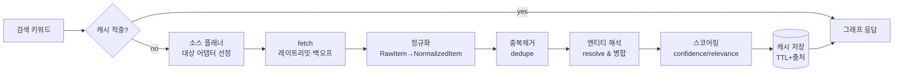

# cerebro — 데이터 수집 전략 (DATA-SOURCING)

> **목적**: cerebro의 하이브리드 데이터 수집(공식 API 우선 + robots.txt 준수 공개데이터)의 소스·합법성·파이프라인·레이트리밋·어댑터 설계를 SSOT로 정의한다.
> **담당 역할**: Backend Engineer (`apps/api`, `packages/shared` 계약)
> **관련 문서**: [Foundation Spec (SSOT)](./foundation/FOUNDATION-SPEC.md) · [ARCHITECTURE](./ARCHITECTURE.md) · [DATA-MODEL](./DATA-MODEL.md) · [SECURITY](./SECURITY.md) · [PRD](./PRD.md)

- 문서 버전: `0.1.0` · 최종 갱신: 2026-06-25 · 상태: Living Document
- 충돌 시 [FOUNDATION-SPEC](./foundation/FOUNDATION-SPEC.md)이 우선한다.

---

## 1. 수집 원칙 (요약)

1. **공식 API 우선.** 우회/스크래핑은 공식 API가 없거나 부족할 때, ToS·robots.txt 준수 범위에서만 보강한다.
2. **합법성 우선.** 인증벽(로그인) 통과·CAPTCHA 우회·robots.txt `Disallow` 위반·ToS 명시적 금지 항목은 **하지 않는다.**
3. **출처 보존.** 모든 노드/엣지는 `source + fetchedAt + sourceUrl + license/근거 + confidence`를 보존한다(출처 없는 데이터는 그래프에 올리지 않는다).
4. **PIPA 가드레일.** 개인은 공개정보/공인 한정, 민감정보 제외, 삭제요청 대응(§8).
5. **무료 운영.** 캐시·쿼터·백오프로 무료 티어 내 운영. 쿼터 초과 시 degrade(부분 결과 + 출처).

---

## 2. 소스별 합법성 / 난이도 / 가치 매트릭스

> 가치 = MVP 그래프 품질 기여도. 난이도 = 구현·운영 비용. MVP 채택 = §6 우선순위.

| 소스 | 접근 방식 | 합법성 | 난이도 | 가치 | 무료 쿼터(개략) | MVP |
|---|---|---|---|---|---|---|
| **네이버 검색 API** (블로그/뉴스/웹/지식인/책) | 공식 REST API(OpenAPI) | 높음(ToS 내 무료) | 낮음 | 높음 | 25,000 호출/일(앱당) | **P0** |
| **네이버 지역(지역검색) API** | 공식 REST API | 높음 | 낮음 | 높음(기업 위치/업종) | 검색 API 쿼터 공유 | **P0** |
| **Google Programmable Search (Custom Search JSON)** | 공식 REST API | 높음 | 낮음 | 높음(웹 보강) | 100 쿼리/일 무료, 초과 유료 | **P1** |
| **Apple App Store** (iTunes Search/Lookup) | 공식 공개 API(키 불요) | 높음 | 낮음 | 중(앱 보유 기업) | 비공식 ~20 req/min 권고 | **P1** |
| **Google Play** | 공식 공개 API 없음 → 우회 필요 | 낮음(ToS 위험) | 높음 | 중 | — | **보류** |
| **공공데이터포털**(사업자/기업 공시 등) | 공식 REST API | 높음(공공) | 중 | 중~높음 | API별 상이(대개 일 1,000~10,000) | **P2** |
| **블로그/커뮤니티 본문** | 네이버 API 메타 우선, 필요 시 robots 준수 fetch | 조건부 | 중 | 중 | — | **P2(메타만)** |
| **SNS(X/Instagram 등) 공개 데이터** | 공식 API 유료/제한, 스크래핑 ToS 금지 | 낮음 | 높음 | 중 | 사실상 무료 불가 | **보류** |
| **위키백과/위키데이터** | 공식 API(MediaWiki/SPARQL) | 높음(CC) | 낮음 | 높음(엔티티 해석·요약) | 관대(에티켓 준수) | **P1** |

**해석**: MVP는 *합법성 높음 + 난이도 낮음 + 가치 높음* 교집합(네이버 검색/지역, 위키, Google PSE, App Store)으로 출발. Google Play·SNS는 ToS/합법성 리스크로 보류하고, 필요 시 공식 유료 API 또는 파트너십으로만 재검토한다.

---

## 3. 소스별 접근 방식 상세

### 3.1 네이버 검색 / 지역 API (P0)
- **엔드포인트**: `openapi.naver.com/v1/search/{blog|news|webkr|kin|book}.json`, 지역은 `/v1/search/local.json`.
- **인증**: 헤더 `X-Naver-Client-Id` / `X-Naver-Client-Secret` (값은 `.env`·시크릿 매니저, 본문 노출 금지).
- **합법성**: 공식 ToS 내 무료 사용. 결과 재배포 시 출처 표기. 지역 API는 `display` 최대 5, 검색 API는 최대 100/요청.
- **쿼터**: 앱당 일 25,000 호출(전 검색 API 합산). → 캐시 필수.
- **취득 데이터**: 제목/요약/링크/날짜/(지역) 주소·카테고리·좌표. **본문 전체는 미제공** → 본문 필요 시 §3.6.

### 3.2 Google Programmable Search Engine (P1)
- **엔드포인트**: `customsearch/v1` (API Key + `cx` 검색엔진 ID).
- **합법성**: 공식 API. 무료 100쿼리/일, 초과 시 1,000쿼리당 과금(상한 설정으로 비용 가드).
- **용도**: 네이버가 약한 글로벌/영문/공식 사이트 보강. MVP에서는 일 쿼터 내 보조 호출만.

### 3.3 Apple App Store — iTunes Search/Lookup (P1)
- **엔드포인트**: `itunes.apple.com/search`, `/lookup`. 키 불요.
- **합법성**: 공식 공개 API. 단 비공식 레이트(분당 ~20) 가이드 존중 → 보수적 백오프.
- **용도**: 기업의 앱 보유 여부·평점·카테고리를 노드로 추가(예: "당근마켓 → 앱 → 평점 4.x").

### 3.4 위키백과 / 위키데이터 (P1)
- **엔드포인트**: MediaWiki REST/Action API, 위키데이터 `wbsearchentities` + SPARQL.
- **합법성**: CC BY-SA. 출처·라이선스 표기 의무. User-Agent에 연락처 명시(에티켓).
- **용도**: **엔티티 해석의 기준점**(동명이인/회사명 정규화), 요약·설립연도·산업 등 구조화 속성.

### 3.5 공공데이터포털 (P2)
- 사업자/기업 기본정보·공시 등 공식 OpenAPI. 인증키 발급. API별 쿼터 상이.
- 신뢰도 높은 정형 데이터 → `confidence` 가중치 상향.

### 3.6 블로그/커뮤니티 본문 (P2, 메타 우선)
- 1차는 네이버 API의 메타(제목/요약/링크)만 사용 → **본문 fetch 회피가 기본값.**
- 본문이 꼭 필요할 때만, 대상 도메인 `robots.txt`를 파서로 확인 후 `Allow` 경로만, `User-Agent: cerebro-bot (+연락처)`로 저빈도 fetch. `noindex`/로그인/페이월/`Disallow`는 즉시 중단.

### 3.7 보류 소스 (Google Play, SNS)
- 공식 무료 API 부재 + ToS가 스크래핑을 금지 → **수집하지 않는다.** 사용자에게는 "해당 출처 미지원"으로 명시(거짓 빈칸 금지). 추후 공식/유료 경로만 재평가.

---

## 4. 수집 파이프라인



| 단계 | 입력 → 출력 | 핵심 책임 | 비고 |
|---|---|---|---|
| **fetch** | Query → `RawItem[]` | 어댑터별 HTTP 호출, 레이트리밋·재시도(§5) | 실패 소스는 부분 degrade |
| **정규화** | `RawItem` → `NormalizedItem` | 소스 스키마 → 공용 스키마(zod 검증), 출처 메타 부착 | `packages/shared` 계약 |
| **중복제거** | `NormalizedItem[]` → 유니크 | URL 정규화 + 제목 유사도(simhash/소문자·공백 정규화) | 동일 콘텐츠 다출처는 출처 배열로 병합 |
| **엔티티 해석** | items → `Entity` + 관계 | 위키데이터 기준 정규화, 동명이인 분기, 별칭 매핑 | 신뢰 소스 우선 병합 |
| **스코어링** | Entity/Edge → score | `confidence`(소스 신뢰도)×`relevance`(쿼리 매칭)×`recency` | 노드 노출 우선순위·LOD 입력 |
| **캐시** | 결과 → store | 쿼리 단위 캐시(TTL) + 원본 RawItem 보존(재처리·근거) | 무료 운영 핵심 |

### 4.1 캐시 정책
- **2계층**: (1) 쿼리 결과 캐시(완성 그래프, TTL 짧게 6~24h), (2) 소스 응답 캐시(RawItem, TTL 길게 7~30d, ETag/조건부 요청).
- **저장소(MVP)**: Supabase Postgres 테이블(`source_cache`, `entity`, `edge`, `provenance`). 인메모리 LRU는 단일 인스턴스 핫 캐시로만(콜드스타트 고려, 진실은 DB).
- **무효화**: TTL + 수동 퍼지(삭제요청·정정 시, §8).

---

## 5. 레이트리밋 · 백오프 · 재시도

| 항목 | 정책 |
|---|---|
| **클라이언트 레이트리밋** | 소스별 토큰버킷(예: 네이버 ≤ 안전 마진으로 일 쿼터의 80%, App Store ~15 req/min). 동시성 캡(소스별 `maxConcurrency`). |
| **재시도 대상** | `429`, `5xx`, 네트워크 타임아웃만. `4xx`(400/401/403/404)는 재시도 금지(설정/권한 문제). |
| **백오프** | 지수 백오프 + 지터: `delay = min(base * 2^attempt, cap) ± jitter`. base 500ms, cap 20s, 최대 3회. |
| **`Retry-After` 존중** | 응답 헤더 있으면 그 값 우선. |
| **회로차단(circuit breaker)** | 연속 실패 임계 초과 시 해당 소스 일시 차단 → 부분 결과로 degrade, 사용자에 "일부 출처 지연" 고지. |
| **타임아웃** | 소스별 `timeoutMs`(기본 5s). 전체 요청 예산(예: 8s) 초과분은 잘라내고 부분 응답. |
| **쿼터 추적** | 소스별 일/분 카운터를 DB·메모리에 기록, 잔여 임계 미만이면 캐시-only 모드. |

---

## 6. MVP 우선 소스 선정 & 근거

| 우선 | 소스 | 근거 |
|---|---|---|
| **P0** | 네이버 검색 + 지역 API | 한국어 전용 MVP의 커버리지·품질 최상, 무료 쿼터 넉넉, 구현 난이도 낮음, ToS 명확. |
| **P0** | 위키데이터/위키백과 | 엔티티 해석·정규화의 기준점(동명이인·회사명 표준화). 합법성·라이선스 명확. |
| **P1** | Apple App Store, Google PSE | 보강 가치 명확하나 쿼터/비용 가드 필요 → 캐시 우선·쿼터 내 보조 호출. |
| **P2** | 공공데이터포털, 블로그/커뮤니티 메타 | 신뢰도/풍부함 ↑이나 API별 편차·robots 점검 비용. 안정화 후 단계 투입. |
| **보류** | Google Play, SNS 스크래핑 | 공식 무료 API 부재 + ToS 위반 리스크. 합법 경로 확보 전 미수집. |

**선정 기준**: (1) 합법성(ToS/robots) 명확, (2) 한국어 MVP 가치, (3) 무료 쿼터·구현 난이도. → P0만으로 의미 있는 그래프가 나오도록 설계하고 P1+는 점진 보강.

---

## 7. 어댑터 패턴 (SourceAdapter)

소스별 차이를 어댑터로 캡슐화해 파이프라인은 단일 인터페이스만 의존한다(개방-폐쇄: 소스 추가 = 어댑터 추가). 계약은 `packages/shared`에 zod 스키마로 둔다.

```ts
// packages/shared 계약 (발췌 — 실제 zod 스키마는 shared에 정의)
export interface SourceAdapter {
  /** 소스 식별자 (예: "naver-search", "wikidata") */
  readonly id: SourceId;
  /** 합법성/쿼터/카테고리 메타 */
  readonly meta: { legalBasis: 'official-api' | 'public-robots'; categories: EntityCategory[] };

  /** 이 쿼리를 이 소스가 다룰 수 있는가 (플래너용) */
  canHandle(query: SearchQuery): boolean;

  /** 원시 데이터 수집 (레이트리밋/백오프는 공통 미들웨어가 래핑) */
  fetch(query: SearchQuery, ctx: FetchContext): Promise<RawItem[]>;

  /** 소스 스키마 → 공용 NormalizedItem (출처 메타 부착, zod 검증) */
  normalize(raw: RawItem): NormalizedItem[];

  /** 소스별 쿼터/레이트 한도 */
  readonly limits: { dailyQuota?: number; ratePerMin?: number; maxConcurrency: number; timeoutMs: number };
}
```

- **공통 미들웨어**: `withRateLimit`, `withRetry`, `withCache`로 어댑터를 감싸 횡단 관심사를 분리(어댑터는 순수 fetch/normalize만).
- **레지스트리**: `AdapterRegistry`가 `id→adapter`를 보유, 플래너가 `canHandle`로 대상 선별.
- **테스트 용이성**: `FetchContext`에 `httpClient` 주입 → Vitest에서 모킹. 어댑터는 부수효과 격리(§4 코딩표준).

---

## 8. PIPA 가드레일 (개인 공개정보)

> 개인 대상은 **공개정보/공인 한정.** 위반 가능성 있는 데이터는 *수집 단계에서 차단*한다(저장 후 필터링이 아니라 fetch/normalize 게이트).

| 가드 | 규칙 |
|---|---|
| **공개정보 한정** | 공식 프로필·언론보도·공시 등 *이미 합법적으로 공개된* 정보만. 로그인·비공개·페이월 뒤 데이터 금지. |
| **공인 판별** | 개인 검색은 공인(임원/대표/공직자/연예인 등) 시그널이 있을 때만 그래프화. 시그널 없으면 인물 노드 미생성. |
| **민감정보 제외** | 주민번호·연락처·집주소·이메일·생체·건강·정치/종교/성적지향 등은 **수집·저장·표시 전면 금지.** 정규화 단계에서 정규식·필드 화이트리스트로 차단. |
| **출처·근거 보존** | 모든 개인 관련 노드에 `sourceUrl + fetchedAt + legalBasis`(공개근거) 필수. 없으면 폐기. |
| **삭제요청 대응** | 삭제/정정 요청 접수 채널(이메일·폼) 운영. 요청 시 해당 엔티티·캐시·provenance를 **하드 삭제 + 재수집 차단 리스트(블록리스트) 등록.** SLA 명시(예: 영업일 기준 처리). |
| **최소수집** | 그래프 표현에 불필요한 필드는 수집하지 않는다(목적 외 수집 금지). |
| **감사 로그** | 수집·삭제 이벤트를 구조적 로그로 남겨 대응 이력 추적. |

> 상세 위협모델·정책 게이트는 [SECURITY](./SECURITY.md)와 연계. 본 문서는 *수집 파이프라인 내 차단 지점*을 정의한다.

---

## 9. 컴플라이언스 체크리스트 (소스 추가 시)

- [ ] 공식 API 존재 여부 확인 — 있으면 우선 사용.
- [ ] ToS에서 스크래핑/재배포/캐시 허용 여부 확인.
- [ ] `robots.txt` 파싱 — 대상 경로 `Allow` 확인, `Disallow` 미접근.
- [ ] 무료 쿼터·과금 상한 설정(비용 가드).
- [ ] User-Agent에 봇 식별자 + 연락처 명시.
- [ ] PIPA: 개인 데이터면 §8 게이트 통과 여부.
- [ ] 출처 메타(`source/url/fetchedAt/license`) 정규화 매핑 완료.
- [ ] 어댑터 단위 테스트(모킹 fetch) 작성.

---

## 10. 미해결 / 후속 (ADR 후보)

- 엔티티 해석 알고리즘 상세(임계값·병합 규칙) → `docs/adr/`로 분리 결정.
- 캐시 TTL 수치 튜닝(소스별 신선도 vs 쿼터) → 운영 데이터 후 조정.
- Google PSE 비용 상한·일 쿼터 분배 정책 확정(P1 진입 시).
