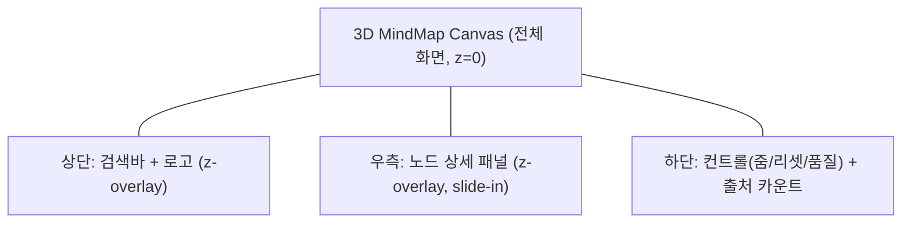

# cerebro — 디자인 시스템 (Design System)

> **목적**: cerebro의 디자인 토큰·컴포넌트·3D 비주얼 규칙을 단일 진실원으로 정의해, 디자이너·프론트엔드가 같은 언어로 일관된 "세레브로" 경험을 만들게 한다.
>
> **담당 역할**: UI/UX Designer · **소유 경로**: `docs/DESIGN-SYSTEM.md`, `apps/web/**`(Frontend Engineer 공동)

**관련 문서**: [Foundation Spec (SSOT)](./foundation/FOUNDATION-SPEC.md) · [PRD](./PRD.md) · [Architecture](./ARCHITECTURE.md) · [UX Spec](./UX-SPEC.md) · [Roadmap](./ROADMAP.md) · [Data Sourcing](./DATA-SOURCING.md)

- 문서 버전: `0.1.0` · 최종 갱신: 2026-06-25 · 상태: Living Document

---

## 0. 디자인 원칙 (Design Tenets)

1. **어둠 속의 신경망**: 깊은 다크 베이스 위에 데이터만 빛난다. 화면 대부분은 어둡고, 정보(노드·라벨·CTA)가 광원이 된다 — *Cerebro* 방의 은유.
2. **정보가 주인공, UI는 그림자**: 패널/툴바는 반투명·저채도로 물러나고, 3D 그래프와 콘텐츠가 시각 위계의 최상단.
3. **모션은 의미를 전달할 때만**: 장식적 모션 금지. 연결·집중·상태 전이를 설명하는 모션만 허용. `prefers-reduced-motion` 1급 시민.
4. **접근성은 기본값**: 모든 텍스트 WCAG AA, 키보드 완전 탐색, 색에만 의존하지 않는 표시(색+아이콘+라벨).
5. **확장 가능한 토큰**: 모든 값은 CSS 변수/토큰으로. 라이트모드·en/ja는 토큰 재바인딩만으로 대응(§12).

---

## 1. 컬러 팔레트

### 1.1 다크 베이스 (Surface Ramp)

깊은 청록빛 블랙에서 시작하는 단일 색조 램프. 패널은 베이스 위에 한 단계씩 밝아진다.

| 토큰 | HEX | 용도 |
|---|---|---|
| `--c-bg-void` | `#05060A` | 최하단 배경(3D 캔버스 뒤, 무한 공간감) |
| `--c-bg-base` | `#0A0D14` | 앱 기본 배경 |
| `--c-surface-1` | `#11151F` | 패널·카드 1단계 |
| `--c-surface-2` | `#192030` | 패널 헤더·호버 상승 |
| `--c-surface-3` | `#232C40` | 입력 필드·선택 상태 |
| `--c-border` | `#2C3650` | 1px 보더(저대비, 구획용) |
| `--c-border-strong` | `#3C496B` | 포커스 외곽·강조 보더 |

### 1.2 뉴럴 글로우 액센트 (Neural Glow)

브랜드 시그니처. 청록(primary)을 중심으로, 글로우/하이라이트 변형을 둔다.

| 토큰 | HEX | 용도 |
|---|---|---|
| `--c-accent` | `#37E0D8` | 주 액센트(중심 노드, 주요 CTA, 포커스) |
| `--c-accent-hi` | `#7FF3EE` | 호버/활성 밝은 변형 |
| `--c-accent-dim` | `#1E8C88` | 비활성/보조 액센트 |
| `--c-accent-glow` | `rgba(55,224,216,0.45)` | 글로우/그림자(box-shadow, 3D bloom 틴트) |
| `--c-accent-2` | `#A98BFF` | 보조 액센트(연보라, 관계선·선택 보강) |

> **근거/트레이드오프**: 청록은 다크 위에서 명도 확보가 쉽고(대비 ↑) "전기적 신경" 톤과 맞다. 단일 액센트 + 1보조로 제한해 카테고리색(§1.4)과 충돌·산만함을 막는다. 빨강 계열은 의미색(위험)에 예약.

### 1.3 텍스트 & 의미색 (Semantic)

| 토큰 | HEX | 용도 / 대비(§2) |
|---|---|---|
| `--c-text-hi` | `#F2F5FA` | 본문/제목 (vs base 16.8:1, AAA) |
| `--c-text-mid` | `#AEB7C8` | 보조 텍스트 (vs base 7.4:1, AA) |
| `--c-text-lo` | `#7C8699` | 캡션/플레이스홀더 (vs base 4.6:1, AA 14px+) |
| `--c-text-on-accent` | `#04201E` | 액센트 버튼 위 텍스트 (vs accent 9.1:1) |
| `--c-success` | `#3FD68A` | 성공·고신뢰도 출처 |
| `--c-warning` | `#F2B847` | 주의·중신뢰도·쿼터 경고 |
| `--c-danger` | `#FF6B6B` | 오류·삭제·저신뢰도 |
| `--c-info` | `#5BB6FF` | 정보·중립 안내 |

### 1.4 노드 카테고리 색 (Data Categories)

PRD §5.3 / DATA-MODEL 카테고리(제품·뉴스·인물·채널·평판 등)에 1:1 매핑. 색은 다크 위 채도·명도를 맞춰 동등 가시성을 갖도록 조정.

| 카테고리 | 토큰 | HEX | 아이콘 보조(색맹 대비) |
|---|---|---|---|
| 중심(검색어) | `--c-cat-center` | `#37E0D8` | ◎ 동심원 |
| 제품/서비스 | `--c-cat-product` | `#5BD1FF` | ▢ 큐브 |
| 뉴스/이슈 | `--c-cat-news` | `#F2B847` | ▲ 신문 |
| 인물 | `--c-cat-person` | `#A98BFF` | ● 인물 |
| 채널/SNS | `--c-cat-channel` | `#FF8FB1` | ◇ 링크 |
| 평판/리뷰 | `--c-cat-reputation` | `#3FD68A` | ★ 별 |
| 관련 개념 | `--c-cat-concept` | `#8AA0FF` | # 태그 |
| 활용 관점 | `--c-cat-usage` | `#FF9F5A` | 💡 전구 |
| 기타/미분류 | `--c-cat-misc` | `#8A93A8` | ○ 점 |

> **규칙**: 색은 보조 단서다. 노드는 **색 + 카테고리 아이콘 + 라벨**로 항상 식별 가능해야 한다(색맹·저대비 환경 대응, 원칙 4).
>
> **구현 정합(ADR-0006)**: 위 HEX는 `apps/web/src/lib/colors.ts`의 `NODE_COLORS`가 SSOT로 미러링하며 패리티 테스트로 고정한다. `관련 개념(#8AA0FF)`은 person(보라)과 구분되는 청보라로 신규 등록. 평판(`#3FD68A`)=success, 뉴스(`#F2B847`)=warning과의 색상 충돌은 의도된 것(아이콘+라벨로 식별).

---

## 2. 명도 대비 (WCAG)

| 대상 | 기준 | 정책 |
|---|---|---|
| 본문 텍스트(<18.66px) | AA 4.5:1 | `--c-text-hi/mid`만 사용, `-lo`는 14px+ 보조에 한정 |
| 대형 텍스트(≥24px or ≥18.66px bold) | AA 3:1 | 제목/배지 허용 폭 넓음 |
| UI 컴포넌트·아이콘·포커스링 | AA 3:1 | 보더·아이콘은 `--c-border-strong` 이상 |
| 액센트 버튼 위 텍스트 | AA 4.5:1 | `--c-text-on-accent` 고정 |

**3D 라벨 예외 처리**: 캔버스 위 노드 라벨은 배경 휘도가 가변이라 대비 보장이 어렵다 → **라벨에 반투명 다크 칩(scrim) 배경**(`--c-surface-1` α0.8)을 깔아 텍스트 대비를 고정한다. 호버 시에만 라벨 노출(상시 노출은 LOD로 거리별 제한).

**검증**: 토큰 변경 PR은 대비 자동 체크(예: axe / Lighthouse) 통과를 게이트로 한다. 신규 색 추가 시 위 표 기준 미달이면 머지 불가.

---

## 3. 타이포그래피

### 3.1 폰트 후보 (한글 가독 우선)

| 역할 | 1순위 | 대안 | 근거 |
|---|---|---|---|
| 본문/UI(Sans) | **Pretendard Variable** | Wanted Sans, 시스템 `-apple-system`/`Noto Sans KR` | 한·영·숫자 일관, 가변폰트로 굵기 무료 확장, 자유 라이선스, 다크 화면 가독 우수 |
| 숫자/데이터(Mono 선택) | **JetBrains Mono** | `ui-monospace` | 신뢰도·수집시각 등 표 정렬 가독 |
| 디스플레이(선택) | Pretendard 700/800 | — | 별도 디스플레이체 미도입(YAGNI). 무게로 위계 표현 |

> **로딩 전략**: 가변폰트 1종(Pretendard)로 시작, `font-display: swap`, 한글 서브셋·preload로 초기 로드 예산(§NFR <3s) 보호. en/ja 확장 시 Pretendard는 라틴 커버, ja는 추후 `Noto Sans JP` 스택 추가(§12).

### 3.2 타입 스케일 (1.25 Major Third, base 16px)

| 토큰 | rem / px | line-height | 용도 |
|---|---|---|---|
| `--fs-2xs` | 0.694 / 11 | 1.4 | 배지·캡션 |
| `--fs-xs` | 0.8 / 13 | 1.5 | 메타·툴팁 |
| `--fs-sm` | 0.875 / 14 | 1.55 | 보조 본문 |
| `--fs-base` | 1 / 16 | 1.6 | 본문 |
| `--fs-md` | 1.25 / 20 | 1.45 | 패널 제목 |
| `--fs-lg` | 1.563 / 25 | 1.3 | 섹션 헤더 |
| `--fs-xl` | 1.953 / 31 | 1.2 | 검색 결과 타이틀 |
| `--fs-2xl` | 2.441 / 39 | 1.15 | 히어로/랜딩 |

**굵기**: `--fw-regular:400` · `--fw-medium:500` · `--fw-semibold:600` · `--fw-bold:700`.
**한글 가독 보정**: 본문 `letter-spacing: -0.01em`(한글 자간 약간 좁힘), line-height ≥1.6(받침 가독). 영문 전용 줄은 자간 0.

---

## 4. 스페이싱 & 레이아웃 그리드

### 4.1 스페이싱 스케일 (4px 베이스)

| 토큰 | px | | 토큰 | px |
|---|---|---|---|---|
| `--sp-1` | 4 | | `--sp-6` | 24 |
| `--sp-2` | 8 | | `--sp-8` | 32 |
| `--sp-3` | 12 | | `--sp-10` | 40 |
| `--sp-4` | 16 | | `--sp-12` | 48 |
| `--sp-5` | 20 | | `--sp-16` | 64 |

### 4.2 레이아웃 모델

cerebro는 **풀스크린 3D 캔버스 + 부유(floating) 오버레이** 구조다(전통적 컬럼 그리드보다 오버레이 레이어가 핵심).



| 항목 | 값 | 비고 |
|---|---|---|
| 컨테이너 패딩 | `--sp-4`(모바일) / `--sp-6`(데스크톱) | 세이프에어리어(`env(safe-area-inset)`) 합산 |
| 상세 패널 폭 | 데스크톱 `min(420px, 38vw)` / 모바일 바텀시트 전체폭 | §11 반응형 |
| 오버레이 최대폭 | 검색바 `640px` 중앙 정렬 | |
| 코너 라운드 | `--radius-sm:8` · `--radius-md:12` · `--radius-lg:16` · `--radius-pill:999` | |

**브레이크포인트**: `--bp-sm:480` · `--bp-md:768` · `--bp-lg:1024` · `--bp-xl:1440`.
**z-index 토큰**: `--z-canvas:0` · `--z-overlay:10` · `--z-panel:20` · `--z-toast:30` · `--z-modal:40` · `--z-tooltip:50`.

---

## 5. 모션 원칙

### 5.1 이징 & 지속시간 토큰

| 토큰 | 값 | 용도 |
|---|---|---|
| `--ease-standard` | `cubic-bezier(0.2, 0, 0, 1)` | 진입/이동(감속 강조) |
| `--ease-emphasized` | `cubic-bezier(0.3, 0, 0, 1)` | 패널 슬라이드 등 큰 전이 |
| `--ease-exit` | `cubic-bezier(0.4, 0, 1, 1)` | 사라짐(가속) |
| `--ease-spring` | spring(stiffness 220, damping 26) | 노드 선택·포커스(R3F/물리 느낌) |
| `--dur-1` | 120ms | 호버·마이크로 피드백 |
| `--dur-2` | 200ms | 버튼·토글·툴팁 |
| `--dur-3` | 320ms | 패널 슬라이드·페이드 |
| `--dur-4` | 600ms | 카메라 이동·노드 재배치 |

### 5.2 모션 규칙

- **방향성**: 상세 패널은 콘텐츠가 있는 쪽(우측)에서 진입. 노드 선택 시 카메라가 대상으로 **부드럽게 도킹**(`--dur-4` + spring).
- **연결 강조**: 노드 호버 시 인접 엣지가 액센트로 **펄스 1회**(의미: "이게 연결돼 있다"). 무한 루프 애니메이션 금지(원칙 3).
- **로딩 연출(Cerebro Loading)**: 회색 인간 형상이 스쳐가는 X맨식 연출(PRD §5.2). 수집 지연을 흡수하는 "의미 있는" 모션이므로 허용. 단 GPU 부담 큰 효과는 모바일에서 자동 축소(§11).

### 5.3 `prefers-reduced-motion` (1급 시민)

| 일반 | reduced-motion 대체 |
|---|---|
| Cerebro 로딩 연출(형상 이동) | 정적 그라데이션 + 진행 텍스트("정보 수집 중…") + 결정적 프로그레스 |
| 카메라 도킹/노드 재배치 | 즉시 점프(0ms) 또는 ≤80ms 페이드 |
| 엣지 펄스 | 색 변경만(이동/스케일 없음) |
| 패널 슬라이드 | 페이드 인(transform 없음) |

> 구현 가이드: 전역 `@media (prefers-reduced-motion: reduce)`에서 `--dur-*`를 0/최소로 재바인딩 + R3F 애니메이션 분기. 접근성 Exit Criteria(ROADMAP M1).

---

## 6. 3D 비주얼 가이드 (R3F)

> three / @react-three/fiber / drei 기준(ARCHITECTURE §2). 인스턴싱·LOD로 60fps 지향.

### 6.1 노드(구체) 머티리얼

| 속성 | 값/방향 | 비고 |
|---|---|---|
| 지오메트리 | Icosphere(중·근접) → 저폴리(원거리 LOD) | `InstancedMesh`로 일괄 렌더 |
| 머티리얼 | `MeshStandardMaterial` 베이스 + emissive | 카테고리색=base, emissive=동색 약하게 |
| Emissive 강도 | 중심 1.2 / 가지 0.4~0.7(신뢰도·관련도 가중) | 신뢰도 높을수록 더 밝게 = 시각적 신뢰 |
| 표면 | metalness 0.1, roughness 0.45 | 매트한 발광체(거울 반사 피함) |
| 크기 | 중심 1.0 / 가지 0.45~0.7(가중) | `MAX_NODES` 내 상대 스케일 |

### 6.2 글로우 / 블룸 / 엣지

- **Bloom(postprocessing)**: 임계값 위 발광만 번지게. threshold 0.6, intensity 0.7(모바일 0.3 또는 off). 액센트/카테고리 emissive가 광원이 되어 "신경 발광" 연출.
- **선택/호버**: 선택 노드는 emissive +0.5 & Fresnel 림 라이트(`--c-accent-hi`). 호버는 미세 스케일 1.06 + 림.
- **엣지(가지)**: `Line2`/튜브, 베이스 `--c-border-strong`(저강도). 활성 경로만 `--c-accent`/`--c-accent-2` 그라데이션 + 흐름 점(요청 시). 두께는 관계 강도에 비례.

### 6.3 뎁스 큐 (Depth Cues)

깊이감 = "Cerebro 방"의 무한 공간 표현의 핵심.

| 큐 | 적용 |
|---|---|
| Fog(거리 안개) | 원거리 노드를 `--c-bg-void`로 페이드 → 무한 공간감 + 원경 클러터 감소 |
| LOD | 거리별 폴리·라벨·블룸 단계 축소(성능 + 집중) |
| DOF(피사계 심도) | 선택 노드 포커스, 주변 약하게 블러(데스크톱 한정, 모바일 off) |
| 시차 별가루 | 옅은 파티클 배경, 카메라 이동 시 패럴럭스(아주 약하게) — reduced-motion에선 정적 |
| 명도 원근 | 가까운 노드 emissive↑/크기↑, 먼 노드↓ |

> **트레이드오프**: Bloom+DOF+Fog는 시각적 임팩트가 크지만 GPU 비용. NFR 성능 예산(60fps/저사양 폴백)에 맞춰 **품질 티어**(고/중/저)로 토글하고 저사양은 중심+상위 가지만, 블룸·DOF off(§11, AC-8).

---

## 7. 컴포넌트 인벤토리

| 컴포넌트 | 변형(Variants) | 핵심 상태 | 토큰/접근성 메모 |
|---|---|---|---|
| **Button** | primary(accent) / secondary(surface) / ghost / icon / danger | default·hover·active·focus-visible·disabled·loading | 높이 40(md)/32(sm), `--radius-md`, focus-visible 2px `--c-accent` 외곽, 최소 터치 44×44 |
| **SearchBar** | hero(랜딩 대형) / compact(상단 고정) | empty·typing·submitting·error·with-suggestions | `--fs-md`, 좌측 search 아이콘, 우측 클리어/제출, Enter 제출, `role=search`+라벨, 추천 드롭다운 키보드 탐색 |
| **Panel (NodeDetail)** | right-drawer(데스크톱) / bottom-sheet(모바일) | open·closing·loading·empty | `--c-surface-1` α0.92 + backdrop-blur, slide-in(§5), `role=dialog` `aria-modal` 아님(비차단), Esc 닫기, 포커스 트랩 약식 |
| **Tooltip** | top/bottom/left/right | — | scrim 칩 배경(§2), `--fs-xs`, hover/focus 트리거, 200ms 지연 노출, 모바일은 long-press |
| **Badge** | category(노드 카테고리색) / trust(고/중/저) / source / count | — | `--radius-pill`, 색+아이콘+라벨(색 단독 금지), trust=success/warning/danger 매핑 |
| **Loader** | cerebro(풀스크린 연출) / inline-spinner / skeleton / progress | indeterminate·determinate | cerebro는 reduced-motion 정적 폴백(§5.3), inline은 액센트 회전, 패널 콘텐츠는 skeleton |
| **Toast** | info/success/warning/danger | enter·auto-dismiss·persistent | 하단 중앙, `--z-toast`, `aria-live=polite`(에러는 assertive), 5s 자동 + 닫기 |
| **EmptyState** | no-result / error / blocked(PIPA) | — | 일러스트 + 안내 + 추천 검색어 CTA(PRD AC-7), 크래시·백지 금지 |
| **Chip / FilterPill** | toggle | selected·unselected | 카테고리 필터(추후), `--radius-pill`, aria-pressed |
| **CanvasControls** | 줌+ / 줌- / 리셋 / 품질토글 | — | 우하단 부유, icon 버튼, 키보드 단축키 병기(+/-/0) |

> 각 컴포넌트는 `apps/web`에서 토큰만 참조(하드코딩 색·간격 금지). 신규 컴포넌트는 이 표에 등재 후 구현(드리프트 방지).

---

## 8. 아이콘 방향성

- **스타일**: **라인 아이콘**, stroke 1.75px(2px 옵션), 라운드 캡/조인. 다크 위에서 가늘고 또렷한 "기술적·정밀" 톤.
- **그리드**: 24×24 기본(16·20 변형). 광학 정렬, 1.5px 그리드 정합.
- **소스**: Lucide 1순위(트리셰이킹·일관·MIT). 누락 아이콘만 동일 규격으로 자체 제작.
- **컬러**: 기본 `currentColor`(텍스트색 상속). 카테고리 아이콘만 카테고리색 + 형태로 이중 단서(§1.4).
- **금지**: 멀티컬러/스큐어모픽/이모지 아이콘 혼용(원칙 2, 시각 일관성). 의미 전달용 아이콘엔 `aria-label`, 장식용엔 `aria-hidden`.

---

## 9. CSS 변수 토큰 예시

```css
:root {
  /* ── Surface (dark base) ── */
  --c-bg-void: #05060A;
  --c-bg-base: #0A0D14;
  --c-surface-1: #11151F;
  --c-surface-2: #192030;
  --c-surface-3: #232C40;
  --c-border: #2C3650;
  --c-border-strong: #3C496B;

  /* ── Neural glow accent ── */
  --c-accent: #37E0D8;
  --c-accent-hi: #7FF3EE;
  --c-accent-dim: #1E8C88;
  --c-accent-glow: rgba(55, 224, 216, 0.45);
  --c-accent-2: #A98BFF;

  /* ── Text & semantic ── */
  --c-text-hi: #F2F5FA;
  --c-text-mid: #AEB7C8;
  --c-text-lo: #7C8699;
  --c-text-on-accent: #04201E;
  --c-success: #3FD68A;
  --c-warning: #F2B847;
  --c-danger: #FF6B6B;
  --c-info: #5BB6FF;

  /* ── Node categories ── */
  --c-cat-center: var(--c-accent);
  --c-cat-product: #5BD1FF;
  --c-cat-news: #F2B847;
  --c-cat-person: #A98BFF;
  --c-cat-channel: #FF8FB1;
  --c-cat-reputation: #3FD68A;
  --c-cat-usage: #FF9F5A;
  --c-cat-misc: #8A93A8;

  /* ── Typography ── */
  --font-sans: "Pretendard Variable", Pretendard, -apple-system,
    "Noto Sans KR", system-ui, sans-serif;
  --font-mono: "JetBrains Mono", ui-monospace, monospace;
  --fs-2xs: 0.694rem; --fs-xs: 0.8rem;  --fs-sm: 0.875rem; --fs-base: 1rem;
  --fs-md: 1.25rem;   --fs-lg: 1.563rem; --fs-xl: 1.953rem; --fs-2xl: 2.441rem;
  --fw-regular: 400; --fw-medium: 500; --fw-semibold: 600; --fw-bold: 700;

  /* ── Spacing / radius / layout ── */
  --sp-1: 4px;  --sp-2: 8px;  --sp-3: 12px; --sp-4: 16px; --sp-5: 20px;
  --sp-6: 24px; --sp-8: 32px; --sp-10: 40px; --sp-12: 48px; --sp-16: 64px;
  --radius-sm: 8px; --radius-md: 12px; --radius-lg: 16px; --radius-pill: 999px;
  --z-canvas: 0; --z-overlay: 10; --z-panel: 20; --z-toast: 30;
  --z-modal: 40; --z-tooltip: 50;

  /* ── Motion ── */
  --ease-standard: cubic-bezier(0.2, 0, 0, 1);
  --ease-emphasized: cubic-bezier(0.3, 0, 0, 1);
  --ease-exit: cubic-bezier(0.4, 0, 1, 1);
  --dur-1: 120ms; --dur-2: 200ms; --dur-3: 320ms; --dur-4: 600ms;

  color-scheme: dark;
}

@media (prefers-reduced-motion: reduce) {
  :root { --dur-1: 0ms; --dur-2: 0ms; --dur-3: 1ms; --dur-4: 1ms; }
}
```

> 토큰은 단일 파일(예: `apps/web/src/styles/tokens.css`)로 관리하고, 3D 측은 동일 HEX를 `packages/shared` 상수 또는 JS 매핑으로 공유해 2D/3D 색 드리프트를 방지한다.

---

## 10. 신뢰도 표현 매핑 (모든 노드의 출처/신뢰도)

PRD AC-3·신뢰 KPI와 정렬. 노드·배지·패널에서 일관 사용.

| 신뢰도 | 색 토큰 | 배지 아이콘 | 3D 반영 |
|---|---|---|---|
| 높음 | `--c-success` | ✓ 실드 | emissive 상단(밝음) |
| 보통 | `--c-warning` | ◐ | emissive 중간 |
| 낮음 | `--c-danger` | ! | emissive 하단(어둡게) + 점선 엣지 |

---

## 11. 반응형 & 품질 티어

| 티어 | 트리거(대략) | 3D 효과 | 노드 |
|---|---|---|---|
| 고 | 데스크톱/고사양 GPU | Bloom+DOF+Fog+파티클 | 전체 `MAX_NODES` |
| 중 | 일반 모바일/노트북 | Bloom 약 + Fog, DOF off | 상위 가중 노드 |
| 저 | 저사양/저FPS 감지 | 효과 off, 평면 셰이딩 | 중심+상위 가지만 |

- **레이아웃 전환**: `--bp-md`(768) 미만에서 상세 패널 → 바텀시트, 검색바 → compact, 컨트롤 → 단순화.
- **자동 저하**: FPS 모니터로 런타임 티어 강등(AC-8). 사용자 수동 품질 토글(CanvasControls) 병행.
- **터치**: 모든 인터랙티브 ≥44×44, 핀치줌/드래그 회전/탭 선택(PRD AC-3).

---

## 12. 확장 여지 — 라이트모드 & 다국어(en/ja)

> 모두 **M3 이후**(ROADMAP §5·§6). 구조만 지금 확보하고 노출은 미룬다(YAGNI).

### 12.1 라이트모드

- 모든 색을 의미 토큰(`--c-bg-base`, `--c-text-hi` 등)으로만 참조했으므로, **`[data-theme="light"]`에서 토큰 재바인딩**만으로 전환 — 컴포넌트 코드 변경 0.
- 주의점(미리 기록): ① 3D 캔버스는 라이트에서도 어두운 무대 유지가 글로우에 유리 → "라이트 UI + 다크 캔버스" 하이브리드 검토. ② 라이트 대비 재검증 필요(글로우 액센트가 흰 배경에서 대비 부족 → 더 어두운 변형 토큰 추가). ③ `color-scheme` 동기화.

### 12.2 다국어 (en / ja)

- **폰트**: ja 노출 시 폰트 스택에 `Noto Sans JP` 추가, 자간/줄높이 로캘별 토큰 분리 가능하게(`--ls-ko`, `--ls-en`). 라틴은 Pretendard 커버.
- **레이아웃**: 텍스트 길이 가변(영문 더 김) → 패널/배지 폭 고정값 대신 min/max + 말줄임. 아이콘은 텍스트 비의존.
- **RTL**: en/ja는 LTR이라 무관(ROADMAP 명시). 단 논리 속성(`padding-inline` 등) 사용으로 향후 RTL 여지만 남김.
- **콘텐츠**: 카테고리 라벨·CTA 문자열은 i18n 리소스 키로(하드코딩 금지). 색·아이콘·토큰은 로캘 불변.

---

## 13. 사용 규칙 (요약)

1. 색·간격·폰트·모션은 **토큰으로만** 참조. 하드코딩 금지(리뷰 게이트).
2. 정보 표시는 **색+아이콘+라벨** 다중 단서. 색 단독 의미 부여 금지.
3. 신규 컴포넌트/색은 본 문서에 **먼저 등재** 후 구현(드리프트 방지).
4. 모션 추가 시 reduced-motion 대체를 동시 정의.
5. 2D 토큰과 3D 머티리얼 색은 단일 소스에서 공유.
