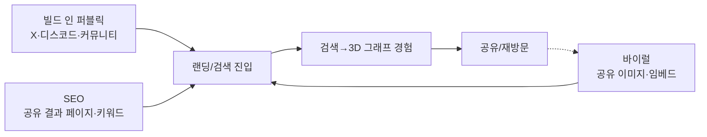
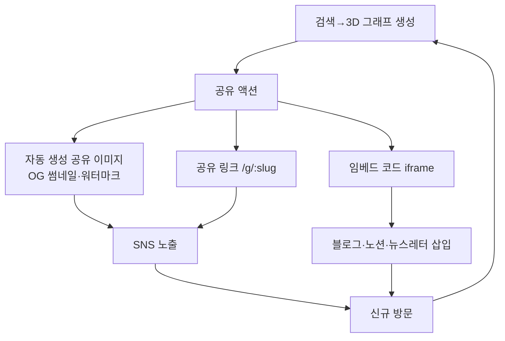
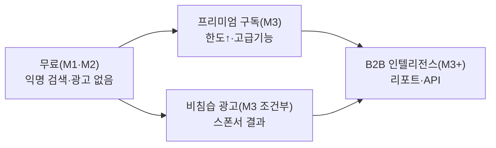

# cerebro — Go-To-Market (GTM)

> **목적**: cerebro를 무료·저비용 그로스로 초기 사용자에게 도달시키고, 검증된 가치 위에 무료→유료 BM을 단계적으로 확장하는 실행 전략을 정의한다.
> **담당 역할**: Growth Marketer
> **버전**: `0.1.0` · 최종 갱신: 2026-06-25 · 상태: Living Document

**관련 문서**: [FOUNDATION-SPEC (SSOT)](./foundation/FOUNDATION-SPEC.md) · [PRD](./PRD.md) · [ROADMAP](./ROADMAP.md) · [ARCHITECTURE](./ARCHITECTURE.md) · [DATA-SOURCING](./DATA-SOURCING.md) · [SECURITY](./SECURITY.md)

> 본 문서는 SSOT에 종속된다. 충돌 시 SSOT가 우선한다. BM 단계·전환 트리거는 [ROADMAP](./ROADMAP.md) §4~7과 정렬한다.

---

## 1. 포지셔닝 & 가치 제안

### 1.1 한 문장 포지셔닝
> "검색 엔진은 링크를 주고, **cerebro는 연결된 지도를 준다** — 기업과 공인을 위한 인터랙티브 3D 지식 그래프."

### 1.2 포지셔닝 스테이트먼트 (Geoffrey Moore 포맷)
- **For** 미팅·면접·콘텐츠 제작 전 한 대상을 빠르게 파악해야 하는 리서처·직장인·취준생·크리에이터
- **Who** 네이버·구글·앱스토어·뉴스를 탭 10개로 오가며 정보를 짜맞추는 데 지친 사람
- **cerebro is** 흩어진 공개정보를 한 번의 검색으로 통합하는 3D 지식 그래프 웹서비스
- **That** 출처·신뢰도·활용법이 붙은 노드로 "전체 구조"를 한 화면에 보여준다
- **Unlike** 링크 리스트만 주는 검색엔진, 텍스트 요약만 주는 AI 챗봇
- **Our product** 'Cerebro' 연출과 공간 탐색으로 기억에 남고 공유하고 싶은 결과물을 만든다

### 1.3 차별화 축 (왜 우리인가)
| 축 | 검색엔진 | AI 요약 챗봇 | **cerebro** |
|---|---|---|---|
| 산출물 | 링크 리스트 | 텍스트 단락 | **연결된 3D 그래프** |
| 출처 신뢰 | 스니펫 | 불투명(환각 위험) | **노드별 출처·수집시각·신뢰도** |
| 기억/공유 | 낮음 | 낮음 | **시각적·공유 가능(임베드)** |
| 관계 파악 | 안 보임 | 서술형 | **중심-가지 구조로 즉시** |

> **트레이드오프**: 3D·시각화는 정보 밀도/속도 면에서 텍스트 리스트보다 불리할 수 있다. 그래서 "깊은 리서치 도구"가 아니라 **"5분 안에 전체 그림 + 출처"** 라는 좁은 가치에 포지션을 집중한다(오버포지셔닝 금지).

---

## 2. 타깃 세그먼트

PRD 페르소나(지윤/민호/세라)와 정렬. 초기엔 **단일 진입 세그먼트(비치헤드)** 에 집중하고 인접 세그먼트로 확장한다.

| 우선 | 세그먼트 | 핵심 Job-to-be-Done | 도달 채널 | 진입 이유 |
|---|---|---|---|---|
| **1 (비치헤드)** | B2B 영업·마케팅 리서처 "지윤" | 미팅 전 거래처/경쟁사 5분 브리핑 | 직무 커뮤니티, 링크드인, 뉴스레터 | 명확한 반복 고통 + 향후 B2B 매출 연결 |
| 2 | 취준생·이직자 "민호" | 면접 전 기업 다각도 파악 | 취업 카페/디스코드, 대학 커뮤니티 | 검색량 大, 입소문 강함, 시즌성 트래픽 |
| 3 | 크리에이터·기자 "세라" | 인물/브랜드 배경 조사 + 시각자료 | 유튜브/뉴스레터, X(트위터) | **바이럴 루프의 엔진**(결과물 공유) |

> **집중 원칙(YAGNI)**: 초기 모든 메시지는 세그먼트 1·2에 맞춘다. 세그먼트 3은 "공유로 신규 유입을 만드는 채널"로 활용하되, 별도 마케팅 예산을 쓰지 않는다.

---

## 3. 초기 획득 채널 (저비용·그로스)

무료 운영(ROADMAP M1) 제약상 **유료 광고 0**, 오가닉·커뮤니티·바이럴 중심.

### 3.1 커뮤니티 시딩 (즉시·0원)
- **타깃 커뮤니티**: GeekNews, 디스콰이엇(Disquiet), 사이드프로젝트/스타트업 디스코드·슬랙, 직무 카페(영업/마케팅), 취업 커뮤니티, Reddit r/sideproject(영문 확장 대비).
- **전술**: 자기홍보 어뷰징 금지 — "데모 영상 30초 + 만든 이유 + 직접 검색해볼 시드 주제 5개" 형식의 진정성 글. 주차별 1~2개 커뮤니티만 정성 게시(스팸 인식 방지).
- **빌드 인 퍼블릭**: 개발 과정·실패담·세레브로 연출 GIF를 X/스레드에 주 1~2회. 팔로워가 곧 초기 시드 유저.

### 3.2 SEO (중기·복리 효과)
- **핵심 자산**: 검색 결과를 **공유 가능한 서버사이드 렌더 결과 페이지**(`/g/:slug`)로 노출 → "[기업명] 한눈에 보기" 류 롱테일 키워드를 자연 점유. 노드 요약·출처가 텍스트로 크롤링 가능해야 함(3D는 인터랙션, SEO는 텍스트 폴백).
- **기술 SEO**: OG 태그(공유 썸네일), JSON-LD(Organization/Person), 사이트맵, 정적 메타. (Vite SPA 한계 → 결과 페이지는 프리렌더/SSR 폴백 필요. ARCHITECTURE와 협의.)
- **온드 미디어**: "기업 리서치 5분 단축법", "면접 전 기업 분석 체크리스트" 등 세그먼트 1·2 키워드 블로그 → CTA로 cerebro 검색 유도.

### 3.3 바이럴 (저비용·고레버리지)
- §4 바이럴 루프 참조. 결과물 자체가 공유 트리거가 되도록 설계.

> **채널 우선순위 근거**: 무료 예산에서 ROI가 가장 높은 순서는 **바이럴(한계비용 0) > 커뮤니티(시간) > SEO(복리, 지연)**. 유료 광고는 CAC<LTV가 데이터로 증명된 M3에서만(ROADMAP §7).

---

## 4. 바이럴 루프 (공유 가능한 마인드맵)

cerebro의 **결과물이 곧 광고**다. K-factor를 높이는 핵심 메커니즘.

### 4.1 공유 단위 3종
| 형태 | 산출물 | 노리는 채널 | 비고 |
|---|---|---|---|
| **공유 이미지** | 그래프 스냅샷 + 중심 라벨 + `cerebro` 워터마크 + OG 카드 | X, 스레드, 카톡 미리보기 | 가장 마찰 적음. 자동 생성. |
| **공유 링크** | `/g/:slug` 결과 페이지(읽기 전용, 재현 가능) | 메신저, 커뮤니티 | SEO 자산과 동일 페이지 재사용 |
| **임베드** | `<iframe>` 코드 | 블로그/노션/뉴스레터/기업 위키 | 크리에이터·기자가 시각자료로 삽입 → 백링크+노출 |

### 4.2 루프 강화 장치 (저비용)
- **워터마크/CTA**: 모든 공유 이미지·임베드 하단에 "cerebro에서 직접 탐색 →" 링크. (제거는 추후 유료 기능 후보.)
- **공유 마찰 최소화**: 1탭 공유(이미지 복사/링크 복사), 로그인 불필요(MVP는 익명 — PRD §4 정렬).
- **PIPA 가드레일**: 공유 페이지도 공개정보·출처만. 공인 외 개인 그래프는 공유 비활성(SECURITY 연계).

> **측정**: 공유율(검색 세션 대비 공유 발생), 공유→신규방문 전환(K-factor 근사 = 공유당 신규 방문수). 초기엔 정성 신호로도 충분, M2에서 이벤트로 정량화.

---

## 5. 콘텐츠 전략

목적: SEO 자산 축적 + 커뮤니티 신뢰 + 바이럴 소재 공급. **무료 운영 한도 내에서 인력=시간만 투입.**

| 유형 | 예시 | 채널 | 빈도(현실적) | 노리는 지표 |
|---|---|---|---|---|
| 데모/연출 클립 | 'Cerebro' 로딩 + 그래프 탐색 30초 GIF/숏폼 | X, 스레드, 유튜브 숏츠 | 주 1~2 | 바이럴·인지 |
| 큐레이션 그래프 | "오늘의 기업/공인 그래프" 캡처 + 한 줄 인사이트 | X, 커뮤니티 | 주 2~3 | 재방문·공유 |
| 실용 가이드(SEO) | "면접 전 기업 분석 체크리스트", "경쟁사 5분 파악법" | 블로그/온드 | 월 2~4 | 롱테일 검색 유입 |
| 빌드 인 퍼블릭 | 개발기·지표 공개·의사결정 회고 | X, 디스콰이엇 | 주 1 | 신뢰·초기 시드 |

- **재활용 원칙**: 1개 그래프 결과 → 이미지(SNS) + 가이드 단락(블로그) + 임베드 데모로 3중 재사용(제작비 절감).
- **금지**: 미검증 정보·과장. 모든 콘텐츠는 출처 표기 가치를 함께 홍보(차별점 강화).

---

## 6. AARRR 지표 (해적 지표)

> PRD §8 KPI를 마케팅 퍼널로 재배치. 목표치는 **베이스라인 측정 전 가설값**이며 데이터로 보정한다.

| 단계 | 핵심 지표 | 정의 | M1/M2 초기 목표(가설) |
|---|---|---|---|
| **Acquisition** | 주간 방문수 / 채널별 유입 | 랜딩·결과페이지 신규 방문 | M1 주 200~500 방문(시드) |
| | 첫 검색 실행율 | 방문 대비 검색 1회 이상 | ≥ 50% |
| **Activation** | **검색→그래프 렌더 성공율** | 의미있는 그래프(중심+가지≥3) 도달 | ≥ 95% (PRD KPI) |
| | 노드 클릭(상세 오픈)율 | 검색당 1+ 노드 클릭 | ≥ 60% (PRD KPI) |
| | 즉시 이탈(0클릭)율 | 검색 후 노드 미클릭 | ≤ 25% (PRD KPI) |
| **Retention** | 주간 재방문율 | 7일 내 재검색 방문 | M2에서 측정·목표선 확정 |
| | 세션당 인터랙션 | 회전/줌/클릭 합 | ≥ 8 (PRD KPI) |
| **Referral** | 공유율 | 검색 세션 대비 공유 발생 | M1 ≥ 5%, M2 ≥ 10% |
| | K-factor(근사) | 공유당 신규 방문 | M2 목표 > 0.3 |
| **Revenue** | (M3) 유료 전환율 | 활성→유료 | M3 1~3% (가설, §7) |
| | (M3) ARPU/마진 | 인당 매출·기여이익 | 양(+) 추세 (ROADMAP §4.1) |

> **측정 인프라**: 무료 티어 분석(예: PostHog/Plausible 무료 한도, Supabase 이벤트 테이블). M1은 핵심 퍼널(Acq→Act)만, M2에서 Retention/Referral 정량화(ROADMAP M2 관측성 산출물과 정렬).

---

## 7. BM 확장 로드맵 (무료 → 유료) & 전환 트리거

ROADMAP M1→M3 및 §4.1 전환 트리거와 1:1 정렬. **선지출 금지, 지표 연동 후행 확장.**

| 단계 | BM | 무엇을 파는가 | 전환 트리거(ROADMAP 정렬) |
|---|---|---|---|
| **0. 무료** (M1/M2) | 없음 | 핵심 루프 무료 공개로 사용자·신뢰 확보 | — |
| **1. 프리미엄 구독** (M3) | Freemium | 검색/노드 상한 확대, 고급 필터, 저장/내보내기(PNG·PDF), 우선 갱신, 워터마크 제거 | (트래픽 OR 비용압박) **AND** 수요신호 **AND** 운영성숙 (ROADMAP §4.1) |
| **2. 광고** (M3, 조건부) | 비침습 광고 | 검색결과 내 "스폰서 노드/관련 기업" 또는 빈 결과 시 추천 — **출처·신뢰 가치 훼손 시 도입 안 함** | 무료 사용자 트래픽 규모화 + 광고가 UX·신뢰 KPI를 낮추지 않음이 A/B로 확인 |
| **3. B2B 인텔리전스 리포트** (M3+) | B2B/엔터프라이즈 | 기업 대상 심화 리포트(경쟁구도·평판·변화 추적), 그래프 API, 화이트라벨 임베드 | B2B 세그먼트(영업/리서처)에서 반복 수요·지불의향 확인 + 데이터 품질 신뢰 확보 |

### 7.1 단계별 전환 트리거 상세
- **무료→프리미엄**: ROADMAP §4.1 판정 규칙 그대로 — `(트래픽 또는 비용압박) AND (수요신호) AND (운영성숙)`. 조기 유료화로 인한 이탈을 막기 위해 **복수 신호 + 비용 압박 결합**으로만 가동.
- **프리미엄→광고**: 프리미엄만으로 마진이 부족하거나, 무료 사용자 트래픽이 충분히 커서 광고 단가가 성립할 때. **단, 출처 링크 클릭률·신뢰 지표가 광고로 하락하면 즉시 롤백**(차별점 보호가 매출보다 우선).
- **→B2B 리포트**: 개인 프리미엄과 별개 트랙. 영업/리서처 세그먼트에서 "팀 단위 결제·심화 리포트" 인터뷰 신호가 반복되면 파일럿(수동 리포트 → 자동화 순). 데이터 정제 품질(DATA-SOURCING)이 B2B 신뢰선을 넘어야 함.

---

## 8. 가격 가설 (Pricing Hypothesis)

> **전부 가설값**. M2 유저 인터뷰(지불의향)와 M3 A/B로 검증·보정. 통화는 KRW, 글로벌은 USD 환산.

| 플랜 | 대상 | 가격 가설(월) | 핵심 한도/혜택 | 근거·트레이드오프 |
|---|---|---|---|---|
| **Free** | 모든 사용자 | ₩0 | 일/월 검색·노드 상한, 워터마크 공유, 익명 | 바이럴·SEO 엔진. 한도는 비용 보호선(캐시로 흡수). |
| **Pro** | 헤비 리서처·크리에이터 | ₩7,900~12,900 (가설) | 상한 대폭↑, 고급 필터, 저장/내보내기, 워터마크 제거, 우선 갱신 | 개인 SaaS 심리적 가격대(₩1만 내외). 너무 높으면 전환↓, 낮으면 마진↓. |
| **Team / B2B** | 영업·리서치 팀 | ₩39,000~/시트 또는 리포트 건당 (가설) | 팀 공유, 심화 리포트, API/임베드, 우선 지원 | LTV 최대 트랙. 가격 탄력 낮음(업무 가치). 영업 리소스 필요 → M3+ 파일럿. |

- **결제 모델**: 월간 + 연간(2개월 할인 가설)로 LTV·캐시플로우 개선. 무료 체험(7~14일 Pro) 가설.
- **가격 검증법**: M2에서 Van Westendorp(가격 민감도) 설문 또는 "이 가격이면 살까?" 인터뷰. M3 출시 시 가짜문(fake door) → 실결제 A/B로 전환율 측정.
- **트레이드오프**: 무료 한도를 너무 빡빡하게 잡으면 바이럴·SEO 손해, 너무 후하면 프리미엄 전환 동기 소멸. **공유·탐색은 후하게 / 저장·내보내기·대량 사용은 게이팅** 원칙.

---

## 9. 무료 운영 한도 내 마케팅 전술 (예산 ≈ ₩0)

ROADMAP M1·M2(거의 $0)에서 실행 가능한 것만. **돈 대신 시간·콘텐츠·제품 내장 루프 사용.**

| 전술 | 비용 | 실행 | 효과 |
|---|---|---|---|
| 빌드 인 퍼블릭 | 0 | 개발기·지표 공개(X/디스콰이엇) | 초기 시드·신뢰 |
| 커뮤니티 시딩 | 0 | GeekNews/디스콰이엇/Reddit 정성 게시 | 첫 트래픽 스파이크 |
| 제품 내장 바이럴 | 0 | 공유 이미지·임베드·워터마크 CTA | 복리 신규 유입 |
| SEO 결과 페이지 | 0(개발 공수) | 프리렌더 결과 페이지 + OG/JSON-LD | 롱테일 오가닉(지연 복리) |
| 시드 주제 큐레이션 | 0 | "오늘의 그래프" 정기 포스팅 | 재방문·공유 소재 |
| 마이크로 협업 | 0 | 뉴스레터·소규모 크리에이터에 임베드 제공 | 백링크+노출 교환 |
| 무료 분석 | 0(무료 티어) | PostHog/Plausible 한도 내 퍼널 | 의사결정 데이터 |

- **유료 채널 테스트(M2 소액)**: CAC 측정용으로만 소액 집행(예: 키워드/SNS 광고 ₩소액). **증액은 CAC<LTV 입증 후 M3**(ROADMAP §7).
- **운영 보호**: 트래픽 스파이크가 무료 티어 쿼터를 위협하면, 캐시·시드 주제 위주로 유도(검색 분산 < 인기 시드 재방문). 비용 가시화는 M2 모니터링과 연계.

---

## 10. 다국어(en/ja) 확장 — 시장 & 채널

> **시점**: ROADMAP §6대로 **M3에서만** 노출(M1부터 i18n 구조는 존재, ko만). 순서 **en → ja**. 각 로캘은 핵심 루프 동등성 Exit Criteria 통과 후 정식 노출.

| 로캘 | 시장 특성 | 우선 채널 | 데이터 소스 정렬 | 트레이드오프 |
|---|---|---|---|---|
| **en (1순위)** | 글로벌 도달·소스 풍부, 영문 SEO 거대 | Reddit, Product Hunt, X, Hacker News, 인디해커 | 구글 PSE·영문 공개 소스 풍부 | 경쟁 치열 → 차별점(3D·출처) 강조 |
| **ja (2순위)** | 인접·고관여, 비주얼 친화, 리서치 수요 | 일본 X, note, Qiita(기술), はてな | 일본 로캘 검색·공개 소스 연결 필요 | 현지화 품질 민감, 소스 정제 비용↑ |

- **확장 게이트(마케팅 관점)**: ko에서 PMF·바이럴 루프·BM이 검증된 뒤에만 진입. 로캘별 **소액 채널 테스트로 CAC·반응 측정 → 검증된 채널만 증액**(ROADMAP M3 정렬).
- **현지화 범위**: UI 번역 + **검색 소스 로캘 대응**이 핵심(단순 번역 ≠ 가치). 영문/일문 결과 품질이 ko 동등 수준 아니면 노출 보류.
- **PH(Product Hunt) 런칭**: en 노출 시점에 1회 집중 런칭(무료 트래픽 스파이크 레버리지).

---

## 11. 측정 가능한 초기 목표 (현실적)

> 무료 운영·인디 규모 가정. 날짜가 아닌 **마일스톤 단위**(ROADMAP 정렬). 미달 시 채널·메시지·온보딩을 보정한다.

| 마일스톤 | 목표 지표 | 현실적 목표(가설) |
|---|---|---|
| **M1 (MVP 공개)** | 누적 검색 수 | 첫 4주 1,000~3,000회 |
| | 활성화: 검색→그래프 성공율 | ≥ 95% |
| | 활성화: 노드 클릭율 | ≥ 60% |
| | 공유율 | ≥ 5% |
| | 커뮤니티 시딩 게시 | 5~8개 커뮤니티 정성 게시 |
| | 인프라 비용 | ₩0 유지(무료 티어) |
| **M2 (베타)** | 월 활성(MAU) | 1,000~3,000(무료 티어 한계 탐색) |
| | 주간 재방문율 | 베이스라인 측정 후 +개선 |
| | 공유율 / K-factor | ≥ 10% / > 0.3 |
| | 유료 지불의향 신호 | 인터뷰 10건+에서 반복 확인 |
| | SEO 인덱싱 결과 페이지 | 100+ 페이지 색인 |
| **M3 (확장/BM)** | 무료→Pro 전환율 | 1~3%(가설) |
| | 기여이익(마진) | 양(+) 추세(증액 게이트) |
| | en 핵심 루프 동등성 | 번역 누락 0, 로캘 소스 연결 |

> **보정 루프**: 매 마일스톤 종료 시 AARRR 퍼널에서 가장 약한 단계 1개를 다음 사이클 집중 개선 과제로 선정(한 번에 하나 — 스코프 폭주 방지). 의사결정은 짧은 ADR로 기록(SSOT §7.1).

---

## 12. 리스크 & 완화 (마케팅 관점)

| 리스크 | 영향 | 완화 |
|---|---|---|
| 트래픽 스파이크 → 무료 티어 쿼터 초과 | 다운·비용 | 캐시 우선·인기 시드 유도, 점진 노출(웨이브 런칭) |
| 커뮤니티 자기홍보 반발 | 평판 | 진정성 게시·빈도 제한·가치 우선 |
| 얕은 정보로 첫인상 후 이탈 | 리텐션↓ | 시드 주제는 풍부한 데이터 보장, 활용법 강조 |
| PIPA/명예훼손 공유 리스크 | 법적·신뢰 | 공개정보·출처만 공유, 비공인 개인 공유 차단(SECURITY) |
| 광고 도입이 신뢰 훼손 | 차별점 상실 | 출처/신뢰 KPI 하락 시 즉시 롤백, 비침습 형태만 |
| 조기 유료화로 이탈 | 성장 정체 | ROADMAP §4.1 복수 트리거 충족 전 무료 유지 |
