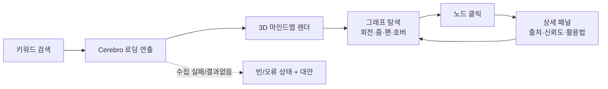

# cerebro — 제품 요구사항 문서 (PRD)

> **목적**: 흩어진 공개 정보를 키워드 검색 한 번으로 중심-가지 3D 마인드맵으로 보여주는 cerebro MVP의 무엇을·누구를 위해·어디까지 만들지 정의한다.
> **담당 역할**: Project Owner
> **버전**: `0.1.0` · 최종 갱신: 2026-06-25 · 상태: Living Document

**관련 문서**: [FOUNDATION-SPEC (SSOT)](./foundation/FOUNDATION-SPEC.md) · [ROADMAP](./ROADMAP.md) · [ARCHITECTURE](./ARCHITECTURE.md) · [DATA-SOURCING](./DATA-SOURCING.md) · [UX-SPEC](./UX-SPEC.md) · [SECURITY](./SECURITY.md) · [QA-STRATEGY](./QA-STRATEGY.md) · [GTM](./GTM.md)

> 본 문서는 SSOT(FOUNDATION-SPEC)에 종속된다. 충돌 시 SSOT가 우선한다.

---

## 1. 제품 비전 & 문제 정의

### 1.1 비전
**"하나의 키워드, 한 화면의 연결된 지식."**
어떤 기업·브랜드·공인을 검색하면, 웹 곳곳에 흩어진 공개 정보를 cerebro가 수집·정제해 **중심(검색어)을 둘러싼 3D 구체 노드**의 마인드맵으로 즉시 보여준다. 사용자는 텍스트를 읽는 대신 **공간을 탐색하며** 대상의 전체 그림과 관계 구조를 직관적으로 파악한다.

### 1.2 문제 정의
| 현재의 고통 | 구체적 상황 | cerebro의 해결 |
|---|---|---|
| 정보가 흩어져 있다 | 한 기업을 파악하려면 네이버·구글·앱스토어·뉴스·홈페이지를 10개 탭으로 오간다 | 한 번의 검색으로 출처별 정보를 한 그래프에 통합 |
| 관계가 안 보인다 | 텍스트 검색 결과는 항목의 **연결**(제품↔카테고리↔경쟁사↔뉴스)을 드러내지 못한다 | 중심-가지 구조로 관계를 시각화 |
| 출처 신뢰가 불투명하다 | 검색 스니펫만으로는 어디서 온 정보인지, 얼마나 믿을지 모른다 | 모든 노드에 출처·수집시각·신뢰도·활용법 명시 |
| 탐색이 지루하다 | 리스트 UI는 빠르지만 기억에 남지 않는다 | 'Cerebro' 연출 + 3D 인터랙션으로 몰입형 탐색 |

### 1.3 한 문장 포지셔닝
> "검색 엔진은 링크를 주고, cerebro는 **연결된 지도**를 준다 — 기업과 공인을 위한 인터랙티브 3D 지식 그래프."

---

## 2. 타깃 사용자 & 페르소나

대상은 **기업/브랜드**와 **공개 인물(공인)** 둘 다. 단, 개인은 **공개정보 한정**(PIPA 가드레일, 민감정보 제외).

### 페르소나 1 — 리서처 / 직장인 "지윤" (주 타깃)
- 30세, B2B 영업·마케팅 담당. 미팅 전 거래처/경쟁사를 빠르게 파악해야 함.
- **목표**: 5분 안에 한 기업의 사업 영역·주요 제품·최근 이슈·경쟁 구도 감 잡기.
- **고통**: 탭 10개 열고 정리하느라 지침. 출처 신뢰도 판단이 어려움.
- **cerebro 가치**: "검색→그래프 한 장"으로 브리핑 시간 단축, 출처 그대로 인용 가능.

### 페르소나 2 — 취준생 / 이직 준비자 "민호"
- 26세, 지원 기업 분석 중. 기업 문화·제품·평판·관련 인물을 입체적으로 알고 싶음.
- **목표**: 면접 전 기업을 다각도로 이해하고 질문 거리 발굴.
- **고통**: 정보가 단편적이고, 무엇이 중요한지 우선순위가 안 보임.
- **cerebro 가치**: 가지 구조로 "이 기업의 핵심 축"을 한눈에, 노드별 출처로 사실 확인.

### 페르소나 3 — 콘텐츠 크리에이터 / 호기심형 탐색자 "세라"
- 23세, 유튜브·뉴스레터 제작. 인물(공인)·브랜드 배경을 빠르게 조사.
- **목표**: 공인의 공개 이력·활동·관련 작품/회사를 탐색하고 시각 자료로 활용.
- **고통**: 출처 표기 누락으로 신뢰 리스크, 비주얼 자료 제작 번거로움.
- **cerebro 가치**: 출처 명시된 공개정보 그래프, 캡처/공유 가능한 시각 결과물.

---

## 3. 핵심 유저 스토리

| ID | 유저 스토리 | 우선순위 |
|---|---|---|
| US-1 | 사용자로서, 검색창에 기업/브랜드/공인 키워드를 입력해 그 대상의 마인드맵을 보고 싶다. | P0 |
| US-2 | 사용자로서, 검색 직후 'Cerebro' 로딩 연출을 보며 시스템이 정보를 모으는 중임을 느끼고 싶다. | P0 |
| US-3 | 사용자로서, 중심 노드와 가지 노드로 구성된 3D 그래프를 회전·줌·이동하며 탐색하고 싶다. | P0 |
| US-4 | 사용자로서, 노드를 클릭하면 그 정보의 출처·요약·활용법이 담긴 상세 패널을 보고 싶다. | P0 |
| US-5 | 사용자로서, 노드 라벨/카테고리로 그래프 내용을 빠르게 읽고 분류하고 싶다. | P0 |
| US-6 | 모바일 사용자로서, 저사양 기기에서도 끊김 없이(품질 자동 저하) 탐색하고 싶다. | P1 |
| US-7 | 사용자로서, 검색이 잘못되거나 결과가 없을 때 명확한 안내와 대안(예: 추천 검색어)을 받고 싶다. | P1 |
| US-8 | 사용자로서, 개인(공인) 검색 시 공개정보만 보이고 출처가 표기됨을 신뢰하고 싶다. | P0 |
| US-9 | 사용자로서, 현재 그래프 화면을 캡처/링크로 공유하고 싶다. | P2 |

---

## 4. MVP 범위 (In-Scope / Out-of-Scope)

### 4.1 In-Scope (MVP에 반드시 포함)
- 한국어 단일 검색 엔트리포인트(키워드 입력 → 결과).
- 대상 유형: **기업/브랜드** + **공인(공개정보)**. (유형 자동 추정 + 노드 카테고리 표기)
- **Cerebro 로딩 연출**(회색 인간 형상 스쳐가는 X맨식 연출, `prefers-reduced-motion` 폴백).
- **3D 마인드맵**: 중심 1 + 가지 N. 구체 노드, 회전/줌/팬, 노드 호버/선택.
- **노드 상세 패널**: 요약 · 출처(URL/이름) · 수집시각 · 신뢰도 · 활용법(이 정보를 어떻게 쓰면 좋은지).
- **하이브리드 데이터 수집**: 공식 API 우선 + robots.txt/ToS 준수 공개 데이터. 수집 결과 캐시.
- **PIPA 가드레일**: 개인은 공개정보 한정, 민감정보(주민번호·연락처·주소·건강·정치성향 등) 수집/표시 금지, 출처·수집근거 표기, 삭제요청 안내 링크.
- **반응형 단일 웹앱**(모바일~데스크톱), 저사양 3D 품질 자동 저하 폴백.
- 빈 결과/오류/로딩 등 기본 상태 처리.

### 4.2 Out-of-Scope (MVP에서 제외 — 추후)
- 회원가입/로그인/개인화·저장 보드(MVP는 익명 단발 검색).
- 다국어(en/ja) — i18n **구조만** 초기 반영, 실제 번역은 추후.
- 결제·유료 플랜·API 판매(BM 확장은 GTM에서 별도).
- 사용자 편집/주석/노드 수동 추가(읽기 전용 그래프).
- 그래프 영구 저장·히스토리·즐겨찾기.
- AI 자유 대화/요약 챗봇(요약은 정해진 패널 영역에 한정).
- 비공개·인증벽 뒤 데이터, 크롤링 우회, 일반 비공인 개인 검색.
- 네이티브 앱(iOS/Android), 데스크톱 앱.

> **스코프 원칙(YAGNI)**: MVP는 "검색→그래프→노드 상세"라는 **단일 핵심 루프**의 완성도에 집중. 부가 기능은 핵심 루프가 검증된 뒤 ROADMAP 순서로 추가.

---

## 5. 기능 요구사항 (핵심 루프)

### 5.1 FR-1 키워드 검색
- 검색창에 한국어 키워드 입력 → 제출(Enter/버튼).
- 입력 검증(zod): 공백/길이/금지문자. 비공개 개인 의심 키워드는 안내 후 차단 가능.
- 대상 유형(기업/공인) 추정. 추정 모호 시 결과 상단에 유형 배지 표기.
- 동일 검색은 캐시 우선(쿼터 절약·속도).

### 5.2 FR-2 Cerebro 로딩 연출
- 검색 제출 직후 백엔드 수집/정제 동안 로딩 연출 표시.
- 진행 감각 제공(단계 텍스트 또는 진행 표시). 일정 시간 초과 시 타임아웃 안내.
- `prefers-reduced-motion` 시 모션 최소화 정적 폴백.

### 5.3 FR-3 3D 마인드맵 렌더 & 탐색
- 중심 노드(검색어, 최대 강조) + 카테고리별 가지 노드(구체).
- 인터랙션: 회전(orbit), 줌, 팬, 노드 호버(라벨/하이라이트), 노드 선택.
- 노드 카테고리 색/그룹 구분(예: 제품, 뉴스, 인물, 채널, 평판 등). 카테고리 정의는 DATA-MODEL과 정렬.
- 성능: 인터랙션 ~60fps 지향, 대형 그래프는 LOD/인스턴싱, 저사양은 노드 수·효과 축소.
- 키보드 탐색 지원(노드 포커스 이동/선택), 명도 대비 준수.

### 5.4 FR-4 노드 상세 패널
- 노드 클릭 시 패널 오픈. 필수 필드:
  | 필드 | 내용 |
  |---|---|
  | 제목/라벨 | 노드 이름 |
  | 요약 | 정제된 한국어 1~3줄 |
  | 출처(Source) | 출처명 + 원문 링크(새 탭) |
  | 수집시각 | 데이터 수집 타임스탬프 |
  | 신뢰도 | 출처 유형 기반 신뢰 등급(예: 공식 API > 공개 사이트) |
  | 활용법 | 이 정보를 어떻게 활용하면 좋은지(맥락별 가이드 1줄) |
- 패널에서 인접 노드로 이동/하이라이트 연동. 패널 닫기 시 그래프 상태 유지.
- 개인(공인) 노드: 공개정보·출처만, 민감정보 없음 보장. PIPA 안내/삭제요청 링크 노출.

### 5.5 FR-5 상태 처리(빈/오류/한계)
- 결과 없음: 안내 + 추천 검색어/철자 제안.
- 수집 부분 실패: 가능한 노드만 표시 + "일부 출처 불러오기 실패" 비차단 알림.
- API 쿼터 초과/타임아웃: 캐시 결과 우선, 없으면 명확한 재시도 안내.

---

## 6. 비기능 요구 (NFR) 요약

> 상세 기준은 SSOT §9 및 ARCHITECTURE/QA-STRATEGY를 따른다.

| 항목 | 목표 |
|---|---|
| 성능 | 의미 있는 첫 콘텐츠 < 3s(중급 모바일), 3D 인터랙션 ~60fps 지향 |
| 반응형 | 모바일~데스크톱 단일 웹앱, 저사양 3D 품질 자동 저하 폴백 |
| 접근성 | 키보드 탐색, 명도 대비, `prefers-reduced-motion` 대응 |
| 보안/개인정보 | 시크릿 비노출, PIPA 가드레일, 입력 zod 검증, 출처/수집근거 보존 |
| 비용 | MVP 무료 티어 내 운영(캐싱·쿼터 관리) |
| 관측성 | 구조적 로깅, 에러 트래킹(무료 티어), 기본 분석 |
| 언어 | 한국어 전용(MVP), i18n 구조 초기 반영 |

---

## 7. 수용 기준 (Acceptance Criteria)

> 형식: Given–When–Then. 전부 충족 시 MVP "출시 가능".

- **AC-1 (검색→그래프)**: *Given* 유효한 기업 키워드 입력, *When* 검색 제출, *Then* 로딩 연출 후 중심 1 + 가지 ≥3개 노드의 3D 그래프가 렌더된다.
- **AC-2 (로딩 연출)**: *Given* 검색 제출, *Then* Cerebro 로딩이 표시되고, `prefers-reduced-motion` 사용자는 정적 폴백을 본다.
- **AC-3 (탐색)**: *Given* 그래프 표시 상태, *When* 드래그/스크롤/핀치, *Then* 회전·줌·팬이 동작하고 호버 시 라벨이 보인다.
- **AC-4 (노드 상세)**: *Given* 노드 클릭, *Then* 패널에 요약·출처(클릭 가능 링크)·수집시각·신뢰도·활용법이 모두 표시된다.
- **AC-5 (출처 무결성)**: *Given* 임의 노드, *Then* 출처 없는 노드는 0개다(모든 노드는 출처를 보존).
- **AC-6 (PIPA)**: *Given* 공인 키워드, *Then* 공개정보만 표시되고 민감정보(연락처·주소·주민번호 등)는 0건, 삭제요청 안내가 노출된다.
- **AC-7 (빈 결과)**: *Given* 결과 없는 키워드, *Then* 빈 상태 안내 + 추천 검색어가 표시된다(빈 화면/크래시 금지).
- **AC-8 (반응형/폴백)**: *Given* 저사양 모바일, *Then* 노드 수/효과가 축소되어도 그래프 탐색이 가능하다.
- **AC-9 (성능)**: *Given* 중급 모바일·표준 그래프, *Then* 첫 의미 콘텐츠 < 3s, 인터랙션이 명백한 끊김 없이 동작한다.
- **AC-10 (캐시)**: *Given* 동일 키워드 재검색, *Then* 캐시 결과로 첫 렌더가 최초 대비 유의미하게 빨라진다.

---

## 8. 성공 지표 (KPI)

| 분류 | 지표 | MVP 초기 목표(가설) |
|---|---|---|
| 핵심 루프 | 검색→그래프 렌더 성공률 | ≥ 95% |
| 참여 | 검색당 노드 클릭(상세 패널 오픈) 비율 | ≥ 60% |
| 참여 | 세션당 평균 탐색 인터랙션 수(회전/줌/클릭) | ≥ 8 |
| 만족 | 검색 후 즉시 이탈(노드 0클릭) 비율 | ≤ 25% |
| 신뢰 | 출처 링크 클릭률(검색 세션 대비) | ≥ 20% |
| 성능 | 첫 의미 콘텐츠 < 3s 충족 세션 비율 | ≥ 80% |
| 운영 | 캐시 적중률(중복 검색 절감) | ≥ 40% |
| 비용 | MVP 월 인프라 비용 | 무료 티어 내(0원 목표) |

> 목표치는 베이스라인 측정 전 **가설값**이며, 출시 후 데이터로 보정한다(ROADMAP에서 추적).

---

## 9. 핵심 가정 & 리스크

### 9.1 핵심 가정
- 공식 API + robots.txt 준수 공개 데이터만으로 의미 있는 그래프(중심+가지 ≥3)를 구성할 수 있다.
- 사용자는 리스트보다 3D 그래프에서 "전체 구조 파악" 가치를 더 크게 느낀다.
- 무료 티어 쿼터 + 캐싱으로 초기 트래픽을 감당할 수 있다.
- 대상 유형(기업/공인) 자동 추정이 충분히 정확하다(모호 시 배지로 보완).

### 9.2 리스크 & 완화
| 리스크 | 영향 | 완화 |
|---|---|---|
| API 쿼터/비용 초과 | 서비스 중단·비용 | 캐시 우선, 쿼터 모니터링, 호출 상한, 부분 실패 graceful 처리 |
| PIPA/명예훼손 등 법적 리스크 | 서비스 신뢰·법적 | 공개정보 한정, 민감정보 차단, 출처 표기, 삭제요청 절차(SECURITY와 연계) |
| 데이터 품질/노이즈 | 신뢰 저하 | 신뢰도 등급, 출처 우선순위, 정제 룰, 빈약 결과 시 빈 상태 안내 |
| 저사양 3D 성능 | 이탈 | LOD/인스턴싱, 품질 자동 저하, 노드 수 상한 |
| 데이터 소스 ToS 변경/차단 | 수집 실패 | 소스 추상화(어댑터), 다중 소스, 변경 모니터링(DATA-SOURCING) |
| 첫인상 대비 얕은 정보 | 재방문 저하 | 핵심 카테고리 우선 확보, 활용법 제공으로 실용 가치 강화 |
| 검색어 유형 오분류 | 잘못된 그래프 | 유형 배지·수동 전환, 추정 신뢰도 표시 |

### 9.3 미해결 질문 (Open Questions)
- 노드 카테고리 최종 분류 체계는? → DATA-MODEL/DATA-SOURCING에서 확정.
- 신뢰도 등급 산식(출처 유형·최신성 가중)? → Backend + Architect 합의.
- 그래프 노드 수 상한(가독성 vs 정보량)? → UX-SPEC 실험으로 결정.

---

## 10. 의존 문서 & 책임

| 영역 | 책임 문서/에이전트 |
|---|---|
| 데이터 소스·정제·신뢰도 | DATA-SOURCING (Backend) |
| 노드/엣지/카테고리 스키마 | DATA-MODEL (Architect) |
| 3D 연출·인터랙션·접근성 | UX-SPEC / DESIGN-SYSTEM (UI/UX) |
| PIPA·시크릿·위협모델 | SECURITY (Cyber Security) |
| 수용기준 검증·회귀 | QA-STRATEGY (QA) |
| 우선순위·일정 | ROADMAP (Project Owner) |
