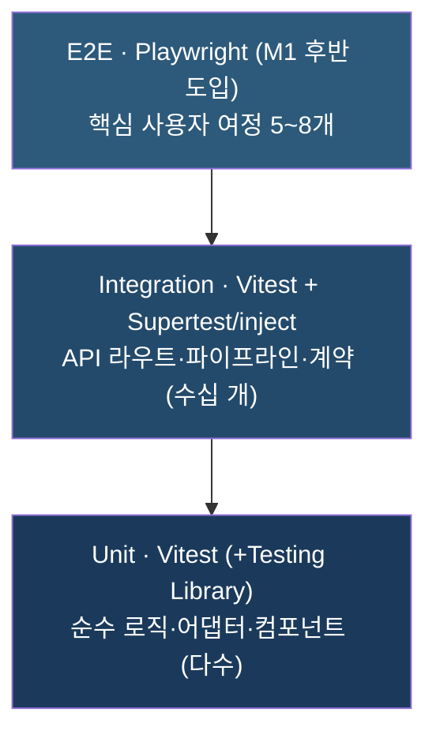
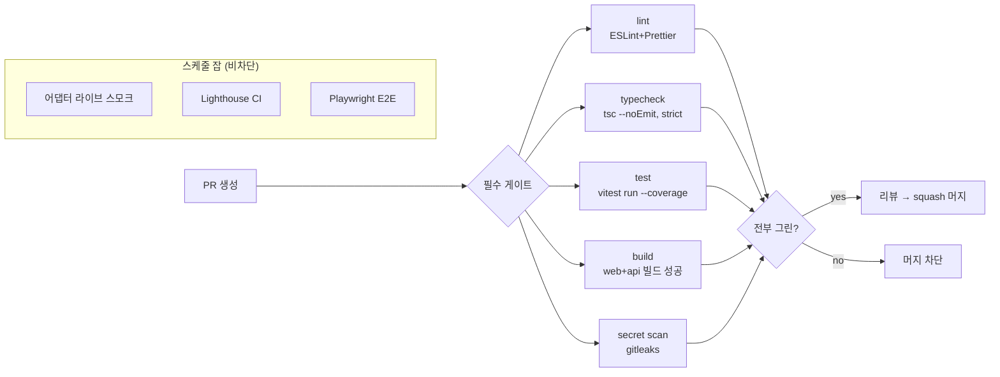
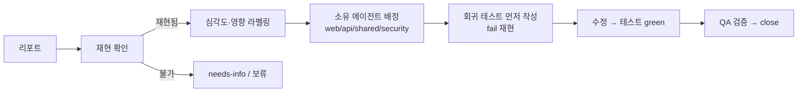

# cerebro — QA 전략 (QA-STRATEGY)

> **목적**: cerebro MVP의 품질을 보장하기 위한 테스트 피라미드·커버리지 목표·수용기준 매핑·어댑터/3D 테스트·CI 품질 게이트·버그 트리아지·DoD·회귀 방지 전략을 무료 도구 우선으로 정의한다.
> **담당 역할**: QA Engineer

**관련 문서**
- [Foundation Spec (SSOT)](./foundation/FOUNDATION-SPEC.md)
- [PRD](./PRD.md) (수용기준 AC-1~AC-10)
- [ARCHITECTURE](./ARCHITECTURE.md)
- [DATA-SOURCING](./DATA-SOURCING.md) (어댑터 패턴 §7)
- [ROADMAP](./ROADMAP.md) (M0~M3 Exit Criteria)
- [SECURITY](./SECURITY.md) (PIPA·시크릿)

> 본 문서는 SSOT(FOUNDATION-SPEC.md)에 종속된다. 충돌 시 SSOT가 우선한다.

- 문서 버전: `0.1.0` · 최종 갱신: 2026-06-25 · 상태: Living Document

---

## 1. QA 철학 & 원칙

1. **계약 우선 검증.** `packages/shared`의 zod 스키마(`NodeSchema`/`EdgeSchema`/`GraphSchema`)가 FE·BE 공통 진실원이므로, 테스트도 이 계약을 중심으로 작성한다(드리프트 차단).
2. **신뢰 경계에 집중.** 브라우저↔API 경계와 API↔외부소스 경계가 핵심 리스크다(ARCHITECTURE §1). 입력 검증·PIPA 필터·부분 실패 처리에 테스트를 집중한다.
3. **빠른 피드백.** 단위/통합은 밀리초~초 단위로 PR마다 실행. 느리고 깨지기 쉬운 E2E·시각 테스트는 최소·핵심 경로만.
4. **결정성(determinism).** 외부 API·시간·랜덤·3D GPU는 비결정적이다. 모킹·고정 시드·시간 고정(`vi.useFakeTimers`)으로 플래키를 제거한다.
5. **무료 도구 우선.** Vitest·Testing Library·Playwright(OSS)·axe-core·Lighthouse CI 등 무료 OSS만 사용. 유료 SaaS(시각 회귀 클라우드 등)는 도입하지 않는다(SSOT 무료 운영 원칙).
6. **오버엔지니어링 경계.** 커버리지 수치 자체가 목표가 아니다. 핵심 루프(검색→그래프→상세)와 보안/PIPA를 우선하고, 사소한 게터·DTO는 굳이 테스트하지 않는다.

---

## 2. 테스트 피라미드 & 도구

| 레이어 | 대상 | 도구 | 실행 위치 | 비고 |
|---|---|---|---|---|
| **Unit** | 순수 함수(정규화·dedupe·스코어링·그래프 빌드·신뢰도 산식), 어댑터 `normalize`, React 컴포넌트, Zustand 스토어 | Vitest, @testing-library/react, @testing-library/user-event | 양 앱 + shared | 가장 많고 빠름. jsdom 환경 |
| **Integration** | Fastify 라우트(`POST /api/search`, `GET /api/graph/:id`), 캐시 read-through/write-back, 어댑터+미들웨어(rate limit/retry) 합성, FE 데이터 패칭(TanStack Query)+MSW | Vitest + `app.inject()`(Fastify 내장) 또는 Supertest, MSW | 주로 api | 외부 HTTP는 모킹, DB는 인메모리/테스트 컨테이너 또는 Supabase 로컬 |
| **E2E** | 검색→로딩→3D 렌더→노드 클릭→상세 패널 여정, 빈/오류 상태, 키보드 탐색 | Playwright(headless Chromium) | web(+백엔드 모킹 또는 시드) | **M1 후반 도입**(SSOT: "Playwright는 추후"). 적게·핵심만 |

### 2.1 도구 선택 근거 / 트레이드오프

| 도구 | 채택 이유 | 트레이드오프 / 대안 |
|---|---|---|
| **Vitest** | Vite 네이티브(동일 변환 파이프라인), Jest 호환 API, ESM·TS 즉시 동작, 빠른 watch | Jest 대비 생태계 작음 → 핵심 기능은 충분 |
| **Testing Library** | 사용자 관점(역할/라벨) 쿼리로 구현 세부 결합↓, 접근성 친화 | 구현 디테일 테스트엔 부적합(의도된 제약) |
| **MSW** | 네트워크 레벨 모킹으로 FE/통합에서 실제 fetch 경로 검증, 핸들러 재사용 | 초기 핸들러 셋업 비용 |
| **Playwright** | 무료·멀티브라우저·자동 대기·트레이스 뷰어, 모바일 에뮬레이션 | E2E는 느리고 플래키 → 수 최소화·태그로 분리 |
| **app.inject()** | Fastify 내장, 실제 서버 포트 없이 라우트 통합 테스트 → 빠르고 가벼움 | 네트워크 스택 일부 미포함 → E2E로 보완 |

> **WebGL/3D 주의**: Playwright headless 환경에서 WebGL은 제한적이다. E2E는 3D 픽셀 검증이 아니라 **DOM 계약**(노드 수·라벨·패널·접근성 트리)을 검증한다. 상세는 §6.

---

## 3. 커버리지 목표 (현실적)

> 커버리지는 **신뢰의 하한선**이지 목표 그 자체가 아니다. 핵심 로직은 높게, 표현/glue는 낮게 차등 적용한다.

| 영역 | 라인/브랜치 목표 | 근거 |
|---|---|---|
| `packages/shared`(스키마·상수·순수 유틸) | **90%+** | 계약 핵심. 깨지면 양 앱 동시 영향 |
| `apps/api` 정제·엔티티·그래프 빌드·신뢰도·dedupe | **85%+** | 데이터 정확성·PIPA의 본체 |
| `apps/api` 어댑터 `normalize`·플래너·캐시 키 | **80%+** | 외부 변동성 흡수 지점 |
| `apps/api` 라우트·미들웨어(검증/rate limit) | **75%+**(통합 위주) | 경계 보안 |
| `apps/web` 상태/로직(Zustand·셀렉터·레이아웃 계산) | **70%+** | 인터랙션 상태 정확성 |
| `apps/web` R3F 캔버스·셰이더·연출 | **수치 목표 없음** | GPU 의존, 행동/계약 테스트로 대체(§6) |
| 전역(저장소 합산) 게이트 | **70%** 미만 시 CI 경고(초기), M1 안정화 후 **75% 실패 게이트** | 점진 강화. 초반 과도한 게이트로 속도 저하 방지 |

**정책**
- 신규/변경 코드에 대한 **diff 커버리지**를 우선 본다(전체 평균보다 PR 단위 회귀 방지에 직접적).
- 커버리지 측정: `vitest --coverage`(v8 provider, 무료). 리포트는 CI 아티팩트로 업로드.
- 커버리지를 위한 의미 없는 테스트(스냅샷 남발·trivial 게터) 금지.

---

## 4. 수용기준 → 테스트 매핑

각 AC(PRD §7)는 **최소 1개 자동화 테스트 + 명시된 레이어**로 추적한다. 테스트 파일은 `// AC-N` 주석/`describe('AC-N: ...')`로 태깅해 역추적 가능하게 한다.

| AC | 요지 | 1차 검증 레이어 | 대표 테스트(예) |
|---|---|---|---|
| **AC-1** | 검색→중심1+가지≥3 그래프 렌더 | E2E + API 통합 | API: 시드 키워드 → `GraphSchema` 파싱 성공·`nodes≥4`(중심+3). E2E: 검색 후 캔버스 노드 라벨 ≥4 노출 |
| **AC-2** | 로딩 연출 + reduced-motion 폴백 | Unit(컴포넌트) + E2E | RTL: `prefers-reduced-motion` 모킹 시 정적 폴백 렌더, 미설정 시 모션 컴포넌트 마운트 |
| **AC-3** | 회전·줌·팬·호버 라벨 | E2E(행동) + Unit(핸들러) | E2E: 드래그/휠 후 카메라 상태 변화 단언(스토어 노출값). Unit: 호버 시 라벨 표시 상태 토글 |
| **AC-4** | 상세 패널 5필드(요약·출처·시각·신뢰도·활용법) | Unit + E2E | RTL: 노드 클릭 → 패널에 5필드 모두 존재, 출처는 `href`·새 탭. E2E: 동일 흐름 스모크 |
| **AC-5** | 출처 없는 노드 0개 | Unit + 통합 | shared: `NodeSchema`가 `source` 필수임을 단언. 통합: 빌더 출력 모든 노드 `source!=null` |
| **AC-6** | 공인 공개정보만·민감정보 0건·삭제요청 안내 | Unit + 통합(**보안 필수**) | 정제: 민감정보 시드(연락처/주소/주민번호) 입력 → 출력 0건. 패널: 인물 노드에 삭제요청 링크 |
| **AC-7** | 빈 결과 안내 + 추천 검색어, 크래시 금지 | 통합 + E2E | API: 결과 없는 키워드 → 빈 상태 payload + suggestions. E2E: 빈 상태 UI·크래시 없음 |
| **AC-8** | 저사양 모바일 품질 자동 저하 | Unit + E2E(에뮬) | Unit: 품질 셀렉터가 저사양 신호에 `MAX_NODES`/효과 축소 반환. E2E: 모바일 뷰포트에서 탐색 가능 |
| **AC-9** | 첫 의미 콘텐츠 < 3s, 끊김 없음 | 성능(Lighthouse CI) | 예산 단언(§7). FPS는 수동/계측 보조 |
| **AC-10** | 동일 키워드 재검색 캐시로 가속 | 통합 | 캐시: 1차 miss(외부 호출 N회) → 2차 hit(외부 호출 0회) 단언, 응답 시간 단축 |

> **추적 매트릭스**는 본 표를 SSOT로 유지한다. AC 추가/변경 시 표를 먼저 갱신하고 테스트를 따른다. M1 Exit Criteria는 "전 AC 매핑 테스트 통과"를 포함한다.

---

## 5. 데이터 수집 어댑터 테스트 (외부 API 모킹 / 계약 테스트)

DATA-SOURCING §7의 `SourceAdapter`는 cerebro 품질의 핵심 리스크 지점이다(외부 ToS·스키마 변동). 어댑터는 **순수 fetch/normalize**이고 횡단 관심사(rate limit/retry/cache)는 미들웨어로 분리되므로, 레이어별로 나눠 테스트한다.

### 5.1 어댑터 단위 테스트 (실 네트워크 금지)
- `FetchContext.httpClient`를 주입 모킹(DATA-SOURCING §7 "테스트 용이성")해 **고정 픽스처**(실제 응답을 1회 캡처·민감정보 제거 후 저장)로 `normalize`를 검증.
- 검증 항목:
  - 소스 스키마 → `NormalizedItem` 매핑 정확성(필드·출처 메타 `source/sourceUrl/fetchedAt/license` 부착).
  - `canHandle(query)` 분기(예: 네이버=한국어 일반, App Store=앱 보유 추정).
  - 빈/부분/깨진 응답(필드 누락·null) 대응 → throw 대신 graceful 빈 배열·경고.
  - **PIPA 게이트**: 민감정보 필드가 입력에 있어도 normalize 출력에서 제거됨(DATA-SOURCING §8, AC-6).

### 5.2 계약 테스트 (Contract Test) — 외부 스키마 드리프트 감지
공식 API 응답 형태가 바뀌면 조용히 깨진다. 이를 두 방향으로 잡는다.

| 방향 | 방법 | 빈도 | 비고 |
|---|---|---|---|
| **내부 계약**(어댑터→파이프라인) | 어댑터 출력이 `NormalizedItemSchema`(zod) `safeParse` 통과 단언 | 모든 PR(빠름·무료) | shared 계약과 결합. 핵심 |
| **외부 계약**(외부 API→어댑터 기대) | 저장된 픽스처 + 주기적 "라이브 스모크"(소량 실호출로 픽스처 키 존재 확인) | **nightly/주간 별도 잡**(PR 게이트 제외) | 쿼터·시크릿 필요 → CI 메인 파이프라인과 분리. 실패 시 알림만(블로킹 X) |

- **라이브 스모크 분리 이유**: PR마다 외부 호출하면 쿼터 소모·플래키·시크릿 노출 위험. PR은 결정적 모킹만, 외부 드리프트는 비차단 스케줄 잡으로 조기 경보한다.
- 시크릿은 CI 시크릿 매니저로만 주입(플레이스홀더 사용, SSOT §5). 픽스처에는 키·개인정보를 넣지 않는다.

### 5.3 미들웨어 통합 테스트
- `withRetry`: `429`/`5xx`/타임아웃만 재시도, `4xx`는 즉시 실패(DATA-SOURCING §5). `Retry-After` 헤더 우선. `vi.useFakeTimers`로 백오프 지연·지터를 결정적으로 검증.
- `withRateLimit`: 토큰버킷 소진 시 차단/대기, 동시성 캡 준수.
- **회로차단기**: 연속 실패 임계 초과 시 소스 일시 차단 → 파이프라인은 부분 결과로 degrade(부분 실패 허용, ARCHITECTURE §3).
- `withCache`: read-through miss→write-back, hit 시 외부 호출 0회(AC-10).

### 5.4 파이프라인 통합 (fan-out → 부분 실패)
- 일부 소스 성공 + 일부 타임아웃/차단 시 **가능한 노드만으로 그래프 구성** + "일부 출처 불러오기 실패" 비차단 신호(PRD FR-5, AC-7 인접).
- dedupe(URL 정규화·제목 유사도)·엔티티 병합·스코어링 결과의 안정성(같은 입력=같은 출력, 정렬 안정).

---

## 6. 3D / 시각 회귀 테스트 접근

### 6.1 픽셀 스냅샷의 한계 (왜 1급 도구로 쓰지 않는가)
- **비결정성**: WebGL 렌더는 GPU/드라이버/안티앨리어싱/폰트/타이밍에 따라 픽셀이 미세하게 달라져 **플래키**하다. CI(headless, 소프트웨어 렌더러)와 로컬이 다른 결과를 낸다.
- **유지비**: 의도된 디자인 변경마다 베이스라인을 대량 갱신해야 해 노이즈가 크다.
- **저신호**: "픽셀이 다름"은 알려주지만 "무엇이·왜 깨졌는지"는 알려주지 않는다.

→ 결론: **픽셀 스냅샷은 3D 캔버스의 1급 검증으로 쓰지 않는다.** 대신 행동·계약·결정적 산출물을 검증한다.

### 6.2 대안 (계층적)

| 대안 | 무엇을 검증 | 도구 | 비고 |
|---|---|---|---|
| **순수 레이아웃 함수 테스트** | 노드 좌표·중심-가지 배치·`MAX_NODES` 컷·LOD 단계 = 입력→좌표 결정적 매핑 | Vitest | 렌더 없이 수학만. **가장 가치 높음** |
| **씬 그래프 단언** | R3F가 만든 객체 트리(노드 N개·머티리얼·그룹·라벨) 검증, 픽셀 아님 | `@react-three/test-renderer`(무료) | GPU 불요. 인스턴싱 카운트·선택 상태 등 |
| **DOM/접근성 계약 (E2E)** | 노드 라벨 텍스트, 패널 필드, 키보드 포커스 이동 = HTML/ARIA 레이어 | Playwright | WebGL 픽셀 우회. AC-1/3/4 |
| **상호작용 상태 단언** | 호버/선택/카메라 상태가 Zustand 스토어에 반영 | Vitest/Playwright | 픽셀 대신 상태값 비교 |
| **DOM 스냅샷(선택적)** | 패널·라벨 같은 **HTML** 구조의 의도치 않은 변경 | Vitest `toMatchSnapshot` | 3D 캔버스 픽셀이 아닌 **DOM**에만 한정 적용 |

### 6.3 시각 검수는 사람이 (자동화 보완)
- 픽셀 회귀는 **수동 시각 QA 체크리스트**(라이트/다크, 모바일/데스크톱, reduced-motion, 빈/대형 그래프)로 릴리스 전 점검. UX-SPEC/DESIGN-SYSTEM과 함께.
- 향후 트래픽·예산이 생기면 OSS 시각 회귀(Playwright `toHaveScreenshot` + 임계 허용치)를 **소수 안정 화면**(빈 상태·패널)에만 한정 도입 검토. MVP에선 보류(유지비 > 가치).

---

## 7. 성능 & 접근성 테스트

### 7.1 성능 (AC-9, NFR)
| 항목 | 방법 | 예산/기준 | 도구(무료) |
|---|---|---|---|
| 초기 로드 / 첫 의미 콘텐츠 | Lighthouse CI(모바일 프로파일·스로틀) | LCP/FCP 기준 < 3s 대역, 번들 사이즈 예산 | Lighthouse CI |
| 번들 크기 회귀 | 빌드 산출물 크기 예산 단언 | three/R3F 무거움 → 청크·코드분할 임계 | `size-limit` 또는 Vite 리포트 |
| 3D 인터랙션 FPS | 수동/계측 보조(스탯 패널, 대표 기기) | ~60fps 지향, 대형 그래프 LOD 동작 | r3f-perf(개발), 수동 측정 |
| API 응답(캐시 히트) | 통합 테스트 시간 단언(상대) | hit ≪ miss(AC-10) | Vitest |

> FPS는 환경 편차가 커 **CI 하드 게이트로 두지 않는다**. Lighthouse는 PR에서 측정하되 초기엔 경고, 베이스라인 확보 후 회귀 임계만 실패 처리(노이즈 방지).

### 7.2 접근성 (NFR: 키보드·명도대비·reduced-motion)
| 항목 | 방법 | 기준 |
|---|---|---|
| 자동 a11y 스캔 | axe-core(`@axe-core/playwright` / `vitest-axe`) | 핵심 화면 0 violations(critical/serious) |
| 키보드 탐색 | Playwright 키보드로 노드 포커스 이동·선택·패널 열기/닫기 | 마우스 없이 핵심 루프 완주 |
| reduced-motion | 미디어 모킹 시 정적 폴백 렌더(AC-2) | 모션 컴포넌트 미마운트 |
| 명도 대비 | axe + 디자인 토큰 대비 검증(DESIGN-SYSTEM 연계) | WCAG AA 대비 충족 |
| 포커스/ARIA | 패널·검색의 role·label·focus trap | 스크린리더 탐색 가능 |

---

## 8. CI 품질 게이트

SSOT §6.3: PR은 **lint·typecheck·test·build 통과 필수**. GitHub Actions(무료)로 구성한다(`.github/**`는 Orchestrator 소유 — QA는 게이트 요건을 정의·요청).

| 게이트 | 명령(개념) | 차단? | 비고 |
|---|---|---|---|
| Lint | `eslint` + `prettier --check` | **차단** | flat config(SSOT §2) |
| Typecheck | `tsc --noEmit`(strict, `any` 금지) | **차단** | shared 계약 포함 |
| Unit+Integration | `vitest run --coverage` | **차단** | diff 커버리지 회귀 시 경고→안정화 후 차단 |
| Build | web(Vite)·api(Fastify) 빌드 | **차단** | 빌드 깨짐=머지 불가 |
| Secret scan | gitleaks | **차단** | 시크릿 누출 0(SSOT §5) |
| Dependency audit | `pnpm audit` / Dependabot | 경고(고위험만 차단) | SSOT §5.6 |
| E2E(Playwright) | 핵심 여정 | M1 후반 차단, 그전 비차단 | 느림 → 별도 잡·태그 |
| Lighthouse CI | 성능 예산 | **비차단**(경고) | 환경 편차 → 회귀 임계만 |
| 어댑터 라이브 스모크 | 외부 실호출 소량 | **비차단**(nightly·알림) | 쿼터·시크릿 분리 |

**원칙**: PR 메인 파이프라인은 **빠르고 결정적**으로 유지(모킹만). 느리거나 외부 의존·환경 민감한 검증은 스케줄/비차단으로 분리해 머지 속도와 신뢰성을 동시에 확보한다.

---

## 9. 버그 트리아지 & 심각도

### 9.1 심각도 등급

| 등급 | 정의 | 예시(cerebro) | 대응 |
|---|---|---|---|
| **S1 Critical** | 핵심 루프 불능 · 보안/개인정보 사고 · 데이터 손상 | 검색→그래프 전면 실패, 민감정보 노출(AC-6 위반), 시크릿 누출 | **즉시**. 핫픽스·필요 시 롤백. 릴리스 차단 |
| **S2 Major** | 핵심 기능 부분 손상·우회 어려움 | 노드 클릭 시 패널 미오픈, 캐시 미동작으로 쿼터 폭주, 모바일 폴백 실패 | 차기 릴리스 전 필수 수정. 릴리스 차단 |
| **S3 Minor** | 비핵심 기능·우회 가능 | 특정 카테고리 라벨 깨짐, 빈 상태 문구 오타, 호버 라벨 지연 | 정상 백로그. 우선순위화 |
| **S4 Trivial** | 미관·로그·엣지케이스 | 미세 정렬·색 토큰 편차 | 여유 시 처리 / 모아서 |

> **보안·PIPA 결함은 심각도 1단계 가산**한다(민감정보·시크릿은 항상 S1). SECURITY와 연계.

### 9.2 트리아지 플로우

- **버그=회귀 테스트.** 모든 S1/S2 수정 PR은 **그 버그를 재현하는 실패 테스트를 먼저 추가**하고 통과시킨다(§10 핵심).
- 라벨: `severity:S1~S4`, `area:web|api|shared|3d|data|security`, `type:bug`. GitHub Issues로 추적(무료).

---

## 10. Definition of Done (체크리스트)

기능/PR이 "완료"로 인정되려면 아래를 모두 충족한다(SSOT §6.3 PR 체크리스트와 정합).

- [ ] **기능**: 관련 수용기준(AC-N)을 충족하고, 해당 AC 매핑 테스트가 존재·통과(§4).
- [ ] **테스트**: 신규/변경 로직에 적절 레이어 테스트 추가(순수 로직 unit, 경계 integration). diff 커버리지 회귀 없음.
- [ ] **계약**: 입출력이 `packages/shared` zod 스키마를 따르고, 변경 시 shared 선반영 + 양측 동기(SSOT §7.1).
- [ ] **CI 그린**: lint·typecheck·test·build·gitleaks 전부 통과.
- [ ] **보안/PIPA**: 외부 입력 zod 검증, 민감정보 미수집·미표시, 출처(`source/fetchedAt/confidence`) 보존. 시크릿 비노출.
- [ ] **에러/상태**: 빈/오류/부분 실패/로딩 상태 처리(PRD FR-5). 에러 삼키지 않음.
- [ ] **접근성**: 키보드 탐색 가능, axe critical/serious 0, reduced-motion 폴백(해당 시).
- [ ] **성능**: 번들·로드 예산 위반 없음, 3D 변경 시 대형 그래프 LOD/폴백 확인(해당 시).
- [ ] **문서/ADR**: 의미 있는 결정은 `docs/adr/`에 기록, 타 에이전트 영향 시 PR에 명시.
- [ ] **정리**: 죽은 코드·디버그 로그·`any` 없음. 보이스카웃 규칙 준수.

> **릴리스(M1 Exit) DoD 추가**: 전 AC(AC-1~10) 매핑 테스트 통과 · PIPA 체크리스트 통과 · 접근성(키보드·reduced-motion) 통과 · 대표 시드(기업 20·공인 10) 그래프 끊김 없이 렌더 · 무료 티어 비용 $0 유지(ROADMAP M1).

---

## 11. 회귀 방지 전략

1. **버그 우선 테스트(Regression-first).** 모든 확인된 버그는 수정 전에 재현 테스트를 추가한다. 같은 버그는 두 번 통과시키지 않는다.
2. **계약 게이트.** `packages/shared` 스키마 변경은 FE·BE 양측 테스트가 동시에 검증 → 한쪽만 바뀌면 CI가 막는다(드리프트=회귀의 주원인).
3. **AC 추적 매트릭스 유지(§4).** 핵심 사용자 가치가 항상 자동 검증 하에 있게 한다.
4. **외부 드리프트 조기 경보.** 어댑터 라이브 스모크(nightly)로 외부 API 스키마 변경을 머지 게이트와 무관하게 조기 감지(§5.2).
5. **결정적 픽스처 + 시간/랜덤 고정.** 플래키 테스트는 회귀 신뢰를 무너뜨린다. 모킹·`fake-timers`·고정 시드로 결정성 확보. 플래키 발견 시 즉시 격리(`test.fixme`)+이슈화.
6. **핵심 E2E 스모크.** 검색→그래프→상세 여정 1~2개를 항상 녹색으로 유지(통합 깨짐 최후 안전망).
7. **점진적 게이트 강화.** 초기엔 경고로 시작해 베이스라인 확보 후 커버리지·성능 임계를 실패 게이트로 승격(과도한 초기 게이트로 속도 저하 방지).
8. **무료 운영 보호.** 캐시·쿼터·부분 실패 경로에 통합 테스트를 유지해 "쿼터 폭주" 회귀(비용 리스크)를 코드 레벨에서 차단(AC-10).

---

## 12. M0 → M1 QA 우선순위 (점진 적용)

| 단계 | 도입 항목 |
|---|---|
| **M0(기반)** | Vitest 셋업·shared 스키마 단위 테스트·CI 4게이트(lint/typecheck/test/build)+gitleaks·diff 커버리지 리포트 |
| **M1 초반** | 어댑터 단위/계약 테스트(MSW·픽스처)·API 라우트 통합·캐시/부분실패 통합·AC 매핑 테스트 골격 |
| **M1 후반** | Playwright 핵심 E2E·axe 접근성·Lighthouse CI(경고)·씬그래프(test-renderer) 테스트·라이브 스모크 nightly |
| **M2+** | 커버리지/성능 게이트 승격·시각 회귀(소수 안정 화면) 도입 검토·플래키 모니터링 |

> YAGNI: 위 순서는 핵심 루프와 보안/PIPA 검증을 가장 먼저, 비용 큰 E2E/시각/성능 게이트는 가치가 검증된 뒤 도입한다.
