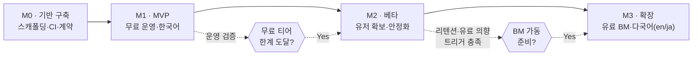

# cerebro — Product Roadmap

> **목적**: cerebro의 단계별 마일스톤(M0→M3)과 무료→유료 BM 확장·다국어 확장·비용 증액 트리거를 정의한다.

- 담당 역할: **Project Owner**
- 상태: Living Document (마일스톤 진척에 따라 갱신)
- 단위 원칙: **날짜가 아닌 상대적 단계**로 표기(자원/검증 기반 게이트). 각 마일스톤은 **Exit Criteria 충족 시에만** 다음 단계로 진입.

### 관련 문서
- [Foundation Spec (SSOT)](./foundation/FOUNDATION-SPEC.md)
- [PRD](./PRD.md) · [GTM (마케팅·BM)](./GTM.md)
- [Architecture](./ARCHITECTURE.md) · [Data Model](./DATA-MODEL.md) · [Data Sourcing](./DATA-SOURCING.md)
- [UX Spec](./UX-SPEC.md) · [Design System](./DESIGN-SYSTEM.md) · [Security](./SECURITY.md) · [QA Strategy](./QA-STRATEGY.md)

---

## 1. 마일스톤 한눈에 보기

| 마일스톤 | 한 줄 목표 | 운영 비용 단계 | 언어 | BM |
|---|---|---|---|---|
| **M0** 기반 구축 | 모노레포·CI·계약을 세워 병렬 개발 가능 상태 | $0 (로컬/무료) | ko | 없음 |
| **M1** MVP | 검색→3D 마인드맵 핵심 경험을 무료로 공개 | 무료 티어 한정 | ko | 없음(무료) |
| **M2** 베타 | 유저·피드백 확보, 안정화·리텐션 검증 | 무료 티어 + 소액 보강 | ko | 무료 + 유료 실험(스위치 OFF) |
| **M3** 확장 | 유료 BM 본격화 + 다국어(en/ja) | 유료 인프라 단계적 증액 | ko·en·ja | Freemium 가동 |

---

## 2. M0 — 기반 구축 (Foundation)

**목표**: FOUNDATION-SPEC 기반으로 8개 에이전트가 충돌 없이 병렬 개발할 수 있는 토대를 만든다. 제품 기능은 아직 없음.

| 항목 | 내용 |
|---|---|
| **핵심 산출물** | pnpm 모노레포 스캐폴딩(`apps/web`, `apps/api`, `packages/shared`) / TS strict·ESLint·Prettier / `.github` CI(lint·typecheck·test·build) + gitleaks / `packages/shared`의 zod 계약 초안(`NodeSchema`·`EdgeSchema`·`SearchRequest`) / 핵심 문서(PRD·ARCHITECTURE·DATA-MODEL·UX-SPEC·SECURITY·DATA-SOURCING·GTM·QA) 초안 / Supabase 무료 프로젝트 + `.env.example` |
| **Exit Criteria** | ① `pnpm i && lint && typecheck && test && build`가 CI에서 그린 ② `apps/web`·`apps/api` 헬로월드가 로컬 기동 ③ shared 계약 타입을 FE·BE 양쪽이 import ④ gitleaks가 PR에서 동작 ⑤ 핵심 8개 문서 초안 머지 |
| **대략 순서** | 모노레포·툴체인 → CI·시크릿 스캐닝 → shared 계약 → 앱 스캐폴딩 → 문서 초안 |
| **비용/마케팅** | 비용 $0. 마케팅 없음(빌드 인 퍼블릭 준비만). |

---

## 3. M1 — MVP (무료 운영, 한국어)

**목표**: "키워드 검색 → 세레브로 로딩 → 3D 그래프 → 노드 클릭 → 출처/활용법 패널"의 **단일 핵심 루프**를 무료 티어로 공개한다.

| 항목 | 내용 |
|---|---|
| **핵심 산출물** | ① 검색 입력 + 세레브로 로딩 연출 ② 중심-가지 3D 마인드맵(R3F, 구체 노드, LOD/인스턴싱 기초) ③ 노드 상세 패널(출처·수집시각·신뢰도·활용법) ④ 하이브리드 수집 1차(공식 API 우선: 네이버/구글 PSE 등) + **수집 캐시**(쿼터·콜드스타트 절감) ⑤ 기업 + 공인 개인(공개정보) 대상, PIPA 가드레일 ⑥ 모바일 폴백(3D 품질 자동 저하) ⑦ i18n 구조는 적용하되 ko만 노출 |
| **Exit Criteria** | ① 대표 시드 주제(예: 기업 20·공인 10)에서 그래프가 끊김 없이 렌더 ② 중급 모바일 의미 콘텐츠 < 3s, 인터랙션 60fps 지향(대형 그래프 LOD 동작) ③ 모든 노드에 출처·수집시각·신뢰도 보존·표시 ④ PIPA 체크리스트(민감정보 제외·삭제요청 경로) 통과 ⑤ 무료 티어 쿼터 내에서 1일 운영 비용 $0 유지 ⑥ QA 핵심 시나리오·접근성(키보드·reduced-motion) 통과 |
| **대략 순서** | shared 계약 확정 → BE 수집·캐시·`/search` API → FE 그래프 렌더 → 로딩 연출·상세 패널 → 모바일 폴백·성능 예산 → PIPA·보안 게이트 |
| **비용 단계** | **무료 티어 한정**: Supabase Free, 정적/서버리스 무료 호스팅, API 무료 쿼터. 비용 초과 위험은 캐싱·쿼터 제한·콜드스타트 허용으로 흡수. |
| **마케팅 단계** | 비용 거의 $0. 빌드 인 퍼블릭 + 소규모 커뮤니티 시딩(자세히는 [GTM](./GTM.md)). |

---

## 4. M2 — 베타 (유저 확보·안정화)

**목표**: 실유저를 받아 **리텐션·핵심 가치**를 검증하고, 무료 운영의 한계 지점을 측정한다. 유료 BM은 **코드로 준비하되 스위치 OFF**.

| 항목 | 내용 |
|---|---|
| **핵심 산출물** | ① 분석·관측성(이벤트·퍼널·에러 트래킹, 무료 티어) ② 수집 소스 확장(앱스토어/플레이스토어·공공데이터 등) + 정제 품질 개선 ③ 그래프 UX 개선(필터·검색 히스토리·공유 링크) ④ 가벼운 계정(Supabase Auth) — 저장/공유 기반 ⑤ 캐시·쿼터 모니터링 대시보드(비용 가시화) ⑥ 유료 기능 **플래그 뒤 구현**(결제는 미연동) |
| **Exit Criteria** | ① 핵심 루프 완주율·재방문(리텐션) 목표선 충족(목표 수치는 GTM에서 확정) ② 무료 티어 사용량이 한계의 일정 비율 근접(아래 트리거) ③ 크래시·심각 버그 안정선 이하 ④ 유저 인터뷰에서 "유료 지불 의향" 신호 확인 ⑤ 결제 켜기 전 보안·PIPA·약관 검토 완료 |
| **대략 순서** | 관측성 도입 → 소스·품질 확장 → 공유/계정 → 비용 모니터링 → BM 플래그 구현 → 유료 의향 검증 |
| **비용 단계** | **무료 티어 + 소액 보강**: 무료 한계 근접 시 단일 항목(예: API 유료 쿼터 or DB)만 최소 유료 전환. 월 운영비를 **소액(저예산) 상한** 안에서 통제. |
| **마케팅 단계** | **소액 시작**: 콘텐츠·SEO·커뮤니티 중심 오가닉 우선. 소액 유료 채널 테스트로 CAC 측정(증액 전 학습 단계). |

### 4.1 무료→유료 전환 트리거 (M2 → M3 게이트)

> 아래 트리거가 **충분히 겹쳐서** 발생하면 M3의 유료 BM을 가동한다. 단일 지표가 아닌 **복수 신호 + 비용 압박**의 결합으로 판단(조기 유료화로 인한 이탈 방지).

| 트리거 분류 | 발동 조건(상대적) | 의미 |
|---|---|---|
| **트래픽/유저** | MAU/검색량이 무료 티어 안정선을 상시 초과(예: 수천 MAU 규모 진입) | 무료 운영으로 더 못 버팀 |
| **비용 압박** | 캐싱·쿼터 최적화 이후에도 무료 티어 한계의 **80%+ 상시 점유** | 인프라 유료화 불가피 |
| **수요 신호** | 핵심 사용자층의 유료 의향·고급 기능 요청이 반복 관측 | 지불 의사 존재 |
| **리텐션** | 재방문/저장 등 가치 지표가 안정선 이상 유지 | BM이 붙을 베이스 존재 |
| **운영 성숙** | 결제·약관·환불·PIPA·세금 처리 준비 완료 | 유료화 리스크 관리 가능 |

**판정 규칙**: (트래픽 또는 비용압박) **AND** (수요신호) **AND** (운영성숙) 충족 시 M3 진입. 셋 중 하나라도 미충족이면 M2에서 최적화·실험을 지속.

---

## 5. M3 — 확장 (유료 BM + 다국어)

**목표**: 검증된 가치 위에 **Freemium 유료 BM**을 가동하고, 시장을 **en/ja**로 확장한다.

| 항목 | 내용 |
|---|---|
| **핵심 산출물** | ① 결제 연동 + Freemium 한도(무료: 일/월 검색·노드 상한 / 유료: 상한 확대·고급 필터·저장/내보내기·우선 갱신) ② **다국어 en/ja**(i18n 리소스·검색 소스 로캘 대응·RTL 무관) ③ 데이터 소스·정제 파이프라인 스케일(큐·백그라운드 갱신) ④ 유료 사용자 운영(구독 관리·인보이스·등급) ⑤ 비용/마진 대시보드 |
| **Exit Criteria** | ① 결제 E2E(구독·취소·환불·실패 복구) 안정 ② 무료↔유료 한도 게이팅이 UX·과금 양쪽에서 정확 ③ en·ja 핵심 루프가 ko 동등 수준 동작(번역 누락 0, 로캘 소스 연결) ④ 유료 전환율·**기여이익(마진) 양(+)** 추세 ⑤ 증설된 인프라가 SLA/성능 예산 유지 |
| **대략 순서** | 결제·Freemium 게이팅 → 비용/마진 검증 → en 우선 → ja → 파이프라인 스케일 |
| **비용 단계** | **유료 인프라 단계적 증액**: 트리거 충족 항목부터 순차 유료화(DB→호스팅/서버→API 쿼터→큐/백그라운드). **증액은 매출/마진 지표에 연동**하여 한 번에 한 단계씩(런웨이 보호). |
| **마케팅 단계** | **증액 단계 진입**: 유료 전환·LTV가 CAC를 정당화하는 채널부터 예산 확대. en/ja는 시장별 소액 테스트 후 검증된 채널만 증액. |

---

## 6. 다국어(en/ja) 확장 시점 — 명시

- **시점**: **M3에서만** 다국어를 노출한다. (i18n 구조 자체는 M1부터 코드에 존재하나 ko만 노출.)
- **이유/트레이드오프**: 조기 다국어는 검색 소스·정제·QA 비용을 N배로 늘려 무료 운영을 깨뜨린다. ko로 PMF·BM을 먼저 검증한 뒤 확장하는 편이 자원 효율·품질 모두에서 유리.
- **순서**: `en` 먼저(글로벌 도달·소스 풍부) → `ja`(인접 시장·고관여) 순. 각 로캘은 **핵심 루프 동등성 Exit Criteria**를 통과해야 정식 노출.

---

## 7. 비용·마케팅 증액 단계 요약

| 단계 | 인프라 비용 | 마케팅 비용 | 증액 트리거 |
|---|---|---|---|
| M0 | $0(로컬/무료) | 없음 | — |
| M1 | 무료 티어 한정 | 거의 $0(빌드 인 퍼블릭) | — |
| M2 | 무료 + 단일 항목 소액 보강 | 소액(오가닉 우선 + 채널 테스트) | 무료 티어 한계 근접 |
| M3 | 단계적 유료 증액(항목별 순차) | 검증 채널부터 예산 확대 | §4.1 전환 트리거 충족 + 마진 양(+) |

> **공통 원칙**: 비용·마케팅 증액은 **선지출이 아니라 지표 연동 후행 지출**. 무료 운영을 최대한 길게 유지(캐싱·쿼터·콜드스타트 허용)하고, 매출/마진이 확인된 항목만 한 단계씩 증액한다(런웨이·트레이드오프는 [GTM](./GTM.md)·ADR로 관리).

---

## 8. 마일스톤 공통 Definition of Done

- FOUNDATION-SPEC·`.claude/rules/*` 준수, 관련 ADR 기록.
- CI 그린(lint·typecheck·test·build) + gitleaks 통과, 시크릿/PIPA 위반 0.
- 변경이 타 에이전트 영역에 영향 시 PR에 명시 + 해당 에이전트 리뷰.
- 성능 예산·접근성 회귀 없음(QA 게이트 통과).
