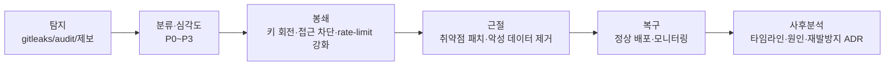

# cerebro — 보안 정책 (SECURITY)

> **목적**: cerebro(공개정보 3D 마인드맵 서비스)의 위협 모델·시크릿 관리·한국 PIPA 준수·수집/웹/인증 보안·사고 대응을 단일 기준으로 정의한다.

- **담당 역할**: Cyber Security Engineer
- **상태**: Living Document · 최종 갱신 2026-06-25
- **관련 문서**:
  - [Foundation Spec (SSOT)](./foundation/FOUNDATION-SPEC.md) — 충돌 시 SSOT 우선
  - [Data Sourcing](./DATA-SOURCING.md) — 수집 ToS/robots/쿼터 상세 (작성 예정)
  - [Architecture](./ARCHITECTURE.md) · [Data Model](./DATA-MODEL.md) (작성 예정)

---

## 0. 적용 범위 & 기본 원칙

- 대상: `apps/web`(Vite+React+R3F), `apps/api`(Fastify), `packages/shared`(zod 계약), Supabase(Postgres+Auth), CI(`.github`).
- 핵심 원칙: **공개정보 한정 / 최소 권한 / 기본 차단(default-deny) / 모든 경계는 zod 검증 / 시크릿은 코드 밖**.
- 이 문서는 Foundation Spec §5(보안 규칙)를 구체화한다. 규칙이 충돌하면 더 엄격한 쪽을 따른다.

---

## 1. 위협 모델 (STRIDE 요약)

신뢰 경계: ① 브라우저↔API, ② API↔외부 수집 소스(네이버/구글/공공API/웹), ③ API↔Supabase, ④ 개발자↔CI/시크릿.

| STRIDE | 위협 (cerebro 맥락) | 자산 | 대응책 |
|---|---|---|---|
| **S**poofing (위장) | 타 사용자/관리자 사칭, API 토큰 도용 | 세션·Auth | Supabase Auth(JWT 검증), HttpOnly+Secure 쿠키, 서버측 `auth.getUser()` 재검증 |
| **T**ampering (변조) | 검색 파라미터·노드 ID 조작, 응답 캐시 오염 | 그래프 데이터·캐시 | zod 입력 검증, 파라미터화 쿼리, 캐시 키 정규화·서명, RLS |
| **R**epudiation (부인) | "삭제요청 안 받았다", 수집 행위 추적 불가 | 감사 로그 | 구조적 로그 + 요청 ID, 삭제요청 티켓 타임스탬프 보존 |
| **I**nformation Disclosure (정보노출) | 시크릿 유출, 민감정보 수집/표시, 에러 스택 노출 | 시크릿·PII | 시크릿 매니저, PIPA 필터, 에러 메시지 일반화, 로그 마스킹 |
| **D**enial of Service (서비스거부) | 검색 폭주로 무료 쿼터 소진, 콜드스타트 악용 | 쿼터·가용성 | rate limit, 캐시, 쿼리 길이 제한, 외부호출 타임아웃·서킷브레이커 |
| **E**levation of Privilege (권한상승) | anon 키로 관리 데이터 접근, SSRF로 내부망 도달 | DB·내부망 | RLS + service_role 서버 전용, SSRF 차단(IP/스킴 화이트리스트) |

> **가장 큰 리스크 3종**: (1) SSRF/크롤링 우회 → 내부망·ToS 위반, (2) PIPA 위반(민감/비공개 PII 수집·표시), (3) 시크릿 유출. 본 문서는 이 3종에 자원을 집중한다.

---

## 2. 시크릿 관리

### 2.1 보관 위치 (계층)
| 환경 | 보관 방식 | 비고 |
|---|---|---|
| 로컬 개발 | `.env.local` (gitignore) | `.env.example`만 커밋(키 이름+빈 값/플레이스홀더) |
| CI (GitHub Actions) | **Repository/Environment Secrets** | `${{ secrets.XXX }}` 주입, 로그 마스킹 |
| 운영(API 호스팅) | 호스팅 시크릿 매니저(예: Render/Fly/Vercel env) | 빌드 아티팩트에 인라인 금지 |
| DB/Auth | Supabase Project Settings (Vault) | `service_role`은 API 서버 메모리에서만 |

### 2.2 키 분류 & 노출 경계
- **공개 가능(브라우저 노출 OK)**: `VITE_SUPABASE_URL`, `VITE_SUPABASE_ANON_KEY`. → 반드시 RLS로 보호. `anon` 키는 비밀이 아니나 권한이 최소여야 함.
- **서버 전용(절대 브라우저 금지)**: `SUPABASE_SERVICE_ROLE_KEY`, `NAVER_CLIENT_SECRET`, `GOOGLE_API_KEY`, 공공데이터 인증키 등.
- 프론트 빌드에 `VITE_` 접두사가 붙은 값만 번들에 포함됨 → **서버 시크릿에 `VITE_` 접두사 금지**(휴먼에러 방지 규칙).

### 2.3 금지사항
- 시크릿을 코드·문서·주석·커밋 메시지·PR·이슈·로그·스크린샷에 평문 노출 금지.
- 시크릿을 클라이언트 번들/소스맵/`window`/콘솔에 노출 금지.
- 공용 캐시·CDN에 인증 응답 캐싱 금지.

### 2.4 키 회전(rotation)
- 정기: 외부 API 키·service_role 키 **90일** 주기 회전(달력 리마인더).
- 즉시: 유출 의심·퇴사·gitleaks 탐지 시 **무효화 후 재발급**(회전 ≠ 단순 교체, 옛 키 폐기까지).
- 절차: 새 키 발급 → 시크릿 매니저 갱신 → 무중단 배포 → 구 키 폐기 확인 → 사고 로그 기록.

---

## 3. 한국 PIPA(개인정보보호법) 준수

> cerebro는 개인 대상에서 **공개정보·공인(public figure) 한정**. 비공개 PII는 수집/저장/표시하지 않는다.

### 3.1 수집 근거 & 범위
- 근거: 공개된 개인정보의 **정당한 이익/사회통념상 동의 추정 범위**(PIPA 제15조·정보주체 공개 취지) 내에서만. 단, 정보주체가 명시 거부 시 즉시 중단.
- 공인 판단: 언론·공식 프로필·기업 공시 등으로 공적 활동이 확인되는 인물에 한정. 일반 사인(私人)은 대상 제외.

### 3.2 민감정보·제외 목록 (수집/저장/표시 금지)
- 주민등록번호·여권번호 등 **고유식별정보**
- 개인 연락처(휴대폰/개인 이메일)·자택 주소·실시간 위치
- 건강/의료·유전·생체인식 정보
- 정치적 견해·노조·종교·사상
- 성생활·성적 지향
- 범죄경력(공식 판결 보도 외)·신용/금융 계좌
- 미성년자 관련 일체

> 수집 파이프라인에 **PII 분류 필터**를 두어 위 카테고리를 자동 차단/마스킹한다(정규식+키워드+소스 화이트리스트). 불확실하면 **표시 보류(fail-closed)**.

### 3.3 출처·근거 표기
- 모든 개인 관련 노드는 `source(url) + collectedAt + confidence + publicityBasis(공개근거)`를 보존하고 상세 패널에 출처를 노출한다(Foundation §8 준수).

### 3.4 삭제/정정 요청 프로세스
```mermaid
flowchart LR
  A[요청 접수<br/>privacy@cerebro] --> B[본인/대리 확인]
  B --> C{공개정보 여부·법적 근거 검토}
  C -->|삭제 대상| D[원본 소스 제거 불가 시<br/>cerebro 색인·캐시·표시 차단]
  C -->|정정| E[데이터 갱신·재수집]
  D --> F[차단목록(blocklist)에 등록<br/>재수집 방지]
  E --> F
  F --> G[처리결과 회신<br/>SLA 영업일 10일 이내]
  G --> H[처리 이력·티임스탬프 보존]
```
- 접수 채널 공개(사이트 푸터/정책 페이지), 요청·처리 이력 보존(부인 방지).
- **blocklist**: 삭제된 엔터티/도메인을 수집·렌더 단계 양쪽에서 차단(재수집 루프 방지).

### 3.5 개인 대상 표시 시 주의
- 추측·평가·미확인 정보 표시 금지(명예훼손 리스크). **사실+출처**만.
- 부정확·차별·낙인 가능 표현 필터링. 신뢰도 낮은 노드는 명시적 표기.
- 개인 노드에는 "공개정보 기반, 삭제요청 안내" 고지를 상세 패널에 노출.

---

## 4. 데이터 수집 시 보안 (SSRF / URL 검증 / robots·ToS)

### 4.1 SSRF 방지 (수집기의 1순위 방어)
서버가 임의 URL을 fetch하므로 SSRF가 핵심 위협이다. **fetch 전 게이트**를 강제한다.

- **스킴 화이트리스트**: `https`(필요 시 `http`)만 허용. `file:`, `ftp:`, `gopher:`, `data:` 차단.
- **DNS 해석 후 IP 검증**: 해석된 IP가 아래면 거부 — `127.0.0.0/8`, `10/8`, `172.16/12`, `192.168/16`, `169.254/16`(메타데이터), `::1`, `fc00::/7`, `0.0.0.0`.
- **메타데이터 엔드포인트 차단**: `169.254.169.254` 등 클라우드 메타데이터 하드블록.
- **리다이렉트 수동 처리**: 자동 리다이렉트 비활성 → 각 홉마다 재검증(TOCTOU 우회 차단). 최대 3홉.
- **포트 제한**: 80/443만. **타임아웃**: 연결+응답 ≤ 10s. **응답 크기 상한**: 예) 5MB.
- 도메인 **allowlist 우선**(네이버/구글/공공데이터/앱·플레이스토어 등) → 그 외는 robots/ToS 통과 + IP 검증 후만.

### 4.2 URL/입력 검증
- 사용자 검색어·노드 ID·수집 대상 URL 모두 `packages/shared`의 zod 스키마로 검증.
- URL은 `new URL()` 파싱 + 위 게이트 통과 + 호스트 정규화(유니코드/펀이코드 혼동 방지).

### 4.3 robots.txt / ToS 준수
- 공식 API **우선**. 크롤링은 robots 허용 범위에서만, `User-Agent: cerebro-bot` 명시 + 연락 URL.
- **금지**: 인증벽/페이월 우회, CAPTCHA 우회, 로그인 세션 도용, 비공개 영역 접근, 과도한 동시요청(소스별 rate limit + 캐시).
- ToS·쿼터 위반 소지 소스는 `DATA-SOURCING.md` 결정 전 수집 금지.

---

## 5. 웹 애플리케이션 보안

### 5.1 XSS
- React 기본 이스케이프 유지. **`dangerouslySetInnerHTML` 금지**(불가피 시 DOMPurify 통과).
- 외부 수집 텍스트는 표시 전 sanitize. URL은 `https/http`만 렌더(자바스크립트 스킴 차단).

### 5.2 CSRF
- 인증은 Authorization 헤더(Bearer JWT) 기반 → CSRF 표면 축소. 쿠키 세션 사용 시 `SameSite=Lax/Strict` + CSRF 토큰.
- 상태변경 API는 GET 금지(POST/PATCH/DELETE), CORS 화이트리스트와 함께.

### 5.3 CORS (화이트리스트)
- Fastify CORS는 **명시 origin allowlist만**(`*` 금지). `credentials: true`일 때 와일드카드 불가.
- 허용 예: 운영 도메인, `http://localhost:5173`(dev). 환경변수 `CORS_ORIGINS`로 주입.

### 5.4 CSP (Content-Security-Policy)
- 기본 골격(R3F/WebGL 고려, `unsafe-eval` 미사용):
```
default-src 'self';
script-src 'self';
style-src 'self' 'unsafe-inline';   # 가능하면 nonce로 대체
img-src 'self' data: https:;
connect-src 'self' https://*.supabase.co <API_ORIGIN>;
worker-src 'self' blob:;            # R3F 워커/오프스크린
object-src 'none'; base-uri 'self'; frame-ancestors 'none';
```
- 추가 헤더: `X-Content-Type-Options: nosniff`, `Referrer-Policy: strict-origin-when-cross-origin`, `X-Frame-Options: DENY`, HSTS(운영 HTTPS).

### 5.5 Rate Limit
- `@fastify/rate-limit`: 전역 기본(예) IP당 60req/분, 검색·수집 트리거 엔드포인트는 더 엄격(예) 10req/분.
- 무료 외부 쿼터 보호용 **상위 쿼터 가드** + 캐시 우선 응답. 429 시 `Retry-After` 반환.

---

## 6. 인증 · 인가

> **적용 시점(정합성)**: MVP(M1)는 **익명 단발 검색**으로 로그인이 없다(PRD §4.2, ARCHITECTURE). 아래 인증·인가 규칙은 계정/개인화가 도입되는 **M2부터** 적용된다. 단, Supabase 사용 시점부터 **RLS·service_role 서버 전용** 원칙은 즉시 적용한다. (ADR-0002 참조)

- **Supabase Auth** 사용(이메일/OAuth). API는 매 요청 JWT를 검증(`auth.getUser()`)하고 만료/서명 확인.
- **RLS 필수**: 모든 테이블 Row Level Security 활성. anon/authenticated 역할에 최소 권한만.
- **service_role 키는 서버 전용**(브라우저·로그·클라이언트 절대 금지). 관리 작업은 API 경유.
- **최소 권한 원칙**: DB 롤·외부 토큰 스코프 최소화. 읽기 전용으로 충분하면 쓰기 권한 부여 금지.
- 인가 결정은 서버에서(클라이언트 검사는 UX용일 뿐 신뢰 금지).

---

## 7. 의존성 보안

- **`pnpm audit`**를 CI에 포함, `--audit-level=high` 이상 실패 처리(저위험은 이슈화).
- **Dependabot**(`.github/dependabot.yml`)로 주간 업데이트 PR(npm+actions). 보안 패치 우선 머지.
- 새 의존성은 Foundation §2 원칙대로 "정말 필요한가" 검토 + 메인테인 상태/다운로드/라이선스 확인.
- `pnpm-lock.yaml`로 버전 핀 고정, lockfile 변경 PR은 diff 리뷰.

---

## 8. 시크릿 스캐닝

- **gitleaks**를 두 곳에서 실행:
  1. **pre-commit 훅**(로컬, 커밋 차단) — `.pre-commit-config` 또는 husky+lint-staged.
  2. **CI 게이트**(`.github/workflows`) — push/PR마다 full + diff 스캔, 탐지 시 잡 실패.
- 탐지 시: 머지 차단 → 해당 시크릿 **즉시 회전**(§2.4) → 히스토리 정리 여부 판단 → 사고 기록.
- 오탐은 `.gitleaks.toml` allowlist로 관리(플레이스홀더/테스트 더미 한정).

---

## 9. 금지 명령 / 코드 (Hard Block)

> Foundation §5.1을 보안 관점에서 확장. 자동화·에이전트·CI 모두 적용.

- `git reset --hard`, 보호 브랜치 `git push --force`, 검토 없는 `git clean -fd`
- `eval`, `new Function(...)`, 검증 없는 입력의 `child_process`/셸 실행
- `rm -rf` 광범위 삭제, fork bomb(`:(){ :|:& };:`)
- 시크릿/자격증명 평문 출력(로그·콘솔 포함)
- 프로덕션 DB 파괴 쿼리(`DROP`, 조건 없는 `DELETE`/`UPDATE`)
- CORS `*` + credentials, CSP `unsafe-eval`, SSL 검증 비활성(`rejectUnauthorized:false`)
- 자동 리다이렉트 따라가는 외부 fetch(§4.1 위반), allowlist 우회 수집

---

## 10. 로깅 시 민감정보 마스킹

- 구조적(JSON) 로깅 + **요청 ID** 부여. 로그에 다음 **금지/마스킹**:
  - 시크릿/토큰/Authorization 헤더 → `***`
  - 개인 연락처·이메일·식별정보(§3.2) → 마스킹(`a***@***`) 또는 제외
  - 전체 응답 본문 덤프 금지(에러 시 요약만)
- Fastify 로거(pino) `redact` 경로 설정: `req.headers.authorization`, `req.headers.cookie`, `*.password`, `*.token`, `*.email`.
- 에러는 **사용자向 일반 메시지** + 내부 상세 분리(스택트레이스 클라이언트 노출 금지). 4xx/5xx 본문에 내부 경로·쿼리 노출 금지.

---

## 11. 보안 사고 대응 절차 (IR)


| 심각도 | 정의 | 예시 | 1차 대응 |
|---|---|---|---|
| P0 | 시크릿 유출·데이터 침해·PII 노출 | service_role 노출 | 즉시 키 회전·서비스 점검·관계자 통지 |
| P1 | 인증 우회·SSRF 성공·RLS 우회 | 내부망 접근 | 엔드포인트 차단·패치 핫픽스 |
| P2 | rate-limit 우회·쿼터 소진 | 검색 폭주 | 제한 강화·캐시 |
| P3 | 저위험 의존성·오탐 | low CVE | 다음 스프린트 처리 |

- 개인정보 침해 시 PIPA상 **정보주체·관계기관 통지/신고 의무** 검토(법무 자문). 처리 이력 보존.
- 사후: ADR(`docs/adr/`)에 원인·조치·재발방지 기록. 룰/필터/탐지 업데이트.

---

## 12. 보안 체크리스트

**커밋/PR 전 (개발자)**
- [ ] 시크릿이 코드·로그·테스트·문서에 없는가 (gitleaks 통과)
- [ ] 모든 외부 입력에 zod 검증이 있는가
- [ ] 새 외부 URL fetch에 SSRF 게이트(§4.1)를 통과하는가
- [ ] PII(§3.2) 수집·저장·표시 경로가 없는가 / 필터를 통과하는가
- [ ] 에러/로그에 민감정보가 마스킹되는가
- [ ] 새 의존성 필요성·라이선스·취약점 확인했는가

**릴리스/운영**
- [ ] RLS가 모든 테이블에 켜져 있고 service_role은 서버 전용인가
- [ ] CORS allowlist·CSP·보안 헤더·rate-limit이 적용됐는가
- [ ] CI에 gitleaks + `pnpm audit`이 게이트로 동작하는가
- [ ] Dependabot 활성·보안 PR 처리 흐름이 있는가
- [ ] 삭제요청 채널·blocklist·SLA가 동작하는가
- [ ] 키 회전 일정(90일)·즉시 회전 절차가 문서화돼 있는가

**수집 파이프라인**
- [ ] 공식 API 우선·robots/ToS 준수·소스별 rate limit·캐시
- [ ] 인증벽/CAPTCHA 우회 코드가 없는가
- [ ] 모든 노드에 source+collectedAt+confidence+공개근거가 보존되는가

---

> 본 정책 위반 의심·취약점 제보: `security@cerebro`(운영 시 확정). 개인정보 요청: `privacy@cerebro`. (실제 주소는 배포 시 설정 — 본 문서에 시크릿/실주소 미기재)
