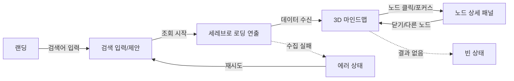

# cerebro — UX 명세 (UX Spec)

> **목적**: cerebro의 비주얼·인터랙션·화면 플로우를 한 곳에 정의해 디자인↔구현 간 단일 기준을 제공한다.
>
> **담당 역할**: UI/UX Designer
>
> **관련 문서**: [FOUNDATION-SPEC (SSOT)](./foundation/FOUNDATION-SPEC.md) · [ROADMAP](./ROADMAP.md) · [DESIGN-SYSTEM](./DESIGN-SYSTEM.md) (토큰/컴포넌트 상세) · [DATA-SOURCING](./DATA-SOURCING.md) (출처/신뢰도 필드)

- 문서 버전: `0.1.0`
- 최종 갱신: 2026-06-25
- 상태: Living Document
- 적용 범위: MVP(한국어 전용, 기업 + 공인 개인). 토큰/색상 HEX·세부 컴포넌트 스펙은 DESIGN-SYSTEM.md로 위임.

---

## 1. 컨셉 무드 — "Neural / Holographic Dark"

영화 *X-Men* 의 Cerebro 룸을 모티프로 한 **다크 + 뉴럴(신경망) + 홀로그래픽** 무드. 사용자는 "어둠 속 수많은 형상 중 하나의 대상을 조준해 그 주변 정보망을 펼쳐 본다"는 경험을 한다.

| 축 | 방향 | 근거 / 트레이드오프 |
|---|---|---|
| 배경 | 깊은 무채색 다크(거의 검정 ~ 짙은 청록 그라데이션) | 발광 노드·홀로 라인의 대비 확보. 라이트모드는 MVP 비대상(무드 손상 + 작업량). |
| 발광색(accent) | 시안~블루 계열 1색 + 보조 1색 | 단색 발광으로 "스캔/뉴럴" 톤 통일. 다색 남발은 정보 위계를 흐림. |
| 형태 | 구체(sphere) 노드 + 가는 발광 엣지 | SSOT의 "구체 노드" 결정 준수. 구체는 3D 깊이감/포커스 표현에 유리. |
| 질감 | 미세 그레인 + bloom(발광 번짐) + 옅은 비네팅 | 홀로그램/스캔 느낌. 단, bloom 과다는 모바일 fps·가독성 저해 → 강도 토큰화. |
| 모션 | 느리고 관성 있는(easing) 카메라, 노드 미세 부유 | "거대한 기계가 천천히 스캔" 느낌. 급격한 전환 지양(멀미·산만 방지). |
| 타이포 | 산세리프, 한글 우선(가독), 라벨은 톤다운 흰색 | 한국어 전용 MVP. 장식체 금지(가독·접근성). |

> 색/타이포의 **정확한 토큰 값**(HEX, font stack, spacing scale)은 DESIGN-SYSTEM.md가 SSOT. 본 문서는 "무엇을/왜"에 집중.

---

## 2. 핵심 화면 플로우



각 화면의 진입/이탈 조건과 상태(로딩/빈/에러)는 9장에 정리.

### 2.1 랜딩 (Landing)
- 목표: 1초 안에 "무엇을 검색하면 무엇이 나오는지" 직관 전달.
- 구성: 중앙 정렬 거대 검색바 1개 + 한 줄 카피("이름을 입력하면, 흩어진 공개 정보가 하나로 모입니다") + 대상 토글(기업 / 인물) + 예시 칩(샘플 키워드).
- 배경: 어둡고 정적인 뉴럴 파티클(저밀도, 저속) — 로딩 연출의 "프리뷰". 입력 포커스 시 파티클이 검색바 쪽으로 미세하게 끌려옴(예고).

```
┌──────────────────────────────────────────────┐
│                                              │
│        · · ·   (저밀도 뉴럴 파티클)   · · ·     │
│                                              │
│            CEREBRO                           │
│   이름을 입력하면, 흩어진 공개 정보가          │
│   하나로 모입니다.                            │
│                                              │
│   [ 기업 ] [ 인물 ]   ← 대상 토글             │
│   ┌────────────────────────────────┐  ┌──┐   │
│   │ 🔍  검색어를 입력하세요…         │  │조회│  │
│   └────────────────────────────────┘  └──┘   │
│   예시:  #삼성전자  #손흥민  #카카오           │
│                                              │
│        · · ·                    · · ·         │
└──────────────────────────────────────────────┘
```

### 2.2 검색 입력 / 제안 (Search)
- 자동완성/제안: 입력 2자 이상 시 후보 목록(엔터티 후보 + 유형 배지[기업/인물]). 디바운스 ~250ms.
- 동명이인/동일명 기업 분기: 후보에 보조 식별자(업종/소속/대표 출처) 노출 → 잘못된 대상 조준 방지(PIPA·정확도).
- 키보드: ↑/↓ 후보 이동, Enter 확정, Esc 닫기.
- 인물 선택 시 안내: "공개된 정보만 표시합니다"라는 마이크로카피 1줄(PIPA 신뢰).

### 2.3 세레브로 로딩 (Cerebro Loading) — 3장 상세
- 검색 확정 → 데이터 수집/정제 동안 표시되는 시그니처 연출.
- 평균 노출 2~6초 가정(캐시 히트 시 1초 이하 → 단축 모션). 길어질 경우 단계 라벨로 체감시간 완화.

### 2.4 3D 마인드맵 (Mind Map) — 4장 상세
- 로딩 수렴이 끝난 "한 점"이 그대로 **중심 노드**로 확대되며 가지가 펼쳐짐(연출↔결과 연속성).

### 2.5 노드 상세 패널 (Detail Panel) — 5장 상세
- 노드 클릭/포커스 시 측면(데스크톱) 또는 하단 시트(모바일)로 슬라이드인.

---

## 3. 세레브로 로딩 연출 (시그니처)

### 3.1 연출 시나리오 (서사)
> "어둠 속, 회색 인간 실루엣 수천이 스쳐 지나간다. 스캔이 진행될수록 무관한 형상들은 흩어져 사라지고, 빛의 흐름이 화면 중앙 **한 점**으로 수렴한다. 그 점이 밝아지며 검색 대상의 중심 노드가 된다."

3단계 비트:

| 단계 | 진행률 | 연출 | 라벨(체감 시간용) |
|---|---|---|---|
| ① 산개(Scatter) | 0–40% | 무수한 회색 실루엣이 카메라를 좌우/원근으로 스쳐 지나감. 약한 글로우, 빠른 패럴랙스. | "공개 출처 스캔 중…" |
| ② 수렴(Converge) | 40–85% | 실루엣들이 중앙 한 점을 향해 휘어지며 빨려듦. 무관 형상은 페이드아웃, 빛 줄기 형성. | "관련 정보 연결 중…" |
| ③ 점화(Ignite) | 85–100% | 중앙 점이 팽창·발광 → 구체(중심 노드) 형성. 가지가 터져 나옴. | "마인드맵 구성 중…" |

### 3.2 진행률 매핑 (실데이터 ↔ 모션)
- 진행률 = 백엔드 수집 파이프라인의 단계 가중 합(예: 후보확정 20% / 소스수집 50% / 정제·신뢰도 20% / 그래프빌드 10%). 추정 불가 구간은 **느린 점근(asymptotic) 진행바**로 채워 멈춤처럼 보이지 않게 함.
- 데이터가 모션보다 먼저 도착하면: 진행률을 100%로 가속(ease-out)하고 ③로 점프.
- 데이터가 6초 초과로 지연되면: ② 루프를 유지하되 라벨을 "출처가 많아 시간이 걸리고 있어요"로 교체 + 취소 버튼 노출.

### 3.3 구현 힌트 (Frontend Engineer 인계)
- **실루엣 표현**: 개별 메시 대신 **GPU 인스턴싱**(`InstancedMesh`). 인스턴스당 행렬/색/페이드값 attribute.
  - 형상: 인물 실루엣은 **빌보드 평면 + 실루엣 텍스처 시트(아틀라스)** 로 처리(폴리곤 최소화). 4~8종 실루엣을 한 시트에 담아 인스턴스마다 UV 오프셋으로 다양화.
  - 대안 트레이드오프: 진짜 3D 휴머노이드 메시는 비주얼↑ 이지만 버텍스/메모리↑ → 모바일 폴백 어려움. MVP는 빌보드 실루엣 채택.
- **수렴 모션**: 인스턴스 위치를 셰이더(또는 CPU)에서 중심점으로 lerp. `progress` uniform 1개로 산개↔수렴 보간 → JS 부하 최소.
- **페이드/탈락**: 인스턴스별 `life` attribute로 alpha 감쇠. 무관 실루엣은 `progress`에 따라 랜덤 시드로 조기 소멸.
- **발광**: bloom 포스트프로세싱(UnrealBloom). 모바일/reduced-motion에서는 bloom off + 정적 글로우 텍스처.
- **수 제어(성능 예산)**: 인스턴스 수를 디바이스 티어로 분기 — 고사양 ~3000, 중간 ~1200, 저사양 ~300(또는 2D 폴백, 7장).
- **연속성**: ③의 중심 점 좌표 = 마인드맵 중심 노드의 스크린 좌표. 로딩 종료 시 언마운트 대신 **카메라 줌아웃으로 자연 전환**(같은 R3F 씬 내에서 처리 권장).

```
[로딩 ASCII 타임라인]
0% ───────────────── 40% ───────────── 85% ──── 100%
 ︵︵ 회색 실루엣 산개 ︶︶ │ ↘↘ 한 점으로 수렴 ↙↙ │ ✷ 점화→중심노드
"공개 출처 스캔 중…"      "관련 정보 연결 중…"   "마인드맵 구성 중…"
[취소]  ← 6초 초과 시 노출
```

### 3.4 접근성/저사양 분기
- `prefers-reduced-motion: reduce`: 산개/수렴 애니메이션 생략 → **정적 스캔 라인 + 단계 텍스트 + 결정적 진행바**로 대체(서사 유지, 모션 제거).
- 저사양/2D 폴백: 실루엣 파티클 대신 **단순 펄스 로더 + 단계 라벨**. 동일한 3단계 텍스트로 일관성 유지.

---

## 4. 3D 마인드맵 인터랙션

### 4.1 구조 / 비주얼 위계
- **중심 노드(Center)**: 가장 큼·가장 밝음·고정적 펄스(맥동). 항상 식별 가능.
- **1차 가지(branch)**: 중심에서 방사. 카테고리 단위(예: 기업이면 기본정보/제품/뉴스/평판/관계사).
- **2차 노드(leaf)**: 가지에 매달린 개별 정보(개별 기사·리뷰·지표 등). 작고 덜 밝음.
- 엣지: 가는 발광 라인. 활성 경로(hover/focus 연결선)는 굵기·밝기 강조.

```
[3D 마인드맵 개념도 — 투영]
              ○ 뉴스
            /
   ◎ 기본정보 ── ○ 설립/대표
        \      \
 ○ 제품 ─ ●CENTER● ─ 평판 ○──○ 리뷰
        /       \
   ○ 관계사      ○ SNS
  (● 중심: 최대/최고휘도 · ◎ 1차가지 · ○ 2차노드)
```

### 4.2 카메라 / 뷰포트 제어
| 제스처(데스크톱) | 동작 | 비고 |
|---|---|---|
| 휠 / 트랙패드 핀치 | 줌 in/out | 줌 한계(min/max) clamp, 중심 노드 기준 |
| 좌드래그 | 회전(orbit) | 관성 감속(damping) |
| 우드래그 / Space+드래그 | 팬(pan) | |
| 더블클릭(노드) | 해당 노드로 카메라 포커스 | smooth 이동(ease) |
| 빈 공간 더블클릭 | 중심 노드로 리셋 | |

- OrbitControls 기반, damping 켜서 "무겁고 정밀한 기계" 느낌. 자동 회전은 idle 8초 후 아주 느리게(선택), 입력 시 즉시 정지.

### 4.3 노드 상태: hover / click / focus
| 상태 | 트리거 | 피드백 |
|---|---|---|
| **hover** | 포인터 오버 / 키보드 이동 도착 | 노드 살짝 확대 + 외곽 글로우, 라벨 강제 표시, 연결 엣지 하이라이트, 무관 노드 살짝 디밍 |
| **click(select)** | 클릭 / Enter | 상세 패널 오픈(5장), 노드에 선택 링 표시 |
| **focus(camera)** | 더블클릭 / 패널 내 "초점" / F 키 | 카메라가 노드를 화면 중앙으로 이동·적정 거리 줌, 해당 가지 펼침 |
| **active path** | hover/focus 시 | 중심→해당 노드 경로 엣지 강조(다른 엣지 디밍) |

- 히트 정확도: 작은 2차 노드는 클릭 어려움 → 노드 주변에 보이지 않는 **확장 히트영역**(특히 터치). raycast 대상은 노드 메시.

### 4.4 가지 확장 / 접힘 (Expand / Collapse)
- 초기 렌더: 중심 + 1차 가지 + 각 가지의 상위 N개 2차 노드만(과밀 방지, 성능 예산).
- 1차 가지 클릭: 해당 가지의 나머지 2차 노드 펼침(스태거 애니메이션). 다시 클릭 시 접힘.
- "더 보기" 노드: 가지에 잔여 개수 배지(예: `+12`). 클릭 시 추가 로드/펼침.
- 트레이드오프: 전체 일괄 렌더는 직관적이나 대형 그래프에서 fps·가독성 붕괴 → 점진적 확장 채택.

### 4.5 라벨 표시 규칙
정보 과밀(label clutter) 방지가 핵심.

| 우선순위 | 항상 표시 | 조건부 표시 |
|---|---|---|
| 1 | 중심 노드 라벨 | — |
| 2 | 1차 가지 라벨 | 카메라가 일정 거리 이내일 때 |
| 3 | 2차 노드 라벨 | hover/focus 시 또는 줌인 임계 이상일 때만 |

- 라벨은 빌보드(항상 카메라 향함). 겹침 회피: 가까운 라벨 충돌 시 우선순위 낮은 쪽 숨김(거리·중요도 기반).
- 라벨 길이 제한 + 말줄임(…). 전체 텍스트는 hover 툴팁/상세 패널에서.
- 가독: 라벨 뒤 옅은 반투명 패드 또는 외곽선으로 발광 배경과 대비 확보(접근성 8장).

### 4.6 모바일 제스처
| 제스처 | 동작 |
|---|---|
| 한 손가락 드래그 | 회전(orbit) |
| 두 손가락 핀치 | 줌 |
| 두 손가락 드래그 | 팬 |
| 노드 탭 | 선택 → 하단 상세 시트 |
| 노드 더블탭 | 포커스(카메라 이동) |
| 빈 공간 더블탭 | 중심 리셋 |

- 터치 타깃 ≥ 44px 환산(히트영역 확장). 제스처 충돌(스크롤 vs 회전)은 캔버스 영역 내 제스처 캡처로 분리, 페이지 스크롤은 캔버스 밖에서만.
- 모바일 기본 노드 수/효과 축소(7장 폴백 표와 연동).

---

## 5. 노드 상세 패널 (Detail Panel)

노드 클릭 시 등장. 데스크톱: 우측 사이드 패널(폭 360~420px, 캔버스 위 오버레이, 캔버스는 살짝 디밍). 모바일: 하단 바텀시트(드래그로 50%↔전체).

### 5.1 콘텐츠 구성 (위→아래)
1. **헤더**: 노드 제목 + 유형 배지(예: 뉴스/제품/평판/기본정보) + 닫기(×).
2. **신뢰도(Trust)**: 0–100 또는 상/중/하 + 색 인디케이터. 산정 근거 1줄 + (i) 툴팁("공식 출처/교차검증 수 기반"). 값 정의는 DATA-SOURCING.md SSOT.
3. **출처(Sources)**: 1개 이상 리스트. 각 항목 = 출처명/도메인 + 출처유형(공식 API/공개 웹) + **원문 링크(새 탭, `rel="noopener noreferrer"`)**. 출처 복수 시 모두 나열(투명성).
4. **수집 시각(Collected at)**: "2026-06-25 14:32 수집" (상대시간 보조: "3시간 전"). 캐시 표기 시 "캐시" 배지.
5. **요약 본문**: 정제된 핵심 내용(불릿/짧은 문단). 원문 전체가 아닌 발췌/요약임을 명시.
6. **정보 활용 방법(How to use)**: cerebro 차별 포인트. 이 정보를 어떤 의사결정/맥락에 쓰면 좋은지 2~4줄(예: "이 평판 지표는 거래/협업 전 리스크 점검에 참고. 단일 출처이므로 교차확인 권장").
7. **관계(선택)**: 연결된 노드로 점프(클릭 시 해당 노드 포커스).
8. **푸터 액션**: [원문 열기] [이 노드로 초점] [공유(링크 복사)] · 개인 대상일 경우 [정보 정정/삭제 요청] 링크(PIPA).

```
┌──────────────── 상세 패널 (데스크톱 우측) ─────┐
│ 〔뉴스〕 OO기업, 신제품 발표            [×] │
│ ───────────────────────────────────────── │
│ 신뢰도  ●●●○○  74/100  (i) 교차검증 2건     │
│                                            │
│ 출처                                        │
│  • 네이버뉴스 (공식 API)        [원문 ↗]    │
│  • 회사 보도자료 (공개 웹)      [원문 ↗]    │
│                                            │
│ 수집 2026-06-25 14:32 (3시간 전) 〔캐시〕   │
│                                            │
│ 요약                                        │
│  - 핵심 요점 1                              │
│  - 핵심 요점 2                              │
│                                            │
│ 💡 정보 활용 방법                            │
│  최근 동향 파악·경쟁사 비교에 활용. 단일      │
│  보도이므로 교차 확인을 권장합니다.          │
│                                            │
│ [원문 열기] [이 노드로 초점] [공유]          │
└────────────────────────────────────────────┘
```

### 5.2 동작 규칙
- 패널 오픈 중 다른 노드 클릭: 패널 내용 교체(슬라이드 전환). 패널은 1개만.
- 닫기: ×, Esc, 패널 밖(캔버스) 클릭, 모바일은 시트 아래로 드래그.
- 패널 오픈 시 해당 노드는 카메라 화면 내로 살짝 이동(패널에 가려지지 않게 오프셋).
- 키보드 포커스 트랩: 패널 열릴 때 포커스 이동, 닫으면 원래 노드로 복귀(8장).

---

## 6. 정보 구조 / 데이터 ↔ UI 매핑

| 데이터(노드) 필드 | UI 표현 위치 |
|---|---|
| `label` / `title` | 노드 라벨, 패널 헤더 |
| `type` | 노드 색/크기 위계, 유형 배지 |
| `sources[]` | 패널 출처 리스트(복수 모두) |
| `trust` | 패널 신뢰도 인디케이터, 노드 외곽 강도(선택) |
| `collectedAt` | 패널 수집 시각 + 캐시 배지 |
| `summary` | 패널 요약 본문 |
| `usageHint` | 패널 "정보 활용 방법" |
| `relations[]` | 엣지, 패널 관계 점프 |

> 필드 계약은 `packages/shared`(Backend↔Frontend)에서 확정. 본 표는 UI 소비 관점.

---

## 7. 반응형 · 저사양 폴백 (Performance Tiering)

자동 디바이스 티어 감지(대략): 화면폭/포인터 종류 + (가능 시) GPU 힌트/프레임 측정. 첫 프레임 후 fps가 임계 미달이면 한 단계 자동 강등.

| 티어 | 대상(대략) | 3D | 노드 상한 | 효과 | 로딩 연출 |
|---|---|---|---|---|---|
| High | 데스크톱/고성능 | full 3D | ~중심+가지 다수 | bloom·그레인·부유 모션 on | 인스턴싱 ~3000 |
| Mid | 일반 모바일/노트북 | 3D | 축소(상위 N) | bloom 약화, 모션 축소 | 인스턴싱 ~1200 |
| Low | 저사양 모바일 | **2D 폴백** | 더 축소 | 효과 off | 펄스 로더(파티클 off) |

- **2D 폴백**: 동일 그래프를 2D 노드-링크(SVG/Canvas)로 렌더(중심-가지 동일 위계·색). 인터랙션(탭/줌/팬/패널)은 동일 멘탈모델 유지. 3D는 못 봐도 "정보 탐색" 본질은 보존.
- 강등 시 사용자에게 1회 토스트: "원활한 사용을 위해 간소화 모드로 표시합니다" + [3D로 전환 시도] 옵션.
- 데스크톱 좁은 폭(예: <768px 환산) = 모바일 레이아웃(패널→바텀시트) 적용.

---

## 8. 접근성 (a11y)

| 항목 | 규칙 |
|---|---|
| 모션 민감 | `prefers-reduced-motion: reduce` → 로딩 산개/수렴·부유·자동회전 제거, 정적 대체(3.4). 본질 정보는 유지. |
| 키보드 | Tab으로 노드 순회(중심→가지→leaf, 논리적 순서), Enter 선택, F 초점, Esc 패널 닫기, 화살표로 인접 노드 이동. 포커스 링 가시화. |
| 포커스 관리 | 패널 오픈 시 포커스 이동·트랩, 닫으면 원위치 복귀. |
| 대비 | 라벨·텍스트는 배경 대비 WCAG AA(본문 4.5:1) 목표. 발광 배경 위 라벨은 패드/외곽선으로 보장. |
| 색 의존 금지 | 신뢰도/유형을 색만으로 구분하지 않음(아이콘/텍스트/형태 병행). |
| 대체 텍스트/구조 | 3D 캔버스에 동등한 텍스트 표현(노드 목록/aria-live로 선택 변경 안내). 스크린리더는 캔버스 대신 리스트 모드 제공 고려. |
| 터치 타깃 | 실효 ≥44px. |
| 단축키 도움 | `?` 키로 단축키/제스처 안내 오버레이. |

> 접근성은 "있으면 좋은 것"이 아니라 폴백(2D·정적 로딩)과 한 묶음으로 설계 — 저사양/모션민감/키보드 사용자가 같은 정보에 도달해야 함.

---

## 9. 상태 정의 (빈 / 로딩 / 에러 / 부분실패)

| 상태 | 발생 | UI | 사용자 액션 |
|---|---|---|---|
| **로딩** | 검색 확정 후 수집 중 | 세레브로 로딩(3장) + 단계 라벨 + (6초+) 취소 | 취소 → 검색 입력 복귀 |
| **빈 결과** | 대상은 식별됐으나 표시할 공개 정보 없음 | 중심 노드만 표시 + "공개된 정보를 찾지 못했어요" 안내 + 검색 제안(철자/다른 대상) | 재검색, 대상 토글 변경 |
| **부분 실패** | 일부 출처만 수집 성공 | 가능한 노드 정상 표시 + 상단 옅은 배너 "일부 출처를 불러오지 못했어요" + [다시 시도] | 부분 재시도 |
| **전체 에러** | 네트워크/서버/쿼터 초과 | 캔버스 대신 에러 화면: 짧은 원인 + [다시 시도] (+쿼터면 "잠시 후 다시 시도") | 재시도 / 검색 복귀 |
| **대상 모호** | 동명 후보 다수 | 로딩 진입 전 후보 선택 모달(보조 식별자 표기) | 정확 대상 선택 |
| **차단/비대상** | PIPA·비공개·민감 영역 | 정중한 차단 메시지("공개정보 기준에 맞지 않아 표시할 수 없어요") | — |

- 모든 에러 메시지: 비난/전문용어 지양, **무엇이 / 다음에 무엇을** 형태. 기술 상세는 로그로(사용자엔 노출 X).
- 로딩↔결과↔에러 전환은 동일 R3F 씬 컨텍스트에서 부드럽게(깜빡임/리마운트 최소화).

```
[빈 결과]                         [전체 에러]
   ●CENTER●                         ⚠
 공개된 정보를                     불러오지 못했어요.
 찾지 못했어요.                    네트워크를 확인하고
 [철자 확인] [대상 바꾸기]          [다시 시도]
```

---

## 10. 모션 / 마이크로인터랙션 원칙 (요약)

- **느림·관성·이징**: 카메라/패널 전환은 ease-in-out, 급정지 금지. "정밀한 거대 기계" 톤.
- **상태 피드백 즉시성**: 입력→시각 반응 100ms 내(hover 글로우, 버튼 press).
- **연속성**: 로딩의 수렴점 → 중심 노드 → 포커스 이동까지 끊김 없는 카메라 워크.
- **절제**: 동시 다발 애니메이션 지양(주의 분산·fps). 한 번에 하나의 주연 모션.
- 모든 모션은 reduced-motion에서 무력화 가능해야 함(8장).

---

## 11. 미해결/후속 (Open Questions)

- 신뢰도 시각화: 노드 외곽 강도로도 반영할지(과하면 위계 혼란) → DESIGN-SYSTEM에서 A/B.
- 동명이인 분기 UX를 로딩 전 모달 vs 결과 내 전환 중 무엇으로 고정할지 검증 필요.
- 대형 그래프(수백 노드+) 라벨/엣지 가독 한계선 → 클러스터링(노드 묶기) 도입 시점(MVP 이후 후보).
- 2D 폴백의 레이아웃 알고리즘(방사형 vs force) 선택 → Frontend와 협의.
